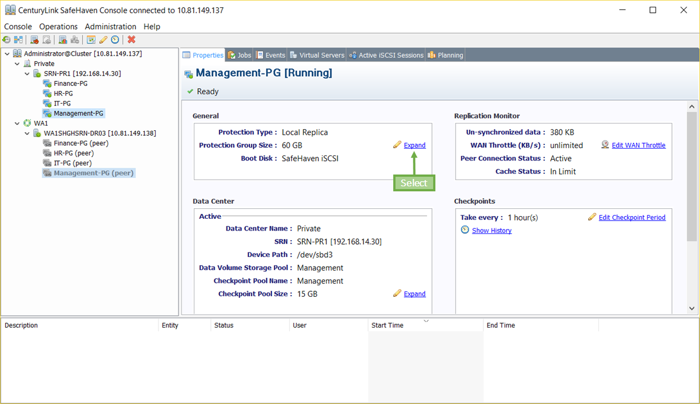
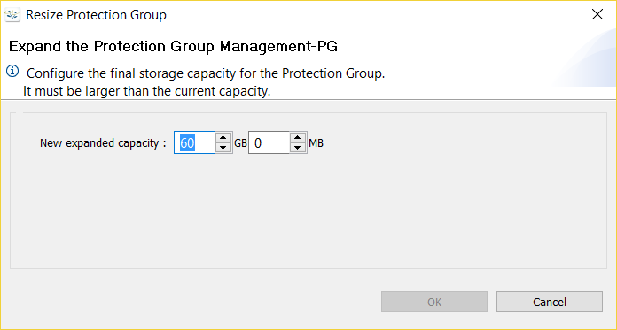

{{{
  "title": Expand Protection Group Size",
  "date": "11-29-2016",
  "author": "Anshul Arora",
  "attachments": [],
  "contentIsHTML": false
}}}
###Article Overview
This article covers how we can increase the size of the protection group using SafeHaven Console. Someone might want to increase the size of the protection group when want to add more VMs to the existing Protection group, or when they want to add more disks to the already protected VMs.

###Prerequisites
Make sure that the SRN (SafeHaven Replication Node) where the protection group exist has enough available space in the corresponding Storage Pool. In order to confirm this, click on the local SRN
###Expanding Protection Group Size

