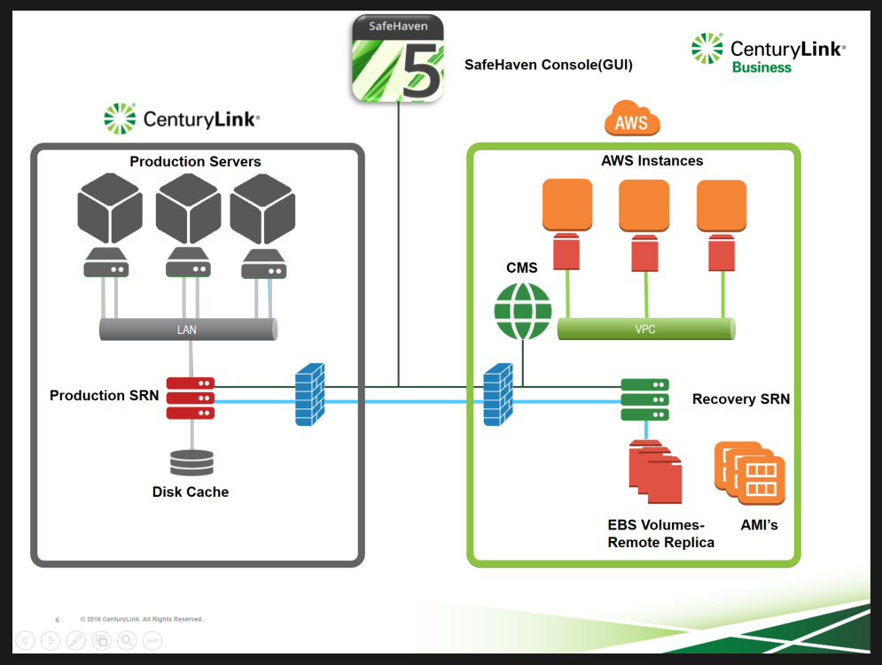

{{{
  "title": "Disaster Recovery with SafeHaven in AWS",
  "date": "05-17-2018",
  "author": "Mahima Kumar",
  "attachments": [],
  "contentIsHTML": false
}}}

### Article Overview
This article explains how SafeHaven performs Disaster Recovery in AWS and how a complete image level recovery is performed incase a disaster event is declared.

### Assumptions
1. The Production Datacenter has network connectivity to the AWS Cloud Recovery Datacenter (VPN or MPLS).
2. User has network connectivity to the AWS Cloud Recovery Datacenter in order to access the SafeHaven Console to manage the DR setup (direct VPN connection).

### Production Datacenter Site Type
Production Datacenter Site type in this scenario can be:

1. On-Prem VMware
2. Any CenturyLink Cloud Datacenter
3. CenturyLink Private Cloud on VMware Cloud Foundation
4. CenturyLink Bare Metal Servers
5. Hyper-V Generation 1
6. Any AWS Region
6. Physical Servers

### Recovery Datacenter Site Type
Any AWS Region can be used as the Recovery Site in this scenario. Each AWS Region is treated as a Datacenter within a SafeHaven Cluster.

### Production Servers
In this scenario there are three Production Servers that a user wants to protect. Each Production Server has a Local Disk attached to it which has to be replicated over to the Recovery Datacenter. Production Servers can either be Windows or Linux. Please refer to [SafeHaven 5.0 Use Case and Support Matrix](../SafeHaven 5 General/SafeHaven-5.0-Use-Case-and-Support-Matrix.md) for more information.

Gather the following information for the servers you want to protect:

1. O.S. Type
2. Number of vCPU
3. RAM
4. Production Server Size (Storage) that has to be protected
5. Network Info./I.P. Address

### SafeHaven Replication Node(SRN)
SafeHaven Replication Node(SRN) is an Ubuntu 16 based lightweight virtual appliance(virtual machine)which transfers and retains production data.

If the Production Datacenter is an On-prem VMware site, CenturyLink Private Cloud on VMware Cloud Foundation, Hyper-V Generation 1 or a Physical Server, CenturyLink team provides an OVF for spinning up SRN appliances. If the Production Datacenter is a CenturyLink Cloud Datacenter or a CenturyLink Bare Metal Server, simply use the standard Ubuntu 16 template that CenturyLink Portal provides. If the Production/Recovery Datacenter is an AWS Region, simply use the SafeHaven template published under Community AMI's.

Production Servers typically resides in the same VLAN as that of the Production SRN. Once connectivity is setup between the Production Server and Production SRN, the next step is to setup a sister SRN in AWS Recovery Datacenter. SRN appliances work in pairs and once a the Recovery SRN is spun up, a peering relationship is established between the Production and Recovery SRN appliances.

### Attach Storage to SafeHaven Replication Nodes(SRN)
Depending on the O.S. Type of servers being protected and the mode of replication(Local Cache or Local Replica) selected, required amount of storage is attached on both the Production and Recovery SRN appliances.

#### Production SRN
For Windows Production Servers, Local Cache mode is selected where storage amounting to "10% of the total provisioned storage on the Production Server" is attached to the Production SRN. This Local Cache attached to the Production SRN acts as a buffer and transfers the production data coming from the Production Servers over to the Recovery SRN in AWS. This mode of replication saves storage related costs as the users do not have to pay for an additional full copy of data on the Production SRN.

For Linux Production Servers, Local Replica mode is selected where storage amounting to "100% of the total used storage(full copy of data) + an additional 5% of the total used storage(for Checkpoints)" on the Production Server = 105% of the total used storage on the Production Server" is attached to the Production SRN. (Local Replica mode of replication is not available for Windows)

#### Recovery SRN
As the Recovery SRN retains a full copy of the production data called "Remote Replica", storage amounting to "100% of the total provisioned/used storage(full copy of data)" on the Production Server is attached to the Recovery SRN as EBS Volumes automatically.

### Central Management Server(CMS) and SafeHaven Console(GUI)
Central Management Server(CMS) is an Ubuntu 16 based lightweight virtual appliance(virtual machine) in AWS Recovery Datacenter that binds all the data centers/appliances together and provides access to the DR environment via a SafeHaven Console(GUI).

A standalone java client(provided by CenturyLink) is used to access the SafeHaven Console/Cluster so that users can manage their DR environment and initiate recovery operations.

### Create Protection Groups
Protection Groups are logical mappings between the Production and Recovery Servers. Protection Groups are created from within the SafeHaven Console and users have the choice to either include one or multiple servers inside a single protection group. All the recovery operations are initiated from a Protection Group level.

### Install Local Replication Agent(LRA)/Scripts on the Production Servers
For Windows Production Servers, users can automatically/manually install the Local Replication Agent(LRA) provided by the CenturyLink Team to replicate production data. For Windows, SafeHaven performs block level replication.

For Linux Production Servers, users will install certain scripts provided by the CenturyLink team to replicate production data. For Linux, SafeHaven performs file level replication using Rsync.

### Initial Replication and Enable Checkpoints
Initial replication is started and data is replicated over the WAN(Production Server sends all the data to the Production SRN, which simultaneously transfers it to the Recovery SRN. Recovery SRN retains a full copy of production data called the "Remote Replica"). Upon completion of the initial replication, periodic as well as scheduled checkpoints are enabled and the user can set the checkpointing interval as per the RPO/RTO requirements. After enabling periodic checkpoints, only the deltas/changes made on the production servers are replicated automatically over to the Recovery SRN. User has the choice to retain VSS and Non-VSS (Crash) Consistent Checkpoints for recovery.

In AWS Recovery site, a snapshot of the EBS Volume(s) is taken every time a periodic/scheduled checkpoint is triggered by SafeHaven. As a next step, AMI's (Amazon Machine Images) are created from these EBS snapshots. For Windows Protection Groups, we have to go through an AMI import procedure but for Linux Protection Groups  this step is not required. Based on the Checkpoint Retention Policy set by the user, these AMI's are retained for disaster recovery. User has the option to retain as many AMI's as they want and will get charged for incrementally stored EBS snapshots. As per Amazon's EBS snapshot billing, a user will only get charged for the blocks that have changed after the last snapshot is taken and will only be billed for the changed blocks.

### Production Site Outage-Declare Disaster
The cause of a production site outage could be anything from a human error to a natural disaster. Incase there is an outage and the user declares a disaster event,  the users might not be able to access the production servers in the Production Datacenter. The users will get notified via email incase the production server replication stops, checkpoints become unclean or if the Production SRN goes down.

### Failover to AWS
Incase of a disaster event, users can login to the SafeHaven Console and with a few clicks, select the latest clean checkpoint/AMI and can Failover the entire Production Datacenter over to AWS.

#### Launch Amazon EC2 Instances
Once the checkpoints/AMI's are selected for Failover, SafeHaven automatically launches the EC2 Instances based on the Instance profile information filled in by the user and performs a native boot. User has the choice to launch multiple instances per AMI and can delete them as well at any given time. Production Server Image is presented in AWS with all the data intact and the user can login to ensure business continuity. In this case AWS becomes the primary site to run business applications until a the user wants to revert back to the Production Datacenter.

**NOTE**: Test-Failover can be performed in an isolated network so that the user can test the recovery instances prior to an actual Failover.
