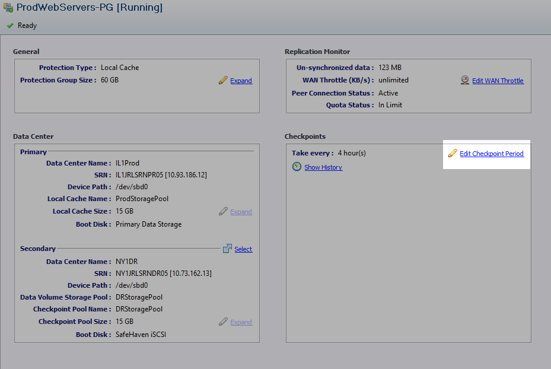
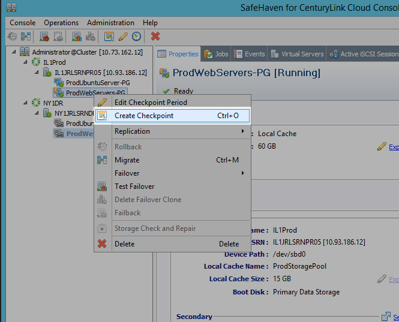
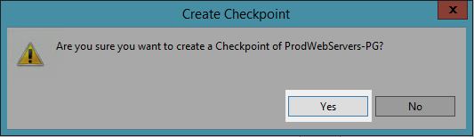
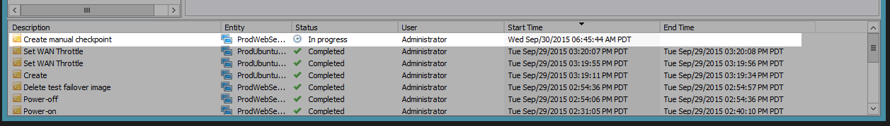
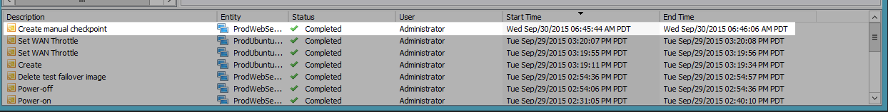
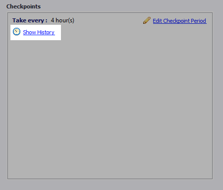
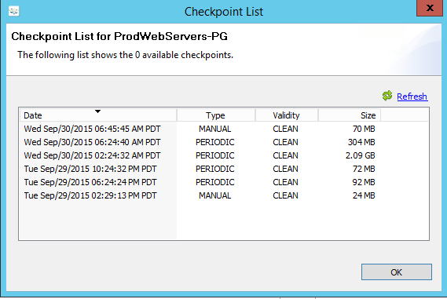

{{{
  "title": "SafeHaven 3.1: Checkpoints",
  "date": "11-16-2015",
  "author": "Josh Leporati",
  "attachments": [],
  "contentIsHTML": false
}}}

## Article Overview
This article will walk you through the process of enabling, modifying, viewing, and taking checkpoints within your SafeHaven protection groups.  Checkpoints are used by SafeHaven as the restorable points for a
server, and will determine your recovery point objective.

## Enabling Checkpoints

1. Open up your SafeHaven Console and login to the CMS.

2. Select **Edit Checkpoint Period**

  

3. Ensure that **Checkpoints Enabled** is ticked under Checkpoint Period, and that a proper period time is specified.  This will be the frequency of checkpoints taken by SafeHaven.

  

## Editing Checkpoints

Similar to the above process, proceed to the **Edit Checkpoints Period**, from there you can modify the Checkpoint Period previously specified.

## Taking a Manual Checkpoint

There may be times when you wish to take a manual Checkpoint, either for test failover scenarios, or after some large changes have been syncronized.

1. Right click on the protection group you wish to take a Checkpoint of, and select Create Checkpoint

  

2. Confirm that you want to create a checkpoint

  

3. Wait for the task to complete.  You can monitor the status in the jobs list at the bottom of the console.

  

  

## Viewing Checkpoints

To view both automatic and manual checkpoints taken follow the next steps

1. Open the SafeHaven Console and login to the CMS

2. Select **Show History** under the Checkpoints group

  

3. The available Checkpoints will display with related data for the Checkpoints shown.

  
