{{{
  "title": "SafeHaven 3.1: Cluster Configuration",
  "date": "11-16-2015",
  "author": "Josh Leporati",
  "attachments": [],
  "contentIsHTML": false
}}}

## Article Overview
We will walk through the configuration of the SafeHaven Cluster.  This process will configure your CMS (Central Management Server) and SRN (SafeHaven Replication Node) roles within your environment.  This should be followed by an engineer level employee looking to deploy a new cluster.

You should already have deployed your SafeHaven nodes to run this process against.  If you have not yet completed that step, please see the [SafeHaven 3.0/3.1 - Build a base-image template from scratch using Ubuntu 14](../Disaster Recovery/build-safehaven-base-image-template-from-ubuntu.md))

## Requirements

+ CLC Portal ID
  + Deployed SafeHaven Templates
  + API v1 User
+ SafeHaven Components (Downloadable)
  + [Console & Cluster Configurator Software - SAHA 3.1.0.6u3](https://www.dropbox.com/sh/8c32qpjseds8srz/AAA8HCZ7hrmkhRYPUdDRBELba/SafeHavenClients-3.1.0.6-u3-Win32.zip?dl=0)
+ Windows OS w/access to both Production and DR SafeHaven environments

## Cluster Configuration
During these next steps we configure our SafeHaven Cluster environment (SRN and CMS nodes) via the SafeHaven Cluster Configurator

### Obtaining SafeHaven Install Software
The cluster configuration software needs to be run off of a Windows machine - with network access to your production SRN as well as access to your DR SRN and CMS

Download and extract the following software to a known location on the Windows machine

[Cluster Configurator Software - SAHA 3.1.0.6u3](https://www.dropbox.com/sh/8c32qpjseds8srz/AAA8HCZ7hrmkhRYPUdDRBELba/SafeHavenClients-3.1.0.6-u3-Win32.zip?dl=0)

**At this time the Cluster Configurator is running off of the 3.1.0.6u3 code, when working in your SafeHaven Console make sure to use the correct GUI version related to your SafeHaven Environment**

### Installing and Configuration Steps

1. Execute SafeHavenClusterConfigurator.exe
  * Accept EULA
  * Enter Licensing information
  * Select correct deployment type
    * We will always be selecting `Configure Safe Haven cluster by selecting pre-installed SafeHaven Nodes`

      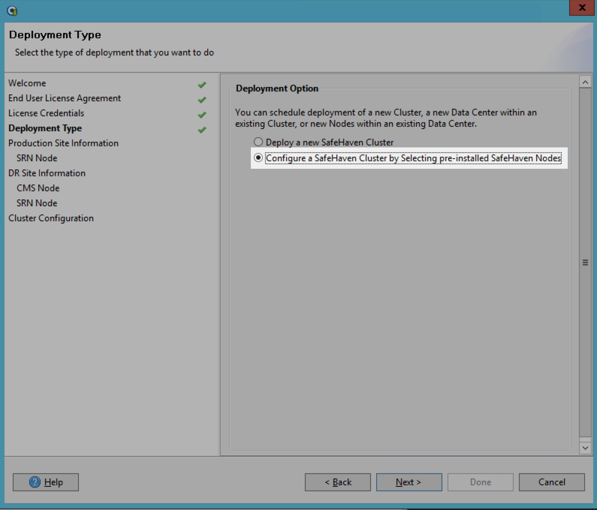

2. Enter a **name** for the Production Site Information (this should be something descriptive - like ProductionDATACENTERALIAS)

  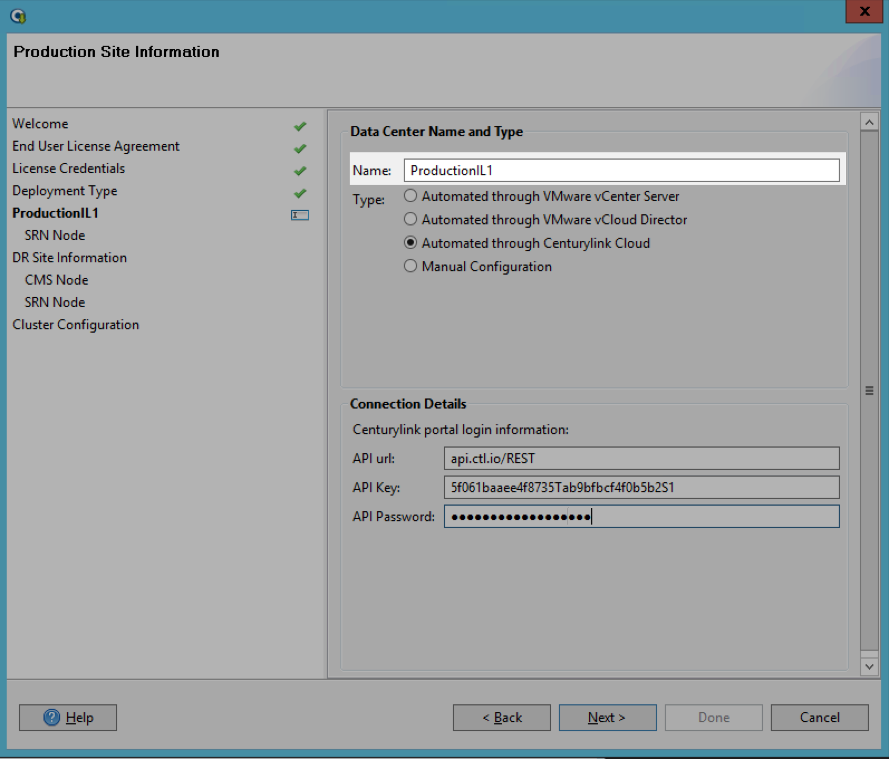

3. Select the correct Production side **type**

  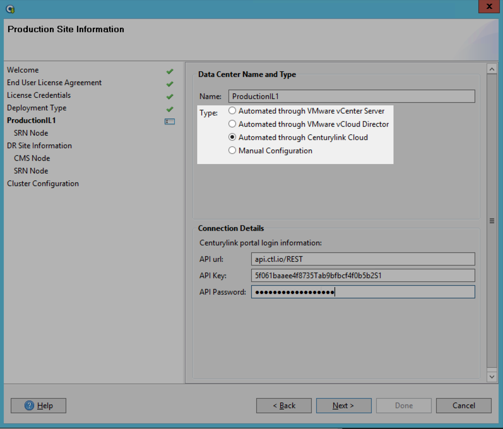

  * If your production environment is in the CLC then you would select  `Automated through CenturyLink Cloud`
  * If your production environment is on your premise then you would select `Automated through VMWare vCenter Server`

4. Update the Connection Details with the correct **API information**

  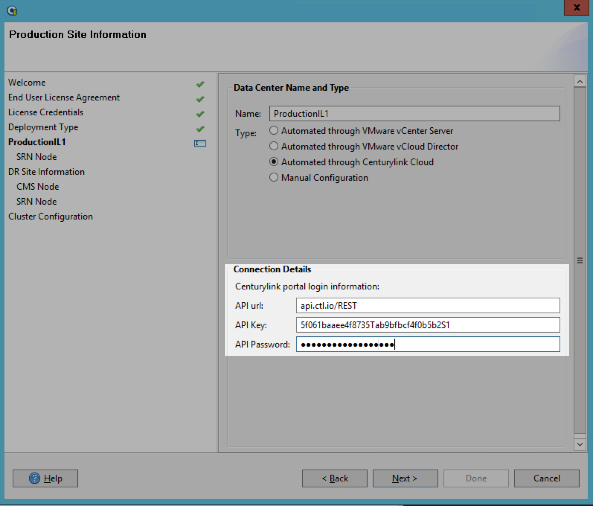

  * For CLC Connection types we will enter in our API v1 User Information (you may want to create a special user just for this)
  * For On-Prem types you will enter in a VMWare vCenter user

5. Select the correct Production SRN from the environment servers listed.  You will select the correct Production Datacenter from the Locations list, followed by the **SRN** contained within that location.

  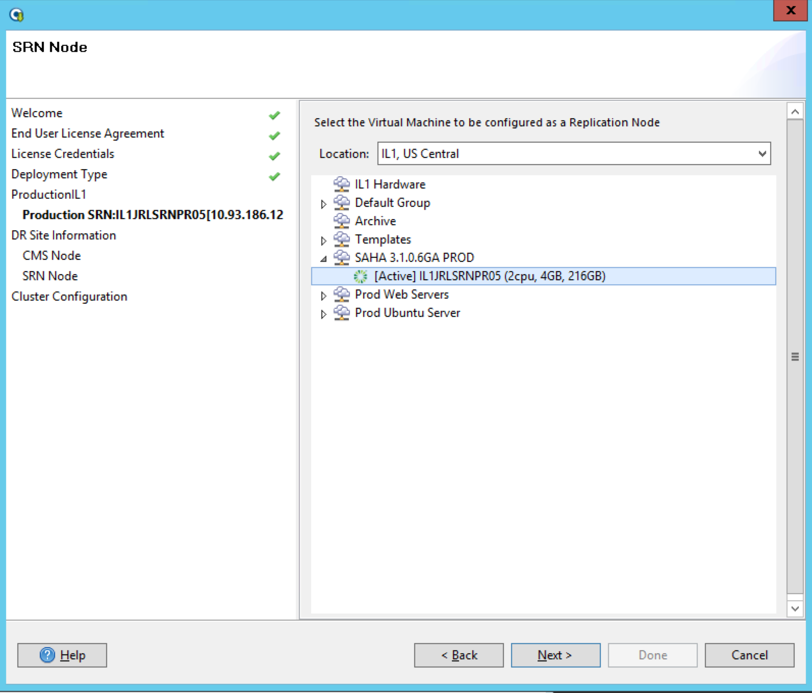

  * Note that if your API / VMWare information is wrong on the previous screen you will not see the correct infrastructure to select from

6. Enter a **name** for the DR Site Information (this should be something descriptive - like DRDATACENTERALIAS)

7. Select the correct DR side **type**

8.  Update the Connection Details with the correct **API information**

  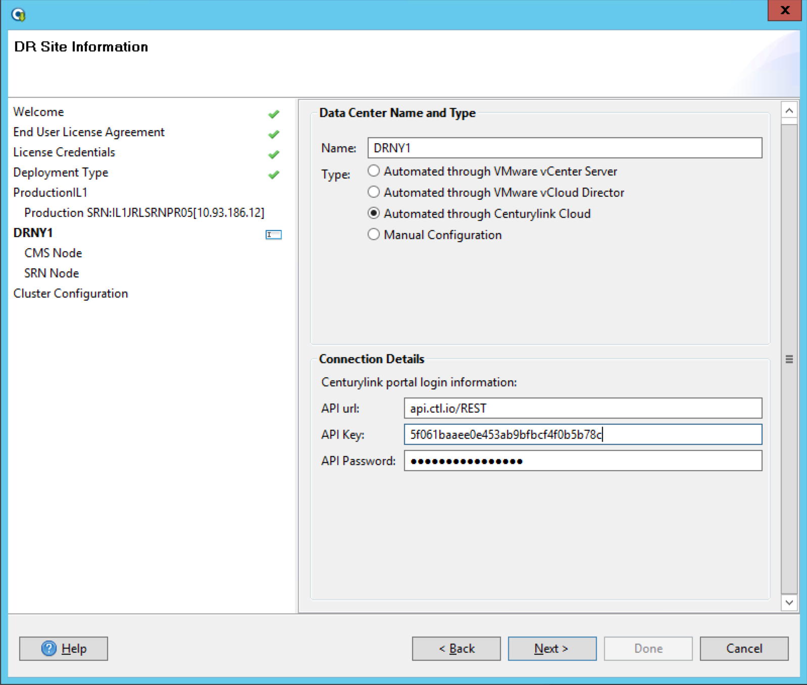

9. Select the correct **CMS** from the environment servers listed.  You will select the correct DR Datacenter from the Locations list, followed by the **CMS** contained within that location.

  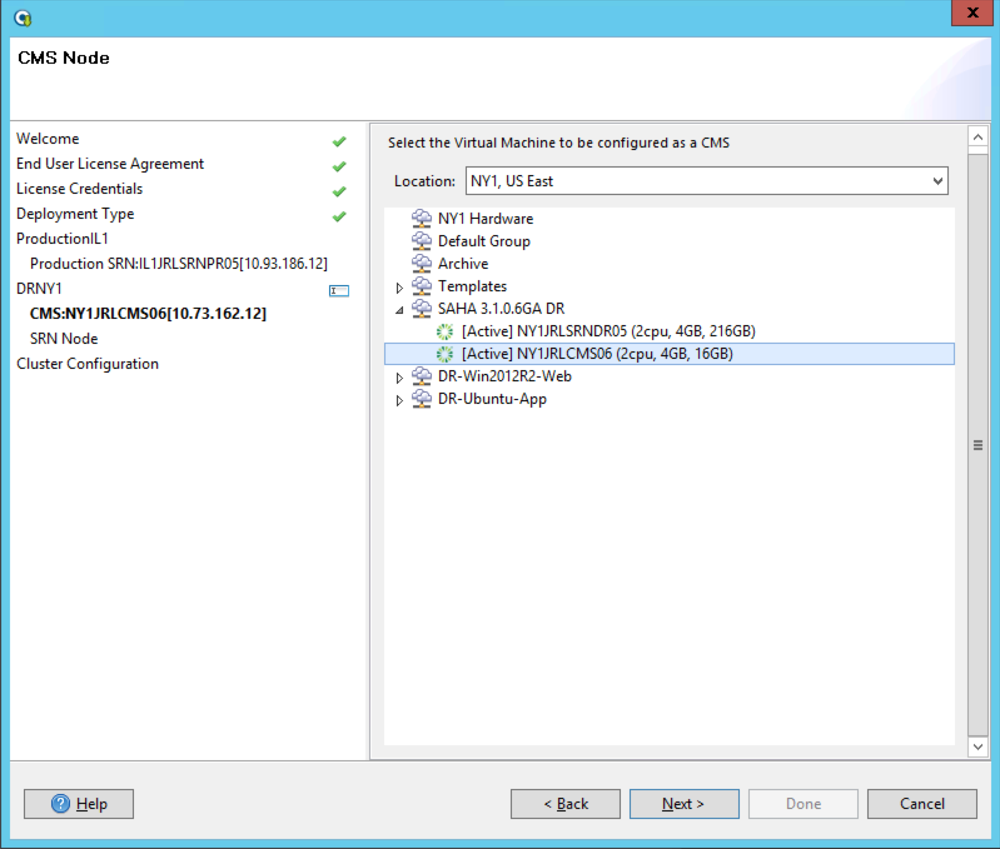

10. Select the correct **DR SRN** from the environment servers listed.  You will select the correct DR Datacenter from the Locations list, followed by the **SRN** contained within that location.

  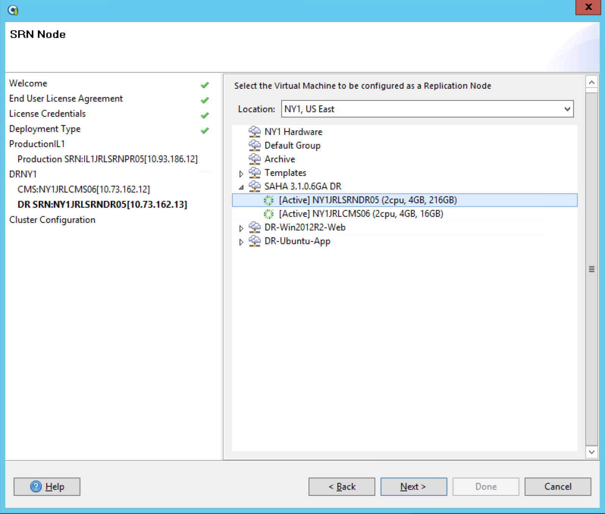

11.  Complete the required sections for the Custer Configuration section.  Here you will be providing passwords, the SafeHaven distribution URL, and confirming other settings predefined.

  **CMS Section**

  * **Administrator Password** - Here we are specifying an administrative password that will be used by the user **Administrator** on the CMS.  This will be the account you connect to the CMS with.

  * **Root Password** - This is the root password for the CMS node that was previously defined during the build process.

  * **SafeHaven distribution URL** - This is the NO SBD link for the current code level of your SafeHaven Environment

      * ***3.1.0.6u3*** - https://www.dropbox.com/sh/8c32qpjseds8srz/AACvFrqpe06NsGRKGQMvuDYXa/SafeHaven3.1.0.6-u3_nosbd_11-04-2015_bin.tar.gz?dl=0

  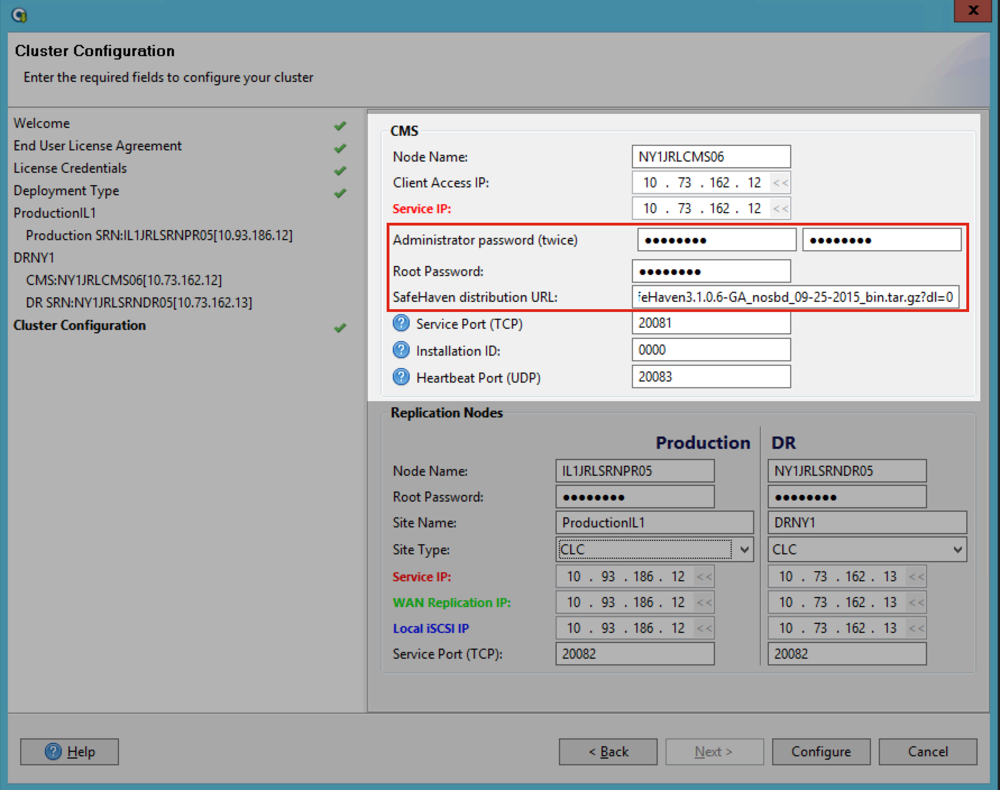

  **Replication Nodes Section**

  * **Root Password** - This is the root password for the SRN node that was previously defined during the build process.  You will need to specify a password both for the Production side, as well as the DR side.

  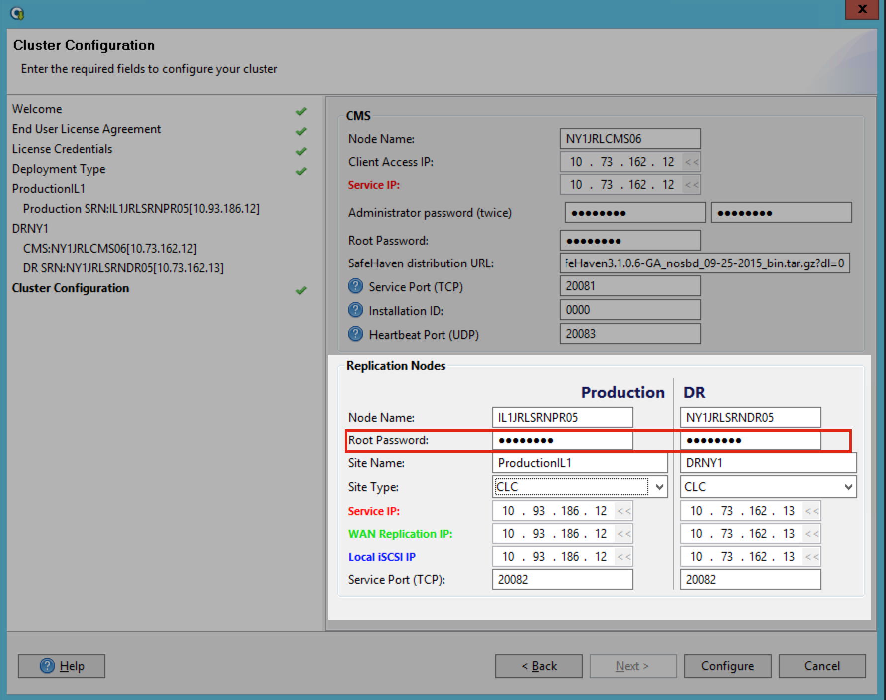

  **Confirm other settings, however do not modify any port information.**

12. Press configure to begin the configuration process.  Once the process has completed successfully the following window will display **Configuration was successful**

  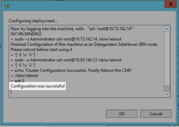

You should now be able to connect to your cluster by utilizing the correct GUI version of the Console software.  Note that you'll be connect to the CMS from here.

  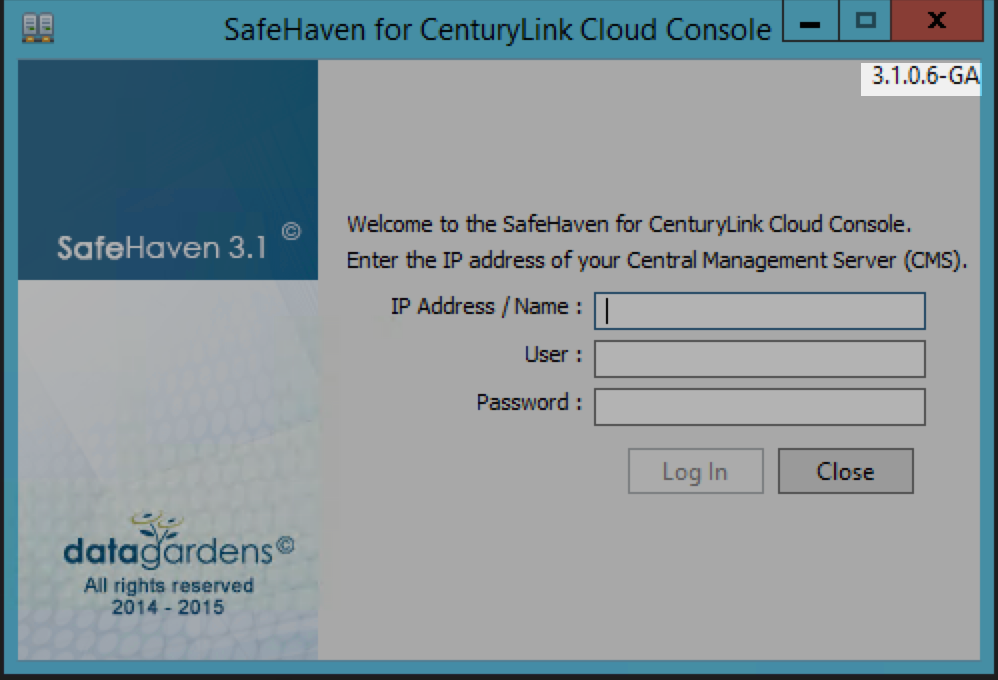
