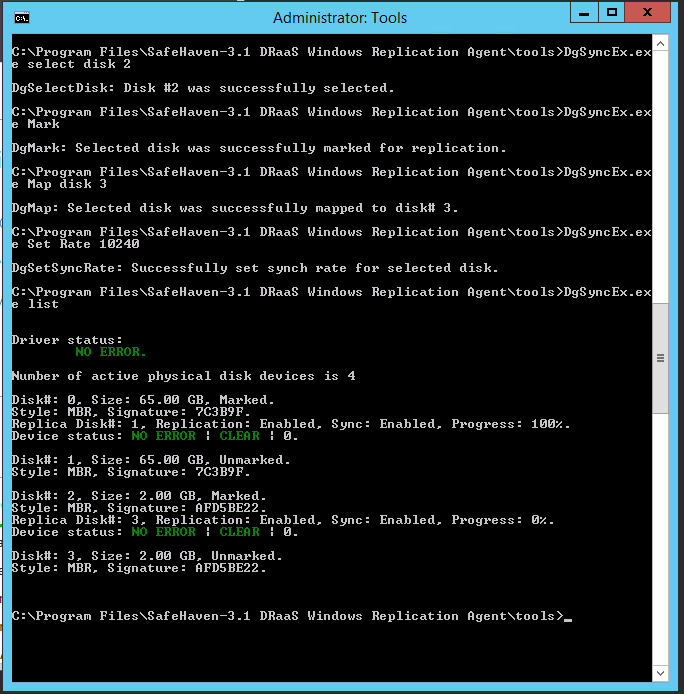

{{{
  "title": "SafeHaven 4.0: Adding, Removing, and Expanding: Disks and VMs",
  "date": "02-13-2017",
  "author": "Aaron Young",
  "attachments": [],
  "contentIsHTML": false
}}}

### Article Overview
This article walks you through the process of adding, removing, and expanding disks or VMs within your SafeHaven protection groups. Steps are provided for both the protected guest and the safehaven console.

### Adding a new disk to a protected VM

**1. Safehaven Console**

Adding a new disk to a protection group requires available space inside the protection group.  The space required is the total sum storage capacity of all disks to be protected. For example, if a protection group is 60GB in size, and the currently protected disks only use 40GB, then 20GB of space remains for additional protection. If your protection group does not have enough free space, you will be unable to add the disk until you expand it. See the [Protection Group Expansion KB](https://link.com) for more information. 

You can view your protected disks in the "Virtual Servers" tab of your protection group, as well as the available space.

Once your protection group has enough space, you can open the "Virtual Servers" tab and select the VM you would like to add a disk for, and then select "Create Disk for replication target" to open the wizard. Specify the properties of the disk and click "Finish".

**2. Protected Guest**

Login to the production server and go to Disk Management. You should see a new source disk (ISCSI) show up. You may need to rescan/refresh for the changes to be updated.  

Open the "Safehaven 4.0 DRaaS Windows Replication Agent/tools" folder with an admin command line shell and run "DgSyncEx.exe list". Note that new disks show up. You may need to run "DgSyncEx.exe rescan" if the disks have not yet refreshed.

Enter the following commands in image 3 to manually start replication from the unprotected disk to the new ISCSI disk.

### Expanding a protected disk

**1. Safehaven Console**

Expanding a disk in a protection group requires available space inside the protection group.  The space required is the total sum storage capacity of all disks to be protected. For example, if a rotection group is 60GB in size, and the currently protected disks only use 40GB, then 20GB of space remains for additional expansion. If your protection group does not have enough free space, you will be unable to expand the disk until you expand the protection group. See the [Protection Group Expansion KB](https://link.com) for more information. 

Once your protection group has enough space, you can open the "Virtual Servers" tab and select the VM you would like to expand a disk for, and then select "Expand Disk" to open the wizard. Specify the properties of the disk and click "Finish".

**2. Protected Guest**

Login to the production server and go to Disk Management. You should see the disk has a new size. You may need to rescan/refresh for the changes to be updated.  

Open the "Safehaven 4.0 DRaaS Windows Replication Agent/tools" folder with an admin command line shell and run "DgSyncEx.exe list". Note that new sizes show up. If you have already resized your source disk, the prompt may warn you that the size has changed. You may need to run "DgSyncEx.exe rescan" if the disks have not yet refreshed.

Once the sizes between the two disks match, replication should automatically resume. You can see the progress reset below 100% if there is remaining data to be synced.

### Removing a disk from a protected VM

**1. Safehaven Console**

Open the "Virtual Servers" tab for your protection group. Select the VM and the disk that you wish to remove and click "Delete".

At this time it is not possible to reduce the size of a protection group.

**2. Protected Guest**

Open the "Safehaven 4.0 DRaaS Windows Replication Agent/tools" folder with an admin command line shell and run "DgSyncEx.exe list". The prompt may warn you that a disk is missing. You may need to run "DgSyncEx.exe rescan" if the disks have not yet refreshed.

To remove a disk from replication, first run "DgSyncEx.exe select disk *num*" where *num* is the disk you wish to remove from replication.  Then run "DgSyncEx.exe unmap".  You can run "DgSyncEx.exe list" to see your changes.

### Adding a new protected VM to a Protection Group

**1. Safehaven Console**

Adding a new VM is much like provisioning a new Protection Group. Select the protection group you'd like to add a VM to and click the "Virtual Servers" tab. Then select "Add VMs" and a familiar provisioning wizard will allow you to add a new VM like you did during onboarding. As outlined in the "Adding a disk to a protected VM" guide above, additional storage space in the protection group may be required. Refer to the [Protection Group Expansion KB](https://link.com) for more information. 

If you'd like to automatically install the Local Replication Agent to the VM, the wizard has the option available. Alternatively, you can install it manually. See the [Local Replication Agent KB](https://link.com) for more information.

### Removing a protected VM from a Protection Group

**1. Safehaven Console**

Removing a VM is much like removing a disk. Select the protection group and then the "Virtual Servers" tab. You can select the VM you wish to remove and click "Remove VM from PG" to delete it. **Note:** Your VM will not be modified.

At this time it is not possible to reduce the size of a protection group.

**2. Protected Guest**

Log into the protected guest and uninstall the Safehaven Local Replication Agent via the "Uninstall" program in the Safehaven folder. This will uninstall the agent, remove all replication, as well as remove the folder, restoring your VM to an unprotected state.
