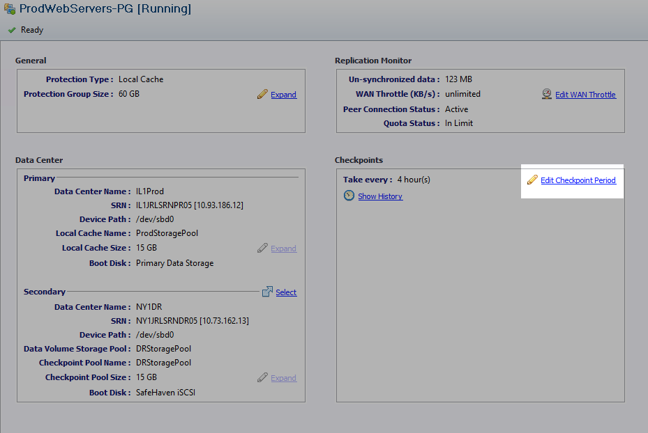
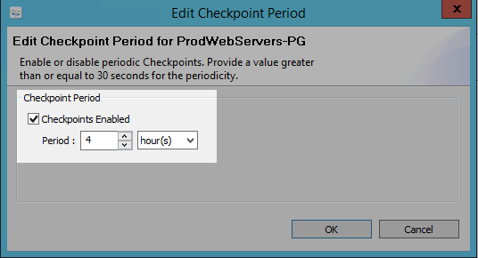
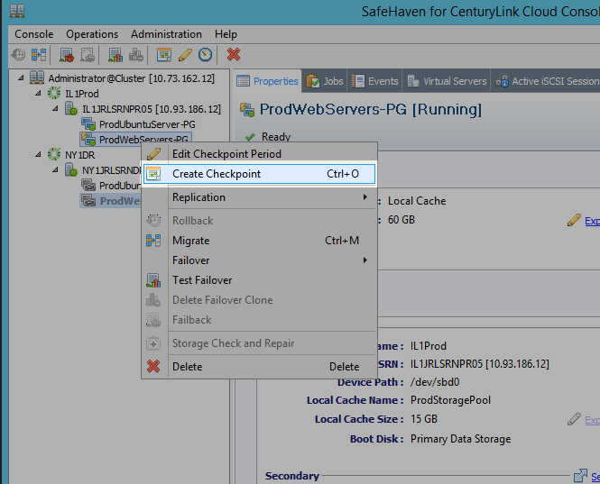
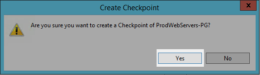
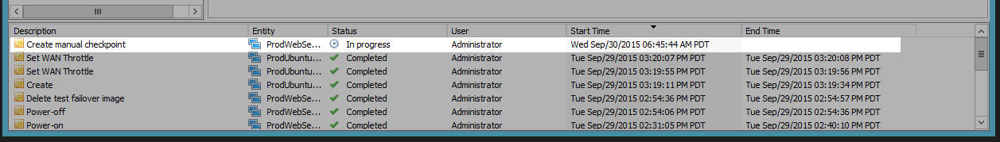
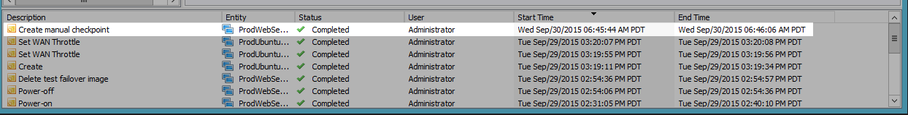
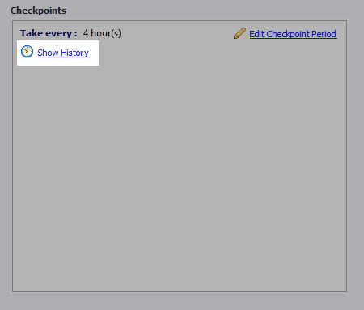
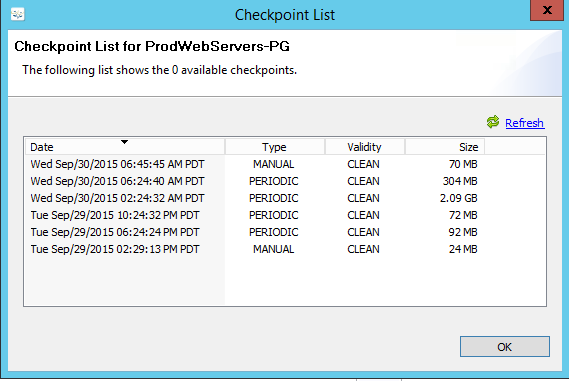

{{{
  "title": "SafeHaven 3.1: Checkpoints",
  "date": "04-08-2016",
  "author": "Jake Malmad",
  "attachments": [],
  "contentIsHTML": false
}}}

### Article Overview
This article walks you through the process of enabling, modifying, viewing, and taking checkpoints within your SafeHaven protection groups. Checkpoints are used by SafeHaven as the restorable points for a server and determine your recovery point objective.

## Enabling Checkpoints
1. Open your SafeHaven Console and login to the CMS.

2. Select **Edit Checkpoint Period**.
   

3. Under Checkpoint Period, ensure that **Checkpoints Enabled** is check marked and that a proper period time is specified. This is the frequency of checkpoints taken by SafeHaven.
   

### Editing Checkpoints
Similar to the above process, proceed to the **Edit Checkpoints Period**. From there you can modify the Checkpoint Period previously specified.

### Taking a Manual Checkpoint
There may be times when you wish to take a manual Checkpoint, either for test failover scenarios, or after some large changes have been synchronized.

1. Right-click on the protection group you wish to take a Checkpoint of and select Create Checkpoint.
   

2. Confirm that you want to create a checkpoint.
   

3. Wait for the task to complete. You can monitor the status in the jobs list at the bottom of the console.
   

   

### Viewing Checkpoints
To view both automatic and manual checkpoints, take follow the next steps.

1. Open the SafeHaven Console and login to the CMS.

2. Select **Show History** under the Checkpoints group.
   

3. The available Checkpoints displays with related data for the Checkpoints. Please note that checkpoints taken for Full Replica Linux VMs always show in an "Unknown" state rather than "Clean" checkpoints, despite being valid and bootable.
   
