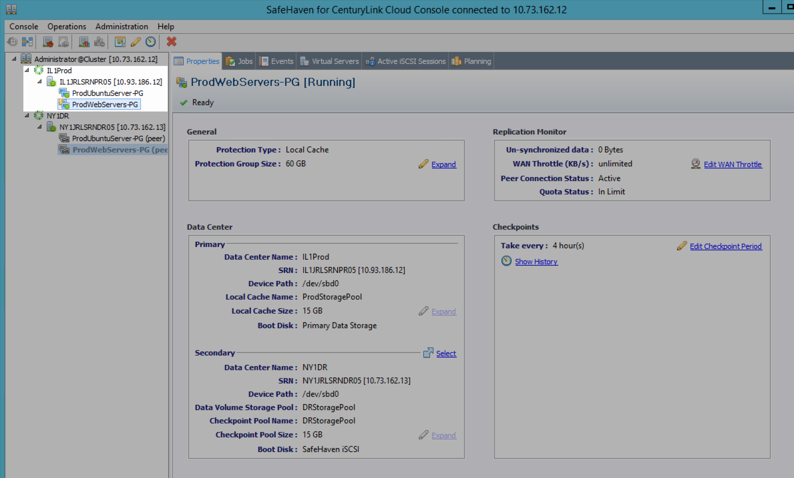
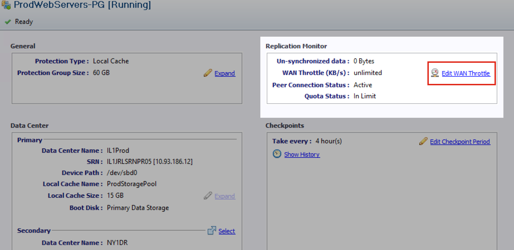
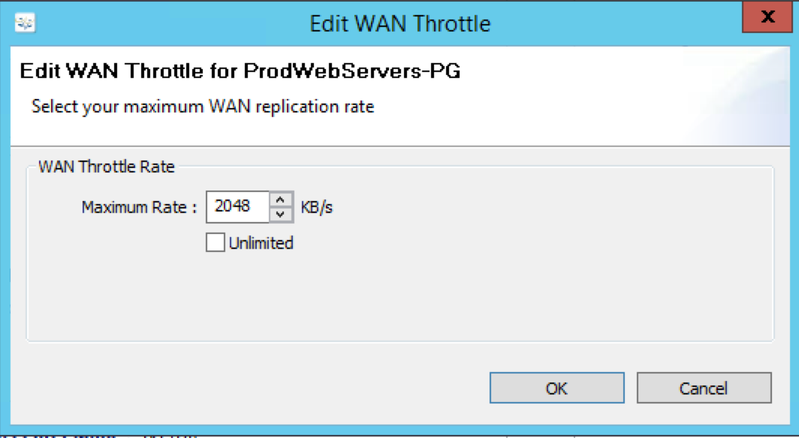

{{{
  "title": "SafeHaven 3.1: Modifying WAN Throttle",
  "date": "11-16-2015",
  "author": "Josh Leporati",
  "attachments": [],
  "contentIsHTML": false
}}}

## Article Overview
This article walks you through editing the WAN Throttle within your SafeHaven Protection Groups.  

This setting can now be controlled via the GUI, and is helpful if you need to limit the amount of replication traffic SafeHaven generates. For example, during off-hours you may wish increase the throttle to use more bandwidth (to decrease the overall sync time), or decrease the throttle during peak business times (which would in return slow down the replication timeframe).

## Modifying the WAN Throttle
The WAN Throttle is set in KB/s.

1. Launch the SafeHaven Console.

2. Select the correct Protection Group that you wish to modify.
   

3. Click **Edit WAN Throttle** from the Replication Monitor Section. You can also monitor current replication statistics from this section.
   

4. Check mark **Unlimited** for no throttle or specify your maximum KB/s limit in the **Maximum Rate** field.
   

5. Confirm that the change was completed by monitoring the tasks jobs at the bottom of the console screen.
   
