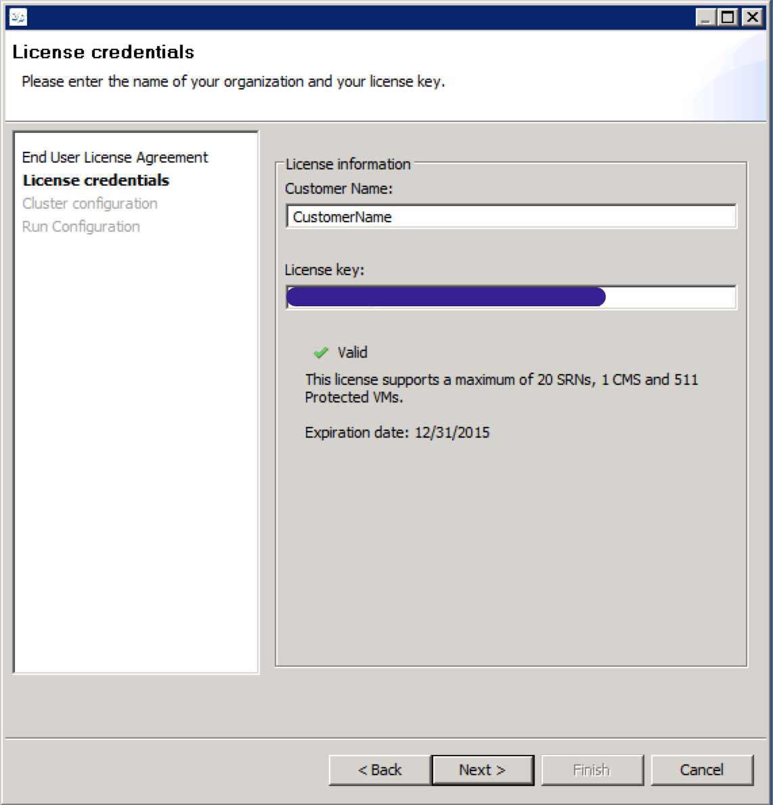

{{{
  "title": "Create A SafeHaven 3.1.1 Cluster",
  "date": "12-01-2015",
  "author": "Shasha Zhu",
  "attachments": [],
  "related-products" : [],
  "contentIsHTML": false,
  "sticky": true
}}}

### Article Overview
This article focuses on how to create a SafeHaven 3.1.1 cluster. In the article,
the primary site is VMware and the remote site is CenturyLink Cloud. Other types of clusters, such as CenturyLink Cloud to CenturyLink Cloud can be set up in a similar way. This article assumes that the CMS node and SRN nodes are already created on a SafeHaven-based image.

### Create Cluster
SafeHaven 3.1.1 integrates the cluster installer with the log-in console. You
setup the CMS first. Then, log-in to it via the SafeHaven console and next sites and SRNs. In this example, we show how to add a VMware site as the production site and how to add CenturyLink Cloud as the disaster recovery site.

#### Set up the CMS
* Double click on the SafeHaven3.1.1-Client.jar and click **Create new cluster**.
  

* Accept the End User License Agreement.
  

* Enter a user name and the license key.
  

- Enter the CMS information. **Client Access IP** is the IP used to log-in to the
  SafeHaven console and **Service IP** is the IP used to communicate with SRNs. Ensure that you enter the correct IP. **SafeHaven Distribution URL**
  is the URL containing the SafeHaven code. Currently, we use
  https://www.dropbox.com/s/bz75nmcccemseo0/SafeHaven3.1.1-GA_nosbd_12-16-2015_bin.tar.gz?dl=0. Ensure that the **Service Port** and **Heartbeat Port** are opened on both public IP and private IP.
  

- Click **Continue** to configure the CMS.
  

- Wait until the CMS is configured and rebooted. Then, log-in to it via the SafeHaven console.
  

- Here is an example of a successful log-in.
  

#### Add sites and SRNs to the cluster
In this section, we add sites and SRNs to the cluster.

- Right-click on the CMS node and select **Register Data Center**.
  

- Enter the **Data Center Name** and select the **Data Center Type**. The
  following shows adding a vCenter data center.
  

- In a same way, you can add a CenturyLink Cloud site.

- Register the **CLC-CA2** site.

- Click **Change Credentials**.
    

    - Enter the Control Potral username and password.
    

    - Choose the Location ID.
    

    - Enter the connection name which has to be unique. Click **Finish**.
    

- Register the VMware site. Enter the vCenter identifier, IP address of the
  vCenter, User Name, and Password.
  

- Register SRN. The following shows how to register a VMware SRN. You can register an SRN in the same way.
  
  

- Here is an example of a successfully registered SRN.
  
