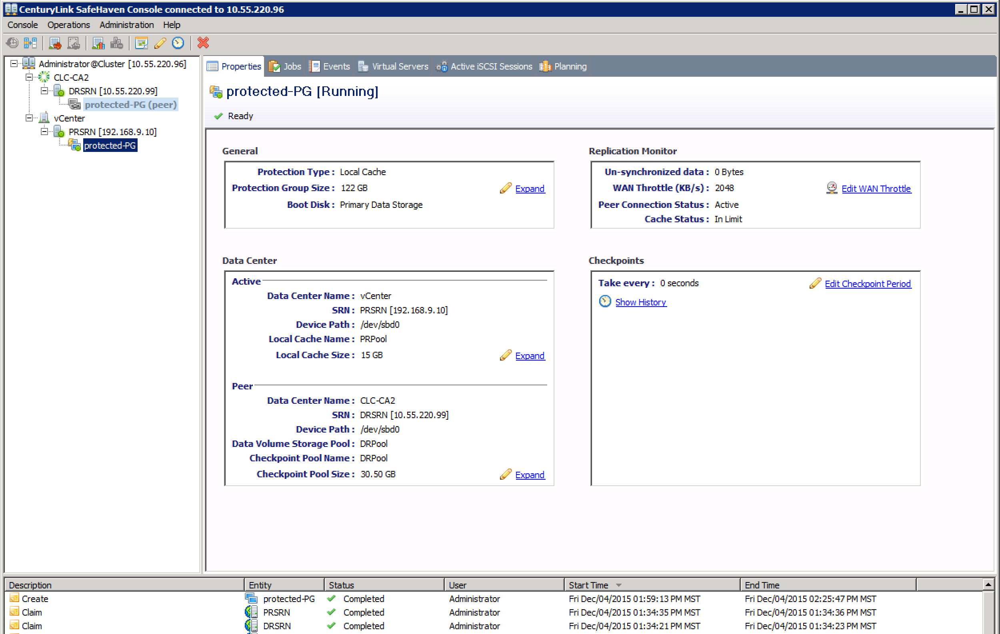
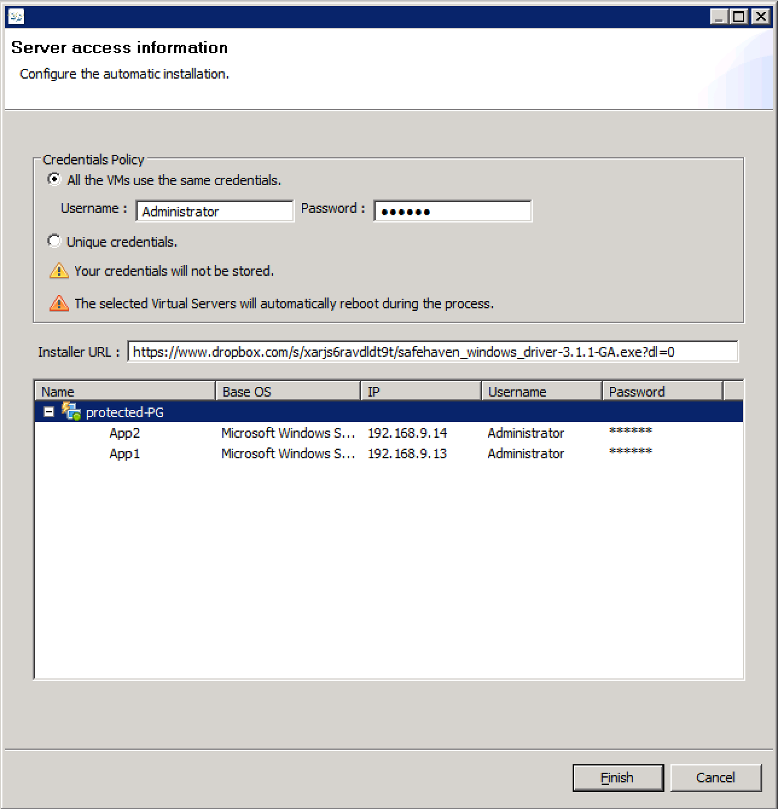

{{{
  "title": "Onboard Windows Servers with Automated LRA Installation and Stub Configuration",
  "date": "12-15-2015",
  "author": "Shasha Zhu",
  "attachments": [],
  "related-products": [],
  "contentIsHTML": false,
  "sticky": true
}}}

### Article Overview
This article demonstrates the procedure of on-boarding Windows server by leveraging the automated LRA installation and stub configuration introduced in SafeHaven 3.1.1. This includes pairing SRNs, claiming storage pool, protection
group creation, Local Replica Agent (LRA) installation, and makestub configuraion.

#### Pair The Two SRNs
- Highlight the PRSRN, under the Peers tabs, click **Add Peer**.
    

- Select the DRSRN and enter the passwords, then click **Register**.
    

- Now the two SRNs are paired.
    

#### Prepare Storage Pool
In this example, we are going to protect two VMs within one protection group.
The disk size is 61GB for each of VM, so in total the protection group is 122GB.
We recommend use 25% of primary storage as checkpoint pool, so the checkpoint pool is 30GB. Since this is Local Replica protection group, the storage recommended on PR SRN is 10% of the primary storage, i.e., 12.2G. The following example shows
how to claim the storage on PR SRN, assuming that there is already a 100GB disk
attached to the PR SRN node. In the same way, 200GB disk is claimed as storage
pool on DR SRN.

- Hightlight the PR SRN node, and click **Claim Storage Pool**.
    
- Select the block device and **Create a new Storage Pool**. Enter the storage
  pool name and click **Claim**.
    
- Now go back the **Properties** panel of the SRN node to verify a storage
  pool is created.
    

#### Create Protection Group
- Right-click on PR SRN and select **Create Protection Group**.

- Select DRSRN as remote SRN and select **I want to protect virtual machine(s)**.

- Browse the VM list on vCenter and select the vApp.

- Enter the information for deploying stubs.
  - Choose CLC server folder.
  - Enter the Alias and Proxy Tempalte for each of the stubs.
  - Select CLC VLAN for the stub.
  - Enter the Administrator password for the stubs.

- Review the protection group name and protected servers.

- Enter the local cache and select storage pools on both SRNs.

- Review the PG information and click **Finish**.

- After the PG is created.

#### Install Local Replica Agent and Start Replication
The automated LRA installation is an experimental feature. It requires that the
guest VM OS to be Windows 2008 R2 or later. Also port TCP `445` has to open on
guest VMs.

- Right-click on the PG and select **Install SafeHaven Local Replication
  Agent**.
  
- Enter the guest VMs username, password, URL of download LRA, and the IP
  addresses of protected VM. Ensure that the IP addresses entered match the
  source VM.
  
- After ten minutes or so, the replication has been started. Refer to the
  following screenshot. The un-synchronized data begins to accumulate.
  
- Verify every protected VM in the PG is connected to the iSCSI target and the
  replication has started on each VM.
  

#### Configure Stub

The automated stub configuration procedure powers on the stubs, installs the
makestub.exe, and configures the stubs to boot from the right target. Then, it
powers off the stubs. This step has to be done before the Test-Failover. The stubs has to be Windows 2008 R2 or later, and TCP `445` port is required to open. Please also match the NIC type and PCI number of the stubs with the guest VMs. 

- Right-click the PG and select **Install SafeHaven MakeStub**.
 
- Enter the stub username, password, URL of downloading the makestub.exe, and
  the IP addresses of stubs. Ensure that the IP addresses entered match the
  source VM name. For example, in the following, 10.55.220.149 is the stub IP which matches to source VM App2. After configuring makestub, the stub with
  this IP is the recovery VM for App2.
  
