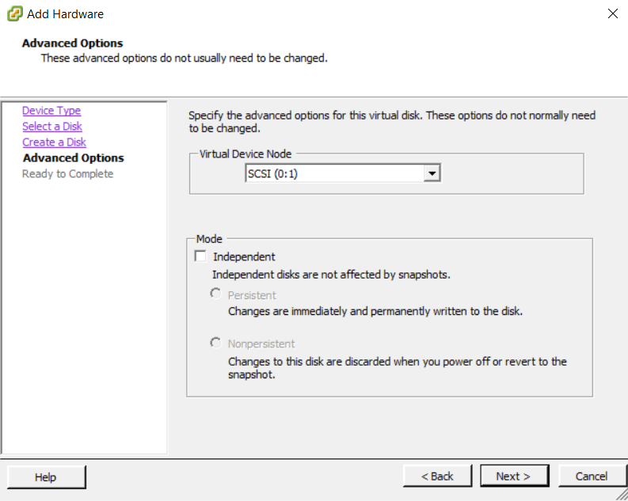
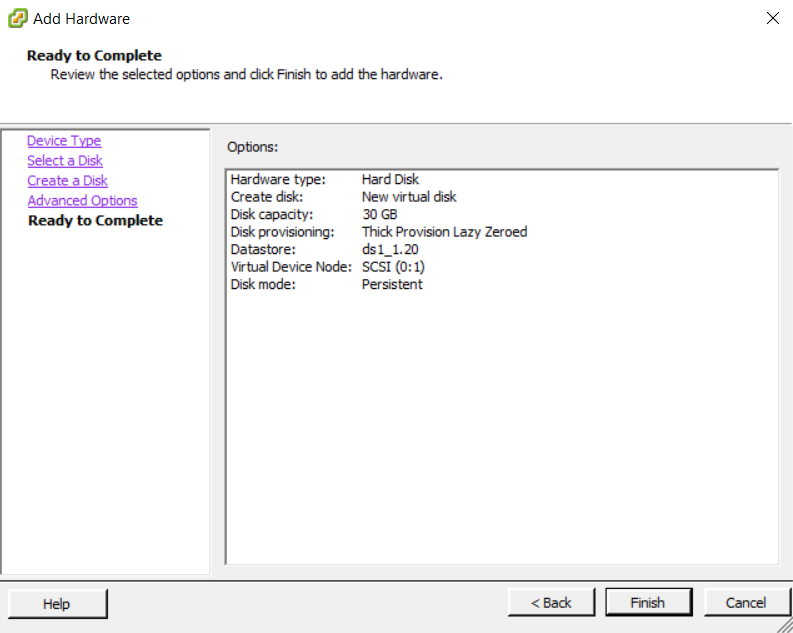

{{{
  "title": "Attach and Claim Storage on SRN",
  "date": "05-08-2017",
  "author": "Sharon Wang",
  "attachments": [],
  "contentIsHTML": false
}}}

### Article Overview

This article explains how to
1. Attach storage on a single SRN in Lumen Cloud and VMware
2. Claim storage on a single SRN from the SafeHaven Console

After the SRN has been registered with the SafeHaven Console, the next step is to attach storage to it before creating Protection Groups. Once the storage is attached, the user has to claim the attached storage and allocate it to a Storage Pool in order to use the storage for Protection Group creation. Storage Pool lets the user allocate the attached storage for creating a single or multiple Protection Groups. A single Storage Pool can span across multiple disks.

**NOTE**: For ease of management and troubleshooting it is recommended that the user creates one Storage Pool per Protection Group.

**NOTE**: Once a disk has been claimed and allocated to a Storage Pool and there is a requirement to expand that Storage Pool, then the user should NOT expand that the existing claimed disk on the SRN but instead attach a new disk and claim it to the same Storage Pool.

### Requirements

1. Access to the SRN in Lumen Cloud portal
2. Access to the SRN in VMware environment
3. Access to the SafeHaven Cluster

### Assumptions

This article assumes that the user has already registered the SRN within the SafeHaven Console and wants to add storage to the SRN before creating Protection Groups.

### Add storage to SRN in Lumen Cloud

Select **Servers** under the **Infrastructure** tab. In the Navigation Tree, select the **SRN**, you want to add storage to, then scroll down on the main data panel and select **edit storage**.

Select **add storage** and then in the drop-down menu select **raw disk**.

**NOTE**: **DO NOT** select a **partitoned** disk.

Add required storage and **apply**. Wait for the job to complete.

**NOTE**: **DO NOT** expand an existing disk on the SRN after it has been claimed.

### Add storage to SRN in VMware Data Center

Right click on the SRN in the VMware data center, select **Edit Settings**.

On the pop-up panel, click on **Add** to add new devices.

Select **Hard Disk** then click **Next**.

Select **Create a new virtual disk** and click **Next**.

Enter the **Disk Size** and select **Thin Provision** (depending on your environment you can also select **Thick Provision Lazy Zeroed**). Specify a **datastore** location and click **Next**.

Leave the default option **SCSI(0:1)** as the **Virtual Device Node** (as this is the first disk being added) and click **Next**.

Confirm all the information is correct, click on **Finish** to add the new disk.

**NOTE**: Following this procedure the user can add multiple disks to the SRN.

**NOTE**: **DO NOT** expand an existing disk on the SRN after it has been claimed.

### Claim storage pools for each SRN

Once the storage has been attached to the SRN, the next step is to login to the **SafeHaven Console**, go to the Navigation Tree and select the SRN. In the **Properties Panel** select **Claim Storage Pool**.

If this is the first storage device you are claiming, then select the **Storage Device** you want to claim and click on the **Create a New Storage Pool**. Provide the new pool a **Name** and click **Claim**.

Depending on the protection group architecture, the user can claim another disk following a similar procedure and can either **Create a new Storage Pool** or **Add to an existing Storage Pool**

Perform a similar task for all the registered SRN's.
