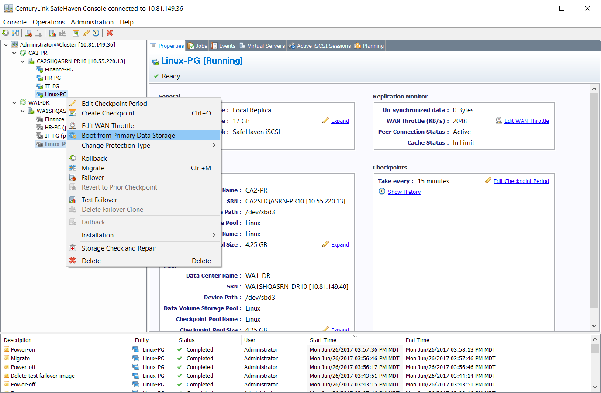
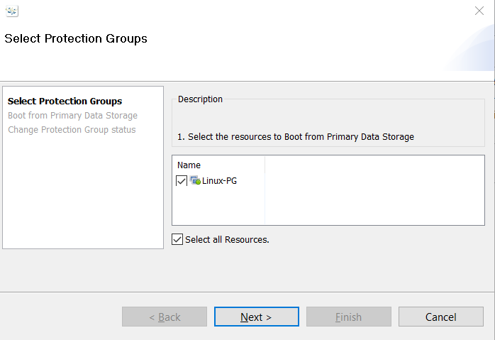
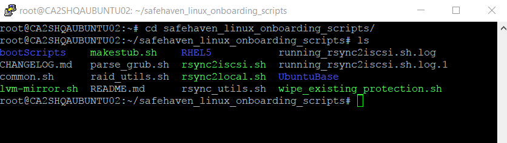
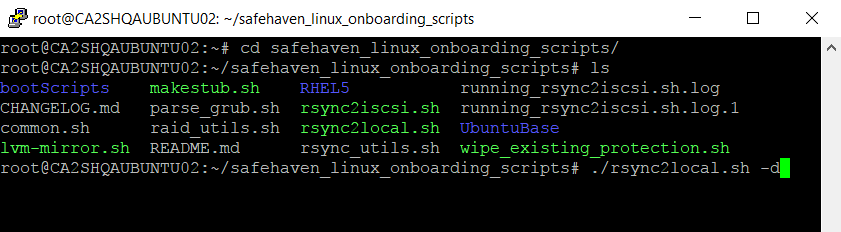
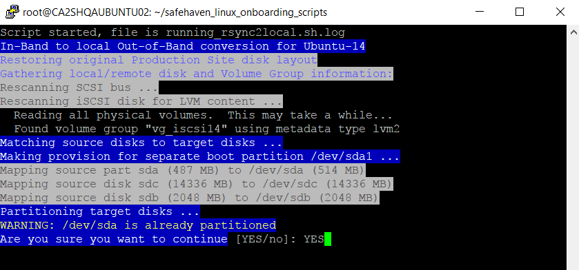
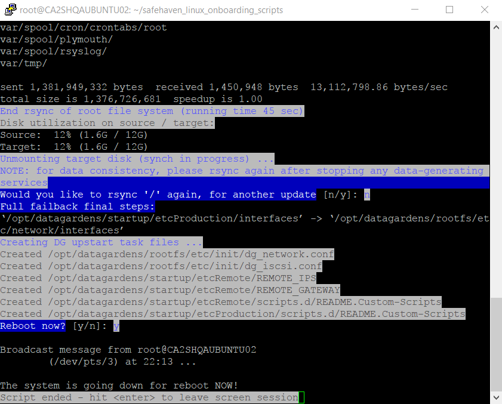
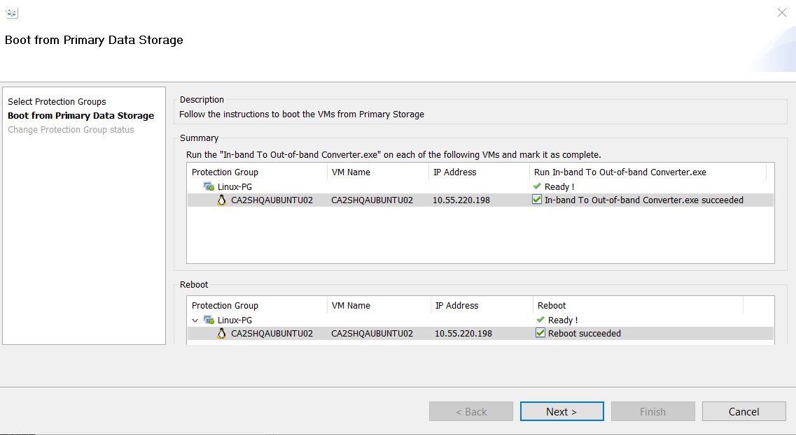
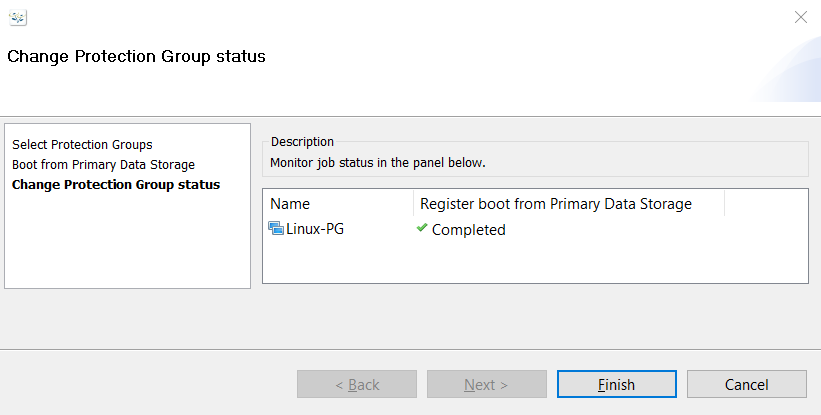

{{{
  "title": "Boot from Primary Data Storage for a Linux Protection Group",
  "date": "06-28-2017",
  "author": "Sharon Wang",
  "attachments": [],
  "contentIsHTML": false
}}}

### Article Overview
This article explains how to boot from a Production VM using primary data storage after it has been configured to boot from iSCSI disks for failback. This is the last step for failback.

**NOTE**: To follow this procedure the user MUST have already completed Failback Phase 1 and Phase 2 covered in the [Failback a Linux Protection Group](Failback a Linux Protection Group.md) KB Article.

### Requirements
1. The protection group has already been Failed Back from the DR site back to its production site. The Production site is now the active site.
2. The Production server must be configured with makestub.sh to boot from the disk of the production SRN.
3. The Production Server must have been successfully booted from the production SRN's disks.

### Assumptions
This article assumes that the user has already successfully performed Failback Phase 1 and Phase 2. The Production VM is configured with makestub.sh and is booting from the iSCSI disks. The user is ready to copy data from the iSCSI disks to the production VM's local disk and then boot the VM from Primary Storage.

For the purpose of this article, we are using Ubuntu 14 as a production server in Lumen's CA2(Toronto) production datacenter. The recovery site is Lumen's WA1(Washington) recovery datacenter.

### Boot from Local Storage
1. Right-click on the Linux protection group, and click **Boot from Primary Data Storage**.
   

2. Select the Linux Protection group then click **Next**.
   

3. Login to the production server, and go to the "Safehaven _linux_onboarding" directory.
   

4. Run **./rsync2local.sh**. Use **-d** to run the script with default parameters.
   This script will copy the data from the SRN's disks to the production VM's local disks.
   

5. Enter **YES** when the script asks **Are you sure you want to continue?**
   

6. The script copies all of the files from the SRN's disks to the production VM's local disks. This may take some time. Once the copy is complete, the script automatically reboots the VM, provided you ran the script with the **-d** option.
   

7. Go back to the SafeHaven Console. Check the boxes for **Manual setup needed** and **Manual Reboot needed**. Then, click **Next**.
   

8. Wait until the **Register boot from Primary Data Storage** is completed. Then, click **Finish** to exit the wizard.
   

The production VM and the Protection group should now be in the same state that they were in before failover.
