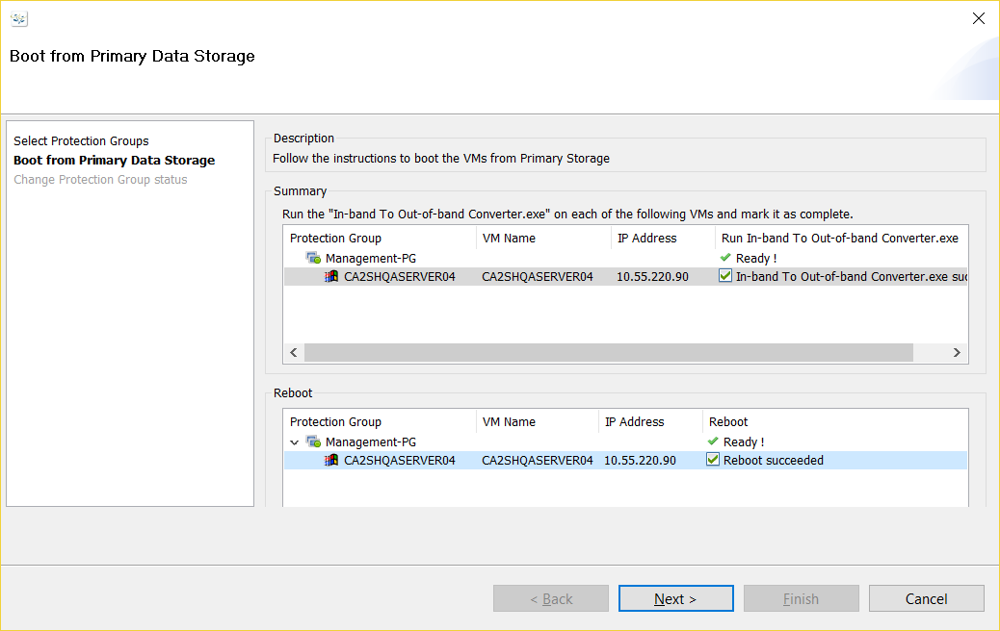

{{{
  "title": "Boot from Primary Data Storage for a Windows Protection Group",
  "date": "08-31-2017",
  "author": "Sharon Wang",
  "attachments": [],
  "contentIsHTML": false
}}}

### Article Overview

This article explains how to boot from a Production VM from primary data storage after it has been configured to boot from iSCSI disks for failback. This is the last step for failback.

**NOTE**: To follow this step the user MUST have already completed Failback Phase 1 and Phase 2 covered in [Failback a Windows Protection Group](Failback a Windows Protection Group.md) KB Article

### Requirements

1. The protection group has already been Failed Back from the DR site back to its production site. The Production site is the active site now.
2. The Production server should be configured with makestub.exe to boot from the disk of the production SRN.
3. The Production Server should be successfully booted from the production SRN's disks.

### Assumptions

This article assumes that the user has already performed Failback Phase 1 and Phase 2, and the Production VM has been configured with makestub.exe and is booting from the iSCSI disks. Now the user wants to copy data from the iSCSI disks to the production VM's local disk and then boot the VM from the Primary Storage.

For the purpose of this article, we have used Windows 2012R2 as a production server in Lumen's CA2(Toronto) production datacenter. The recovery site being used is Lumen's WA1(Washington) recovery datacenter.

###Boot From Primary Storage
Log into production server, find ** In-band To Out-of-band Converter**

Leave the 2 boxes checked and click on ** Next**

Choose 81920 KB/s as Sync Rate and click on ** Next**

A pop-up window will inform that the existing mapping will be erased, click on ** yes**

Wait till Progress reaches 100%, click on **Swap**

A pop-up warning will show up, click on ** yes**

The boot disk is swapped to local disk, Click on ** Next**

Select ** Yes, restart the computer now** and click on finish to reboot the production server

Go back to SafeHaven Console, right click on **Management-PG**, select ** Boot from Primary Data Storage**.

Select ** Management-PG** and click on ** Next**

Check both boxes adn click on ** Next**

Once the Register is completed, click on ** Finish** to exit the wizard

This Article concludes the Failover, Failback and Boot from Primary storage for a Windows Protectiong Group.
