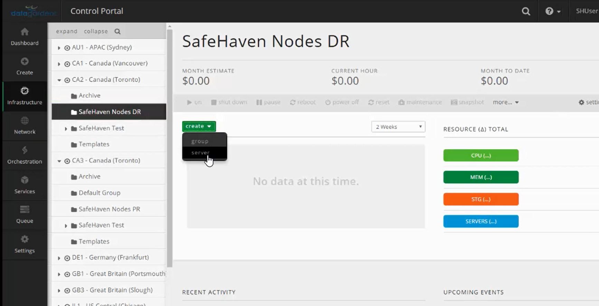

{{{

  "title": "Deploy CMS and SRN in CenturyLink Cloud",

  "date": "05-04-2017",

  "author": "Sharon Wang",

  "attachments": [],

  "contentIsHTML": false

}}}

### Article Overview

This article explains how to deploy the Central Management Server(CMS) and SafeHaven Replication Node(SRN) in CenturyLink Cloud.

A single CMS server is required for a single SafeHaven Cluster. Typically CMS resides in the DR datacenter so that users can access it and manage their SafeHaven environment, even if the production datacenter is unavailable. In this scenario our DR site is CA2-Canada(Toronto) in CenturyLink Cloud.

SRN resides in both production and DR datacenters and work in pairs. A single SafeHaven Cluster can have upto 64 SRN's registered. Total number of SRN's depend on the size and type of environment that needs to be protected. 

Please refer to the **Support Matrix** section in the [SafeHaven 4.0.1 Release Notes](safehaven-4.0.1-release.md) for more information.

### Requirements

Login access to the CenturyLink Cloud Portal at https://control.ctl.io.

### Assumptions

This article assumes that the user has login access to the CenturyLink Cloud Portal. Login to the **CenturyLink Control Portal**  https://control.ctl.io with your credentials.

### Deploy the Central Management Server(CMS) in CenturyLink Cloud

We will deploy the Central Management Server (CMS) for the SafeHaven Cluster. CMS acts as a master server for the SafeHaven Cluster and commands from the SafeHaven Console (GUI) are parsed by the CMS and then sent for execution to the appropriate SRNs in the appropriate datacenters.

Select **Servers** under the **Infrastructure** tab.

Select the **Recovery DataCenter** (in this case its CA2-Canada (Toronto)) and the appropriate **Server Group** to deploy the CMS.

Select the **Server Group** and click on **Create Server** from the drop-down menu.

Under the **Create Server** section, select the **Standard** server type.

Select **Ubuntu 14 | 64 bit** as the **Operating System** type. Provide a **Name** and **Description** for the CMS. Provide a strong **root password** and confirm it.

Configure the CMS with **1 vCPU** and **2GB of memory**. (bare minimum requirements)

Under the **Network** section, select a **network** (VLAN) that will have connectivity to the all the SRNs (both in production and DR datacenter) and enter the **Primary and Secondary DNS**. Click on **Create Server**. Wait for the server to get deployed.

### Deploy the SafeHaven Repliation Node(SRN) in CenturyLink Cloud

Login to the **CenturyLink Control Portal** with your credentials and select the appropriate **DataCenter** (in this case its CA2-Canada (Toronto)) and the appropriate **Server Group** to deploy the SRN. Click on **Create Server** from the drop-down menu.

Under the **Create Server** section, select the **Standard** server type. Select **Ubuntu 14 | 64 bit** as the **Operating System** type. Provide a **Name** and **Description** for the SRN. Provide a strong **root password** and confirm it. 

Configure the SRN with **2 vCPU** and **4GB of memory**.(bare minimum requirements)

Under the **Network** section, select a **network** (VLAN) that will have connectivity to the peer SRN, CMS and the appropriate recovery / production servers(depending on the environemnt) and enter the appropriate **Primary and Secondary DNS**. Click on **Create Server**. Wait for the server to get deployed.

You have now completed the deployment of CMS and SRN in CenturyLink Cloud. After completing the deployment of all the required SRNs, you can then start installation of the SafeHaven Cluster.

