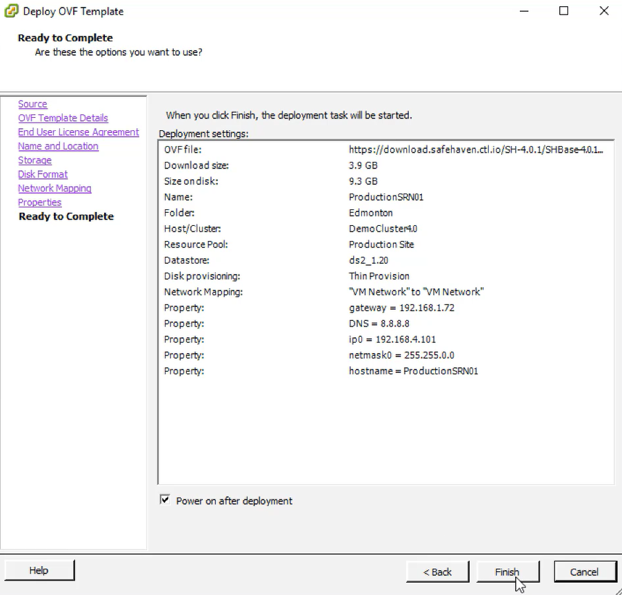

{{{
  "title": "Deploy SRN in VMware (Private or On-premise DataCenter)",
  "date": "05-04-2017",
  "author": "Mahima Kumar",
  "attachments": [],
  "contentIsHTML": false
}}}

### Article Overview

This article explains how to deploy the SafeHaven Replication Node(SRN) in VMware (Private or On-premise DataCenter).

### Requirements

Login access to the production VMware vCenter environment.

### Assumptions

This article assumes that the user has login access to **VMware vCenter** environment.

### Deploy the SafeHaven Repliation Node(SRN) in VMware

Login to the **VMware vCenter** with your credentials and select the appropriate **Host** and **Resource Pool** to deploy the SRN. Click **File**, select **Deploy OVF Template...** from the drop-down menu.

**NOTE**: Get the SHBase OVA link from the latest SafeHaven release notes. For this article we are using [SafeHaven 4.0.1 Release Notes](safehaven-4.0.1-release.md).

Copy the **SHBase-4.0.1-Mar-20-2017.ova URL** from the **Download Links** section in the [SafeHaven 4.0.1 Release Notes](safehaven-4.0.1-release.md).

Paste the URL in the  **Deploy from a file or URL** section and click **Next**. (Alternatively the user can download the OVA and use **Browse** option to use the downloaded OVA)

Confirm the **OVF Template Details** and click on **Next**

**Accept** the **End User License Agreement** and click **Next**

 Provide a **Name** and **Inventory Location** for the SRN. Click **Next**

Choose a datastore for SRN deployment, click on **Next**

Select the **Disk Format** as **Thin Provision** and click **Next**

Confirm the **Source and Destination Networks** and click on **Next**

Provide the **Networking Properties** for the SRN and Click **Next**

Confirm the Deployment settings, check **Power on after deployment** and click **Finish** to start the deployment. Wait for the delpoyment to complete.

**NOTE**: Once the deployment completes, confirm the SRN has atleast **2vCPU and 4GB RAM** (bare minimum requirements)by right-clicking on the SRN and selecting **Edit Settings**.

Click on the SRN and navigate to the **Summary** tab in VMware to get the **Login Credentials for root user** under the **Annotations** section.

SRN deployment in VMware is now complete.
