{{{
  "title": "Failback a Linux Protection Group",
  "date": "06-28-2017",
  "author": "Sharon Wang",
  "attachments": [],
  "contentIsHTML": false
}}}

### Article Overview

This article explains how to Failback a Linux Protection Group from a Recovery Datacenter back to its Production Datacenter. The user should make sure that the production site is available before initiating a Failback.

**NOTE**: Failback is a disruptive operation since the Recovery Server is powered OFF and the production server is Powered ON during the operation.

### Requirements
1. Verify that the protection group is in a healthy state.
2. Verify that the Production server is available for failback.

### Assumptions
This article assumes that the Protection group is in a failed over state and the production VM is available to initiate a failback.

For the purpose of this article, we are using Ubuntu 14 as a production server in Lumen's CA2(Toronto) production datacenter. The recovery site is Lumen's WA1(Washington) recovery datacenter.

### Failback
1. Once the production site is ready for failback, right-click the protection group on the DR Site and click **Failback**.
   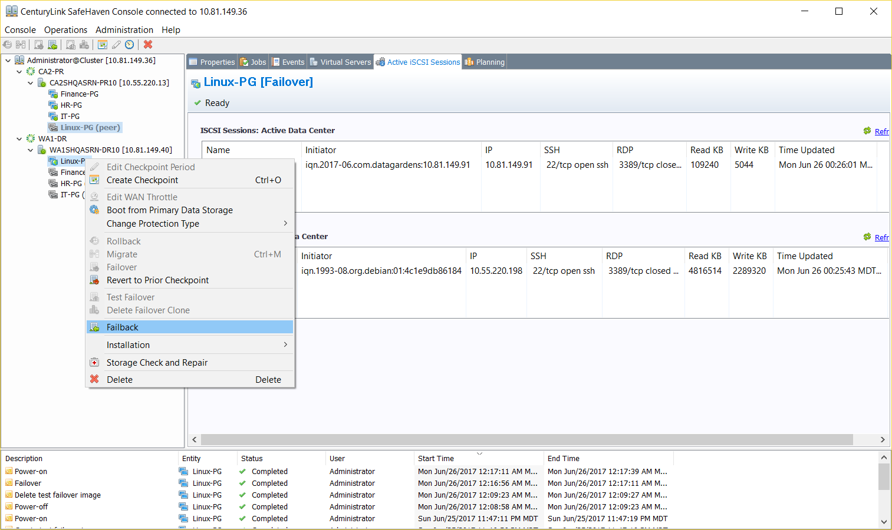

2. Leave the **Automated Power Operation** box checked and click **Next**.
   This automatically shuts down the production server, if it is still ON to avoid a "split-brain" scenario in which both the production and recovery servers are ON at the same time.
   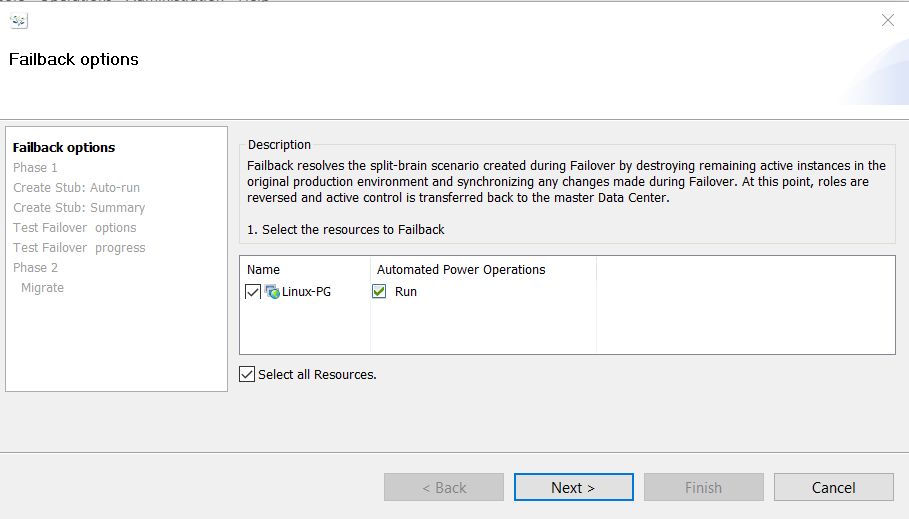

   Synchronization of data from the DR SRN to the Production SRN is initiated. It may take some time to synchronize all of the changes on the DR side with the production side, depending on the number of changes written in the Recovery Server after Failover.

3. Wait until the Failback Resync is complete. Then, click **Next**.
   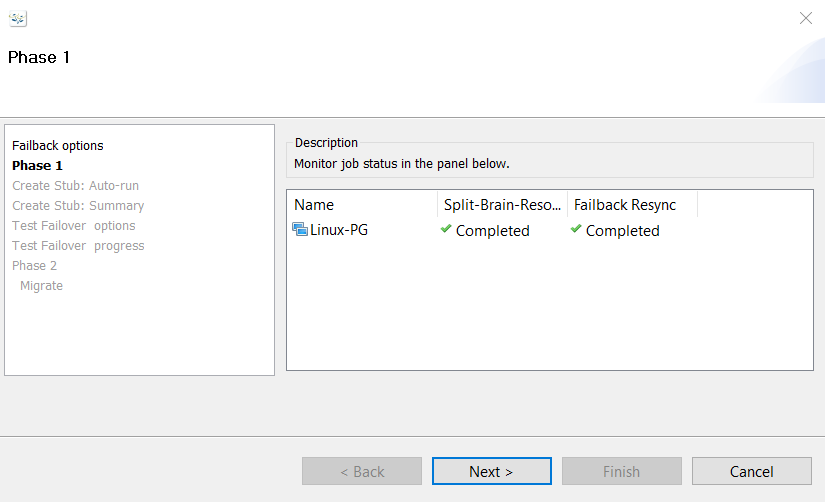

4. Uncheck the **Auto-Stub configuration** box and click **Next**.
   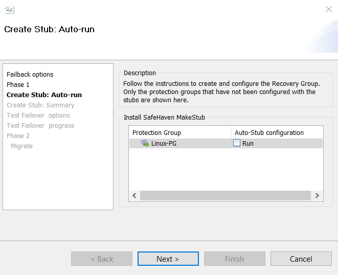

5. Check the boxes for **Manual setup needed** and **Manual Shutdown needed**. Then, click **Next**.
   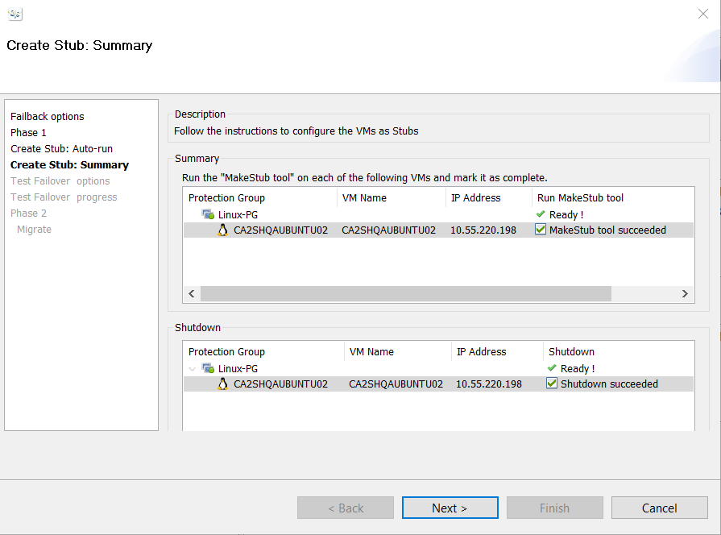

6. Leave the **Skip** Test Failover box unchecked. Choose a clean and 0 Bytes checkpoint. Then, click **Next**.
   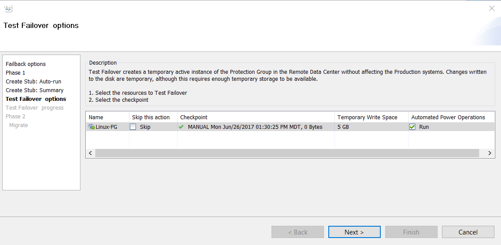

   Wait till Test Failover and Power on have completed. The production VM should be powered ON.

7. The Production server is now configured to iSCSI boot using the disks of the Production SRN instead of its own local disks. We **strongly recommend** taking a snapshot of the Production VM at this point from the Lumen Control Portal.
   

8. Log in to the production server.

9. Go to the "Safehaven_linux_onboarding_scripts" directory.
   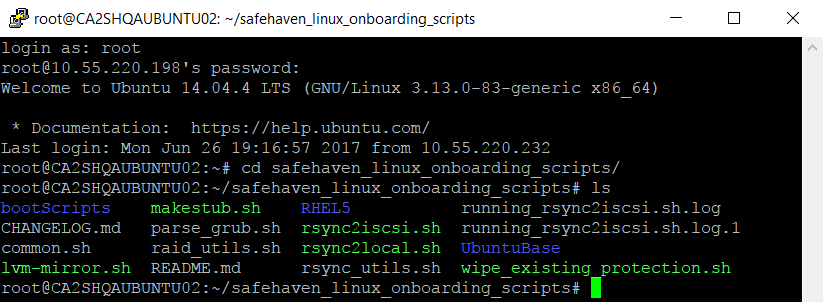

10. Run the makestub.sh stript with **-d** to run it with default parameters.
   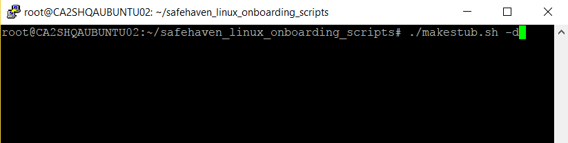
   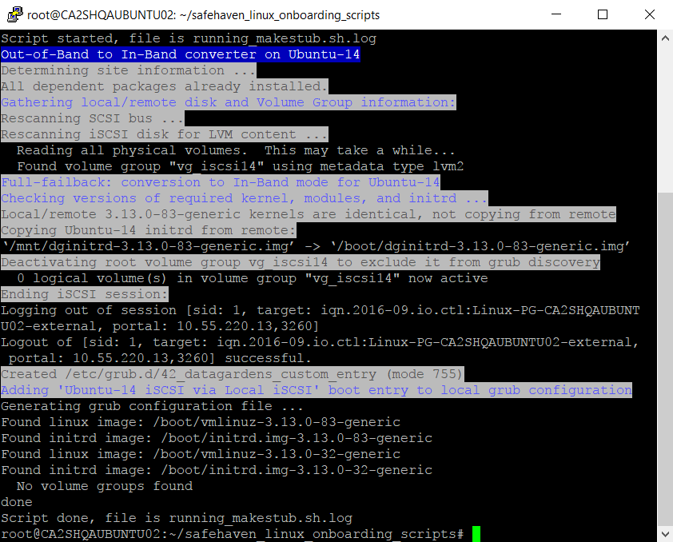

11. After the script finishes running successfully, reboot the server.
   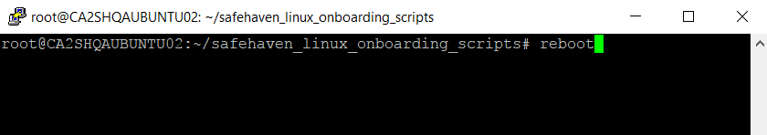

12. Run **lsblk** and verify that the server is now booting from the iSCSI target. In the image below the boot disk is sdd(iscsi disk), instead of sda(local disk).
   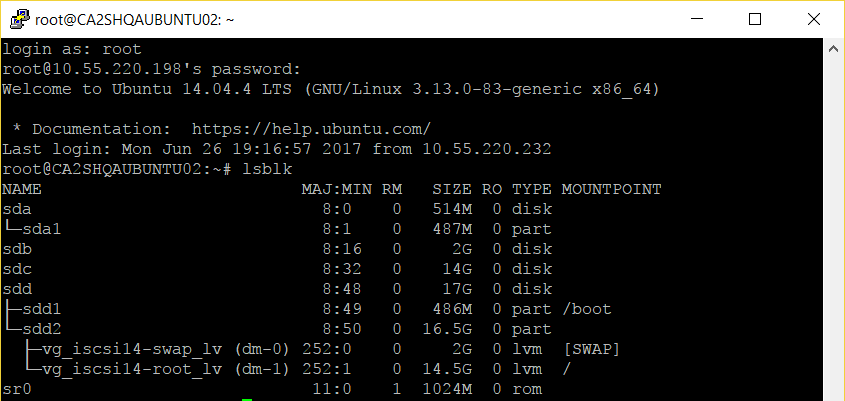

13. Click on **Run Test Failover delete** to delete the test failover clone. This automatically shuts down the production server after deleting the test-failover clone.
   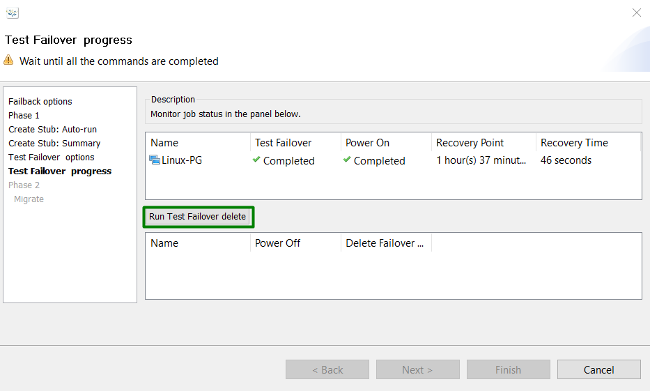

14. After **Power Off** and **Delete Failover Clone** are complete, click **Next**.
   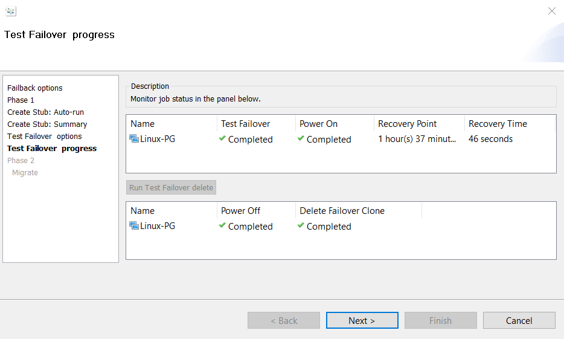

15. Confirm that the **Unsynchronized Data** is 0 Bytes and the **Connection Status** is Active. Then, click **Next**.
   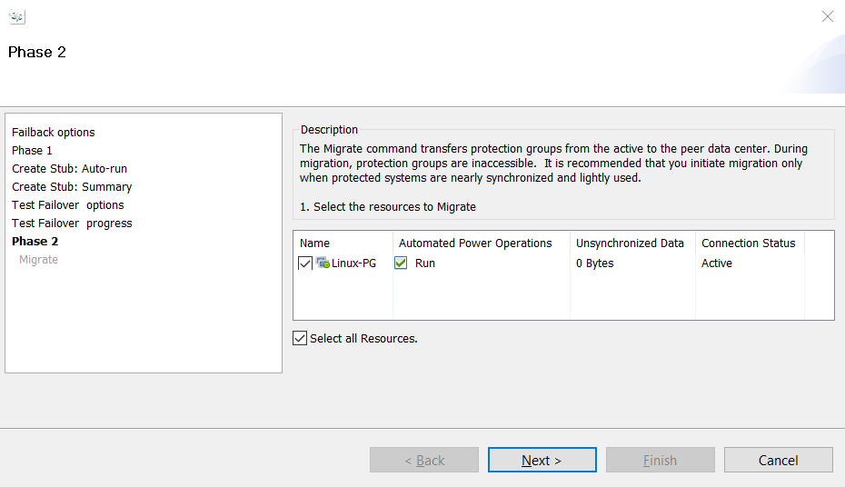

16. Wait until the **Connection Status** changes to Active. Then, click **Finish** to exit the wizard.
   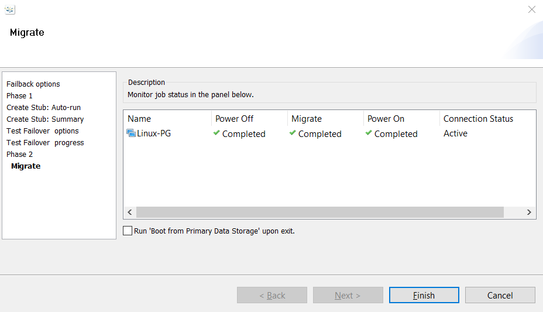

**THE NEXT STEP IS BOOTING FROM THE PRIMARY DATASTORE.**
