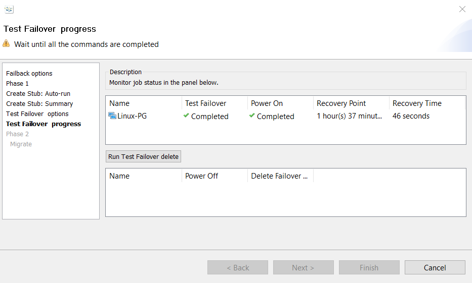

{{{
  "title": "Failback a Linux Protection Group",
  "date": "06-28-2017",
  "author": "Sharon Wang",
  "attachments": [],
  "contentIsHTML": false
}}}

### Article Overview

This article explains how to Failback a Linux Protection Group from a Recovery Datacenter back to its Production Datacenter. User should make sure that the production site is available before initiating a Failback.

**NOTE**: Failback is a disruptive operation since the Recovery Server is powered Off and the production server is Powered On during the operation.

### Requirements

1. Verify that the protection group is in a healthy state
2. Production server is available to  failback to.

### Assumptions

This article assumes that the Protection group is in a failed over state, and the production VM is available to initiate a failback.

For the purpose of this article, we have used Ubuntu 14 as a production server in CenturyLink's CA2(Toronto) production datacenter. The recovery site being used is CenturyLink's WA1(Washington) recovery datacenter.

### Failback
Once the production site is ready for failback, right click the protection group on the DR Site and click **Failback**.

Leave the ** Automated Power Operation** box checked, and click ** Next**.
This will automatically shutdown the production server if it is still ON to avoid a "split-brain" scenario where both the production and recovery servers are ON at the same time

At this step, synchronization of data from the DR SRN to the Production SRN is initiated. It may take some time to synzhronize all the changes in the DR side with production side depending upon number of changes written in the Recovery Server after Failover. 
Wait till the Failback Resync is completed, and click ** Next**

Uncheck the ** Auto-Stub configuration** box and click ** Next**

Check both ** Manual setup needed ** and ** Manual Shutdown needed** boxes, click ** Next **

Leave the **Skip** Test Failover box unchecked and choose a clean and 0 Bytes checkpoint, then click ** Next**

Wait till Test Failover and Power on are completed. Now the production VM should be powered ON. Log in to the production server.
NOTE: Now the Production server will be configured to iSCSI boot using the disks of the Production SRN instead of its own local disks. It is **strongly Recommended** to take a snapshot of the Production VM at this point from CLC Portal.

Go to the "Safehaven_linux_onboarding_scripts" directory

Run makestub.sh stript with **-d** to run it with default parameters

Once the script has finished running successfully, reboot the server.

Run **lsblk** to check if the server is now booting from iSCSI target.
It can be seen in the image below that  boot disk is sdd(iscsi disk) instead of sda(local disk) 

Click on ** Run Test Failover delete** to delete the test failover clone and shutdown the production server.
It will automatically shutdown the production server after deleting the test-failover clone.

Once **Power Off ** and ** Delete Failover Clone** are completed, click ** Next **

Confirm the ** Unsynchronized Data** is 0 Bytes and ** Connection Status** is Active. Click ** Next**

Wait till ** Connection Status ** changes to Active, and click **Finish** to exit the wizard

NEXT STEP IS BOOT FROM PRIMARY DATASTORE
