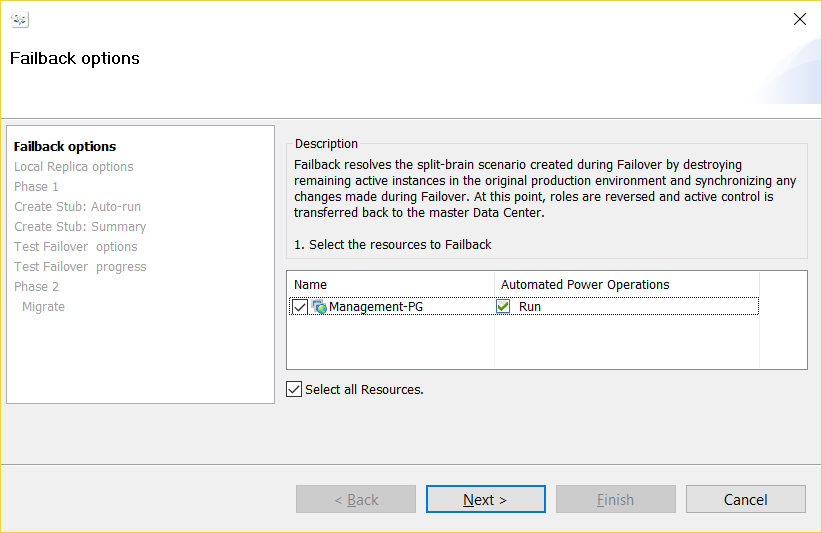
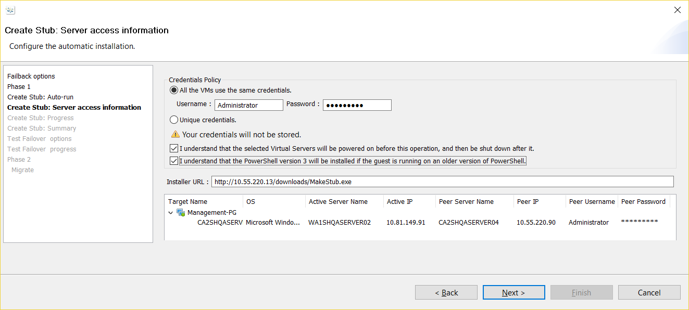

{{{
  "title": "Failback a Windows Protection Group",
  "date": "08-31-2017",
  "author": "Sharon Wang",
  "attachments": [],
  "contentIsHTML": false
}}}

### Article Overview

This article explains how to Failback a Windows Protection Group from a Recovery Datacenter back to its Production Datacenter. User should make sure that the production site is available before initiating a Failback.

**NOTE**: Failback is a disruptive operation since the Recovery Server is powered Off and the production server is Powered On.

### Requirements

1. Verify that the protection group is in a healthy state
2. Production server is available to failback to.

### Assumptions

This article assumes that the Protection group is in a failed over state, and the production VM is available to initiate a failback.

For the purpose of this article, we have used Lumen's CA2(Toronto) as the production datacenter. The recovery site being used is Lumen's WA1(Washington) recovery datacenter.

### Failback

Before initiating the Failback, we need to add disk to the production SRN to failback to. Login to Lumen Portal, go to Production SRN, and click on ** Add raw disk**. Please add 125% of the protection group size + 5GB extra storage for Failback. For example, the size of Management-PG is 60GB, so we added 80GB raw disk to the production SRN

Now the new disk needs to be claimed in SafeHaven console. Select Production SRN from SafeHaven Console, and click on ** Claim Storage Pool**

Select the new disk and choose **Create a new Storage Pool**, choose a name for the new storage pool and click on ** Claim**

Once the production site is ready for failback, right click the protection group on the DR Site and click **Failback**.

Leave the ** Automated Power Operation** box checked, and click ** Next**.
This will automatically shutdown the production server if it is still ON to avoid a "split-brain" scenario where both the production and recovery servers are ON at the same time

Choose the Storage pool we just claimed

At this step, synchronization of data from the DR SRN to the Production SRN is initiated. It may take some time to synchronize all the changes in the DR side with production side depending upon number of changes in the Recovery Server after Failover.
Wait till the Failback Resync is completed, and click ** Next**

Leave ** Auto-Stub configuration** checked, click on ** Next**

Type the Administrator password of the production machine, check both boxes, and click on ** Next**

Once the job is completed, click on ** Next**.

Leave the 2 boxes checked, click on ** Next**

Leave the skip box unchecked, click on ** Next**

After confirm makestub in production server is configured successfully, click on ** Run Test Failover delete**

After Test Failover Clone is deleted, click on ** Next**

Leave the ** Automated Power Operations** box checked, click on ** Next**

After Migrate is finished, and the ** Connection Status** is ** Active**, click ** Finish** to exit the wizard.

This concludes the failback of a Windows Protection Group, but the production server is still booting from the iSCSI disk. Therefore, the next step is to make the production server [Boot from Primary Data Storage](Boot from Primary Data Storage for a Windows Protection Group.md).

