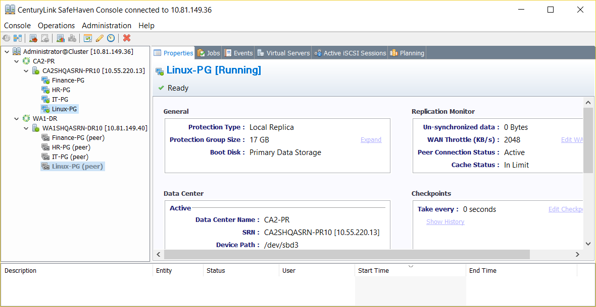
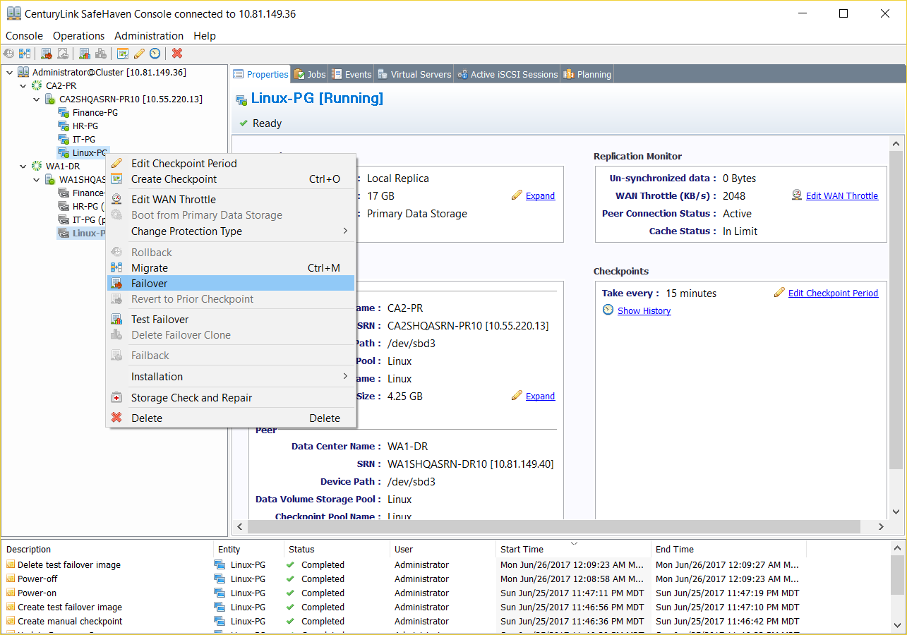
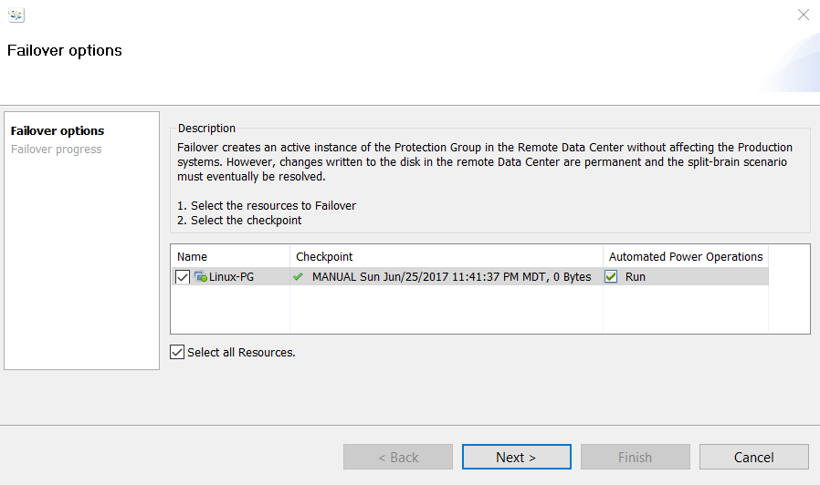
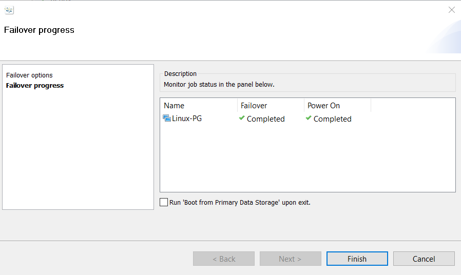
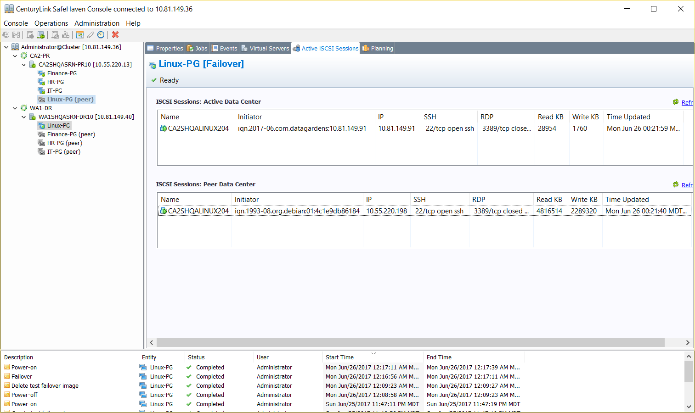

{{{
  "title": "Failover a Linux Protection Group",
  "date": "06-28-2017",
  "author": "Sharon Wang",
  "attachments": [],
  "contentIsHTML": false
}}}

### Article Overview
This article explains how to Failover a Linux Protection Group from a production datacenter to a recovery datacenter.

* **Note**: Unlike Test-Failover, Failover is a disruptive operation. The user must understand the consequences of initiating a failover beforehand.
* **Note**: Once a protection group is in a failed over state, the recovery server sitting in the recovery(DR) datacenter becomes the active primary production site to which users can connect and use for business continuity until Failback is performed.
* **Note**: We highly recommend that a user perform Test Failover before initiating a permanent Failover to confirm that the recovery instance boots correctly and the user can access it.
* **Note**: Typically, network isolation is not required during Failover. If the user wants to isolate the network during Failover (like Test-Failover), please follow the network isolation procedures stated in the SafeHaven Guides.

### Requirements
1. A SafeHaven cluster has already been set up and all datacenters have been registered.
2. Both production and recovery SRNs have been registered and peered along with the storage pools claimed.
3. The Linux Protection Group has been created, initial sync has completed, and periodic checkpoints have been enabled.
4. The Linux recovery server has been configured as a stub.
5. The user has confirmed that Test Failover for the Linux Protection Group works successfully.

### Assumptions
This article assumes that the user has successfully completed the setup of a Linux Protection Group and has already performed a successful non-disruptive Test Failover to confirm the recovery instance boots correctly and presents the production data in the recovery datacenter. The assumption is that now the user wants to Failover to the recovery site and make the recovery instance in the recovery(DR) datacenter an active production instance for business continuity.

For the purpose of this article, we are using Ubuntu 14 for the Linux production server in CenturyLink's CA2(Toronto) production datacenter. The recovery datacenter is CenturyLink's WA1(Seattle) datacenter.

### Failover
Here is a Linux Protection Group called **Linux-PG** that is currently active in CA2 datacenter (booting from local storage) and is ready for Failover.

1. To initiate a Failover, right-click on the Linux Protection Group **Linux-PG** and select **Failover** from the drop-down list.
   

2. Select a **clean 0 (zero) byte checkpoint** for Linux recovery and click **Next**.
   

   When Failover is initiated, the iSCSI targets in the recovery datacenter get activated. Then, the recovery server (stub) powers on and boots from the iSCSI disks presented in the recovery datacenter. A power on job can be seen in CLC-WA1 datacenter's queue from the CenturyLink Control Portal.

3. Select **Finish** to complete Failover.
   * **Note**: DO NOT CHECK Run 'Boot from Primary Data Storage' upon exit.
   

   The Linux-PG is now active under WA1-DR datacenter instead of CA2-PR. Select the Linux Protection Group **Linux-PG** and go to the **Active iSCSI Sessions** tab to monitor the boot process of the failed over instance in WA1-DR **ISCSI Sessions: Active Data Center**. Wait for the **SSH 22/tcp** to go to an **OPEN** state and then proceed to login to the failover instance in WA1 vis SSH.

**NOTE**: As the failed over instance is a copy of the original production server, the user must make sure to use the original production server credentials (username and password) to login to the failed over instance.

