{{{
  "title": "Register Data Center,SRN and pair SRN's",
  "date": "05-08-2017",
  "author": "Mahima Kumar",
  "attachments": [],
  "contentIsHTML": false
}}}

### Article Overview

This article focusses on how to:
1. Register Data Centers and SRN's within the SafeHaven Console for Lumen Cloud, VMware vSphere and Manual(Standalone VMware ESXi hosts and DCC) datacenter type.
2. Pair the SRN's together to set up Protection Groups.

A single SafeHaven Cluster can have upto 64 datacenters registered within itself which can be accessed through a single pane of glass. Each production and recovery datacenter has to be registered within the SafeHaven Console.

There are 4 **Data Center Types** available:
1. VMware vSphere
2. VMware vCloud Director
3. Lumen Cloud
4. Manual (Standalone VMware ESXi hosts and DCC)

**NOTE**: For Lumen Cloud, each sub-account has to be registered as a separate datacenter.

### Requirements

1. SafeHaven Cluster already installed.
2. CMS and SRNs to have proper network connectivity as per [SAHA4.0 Networking](SAHA4.0 Networking.md)

### Assumptions

SafeHaven Cluster already installed with proper network connectivity between CMS-SRN and SRN-SRN.

### Register Data Centers

#### VMware Data Center

Within the SafeHaven Console, right-click on the **Administrator@Cluster** in the Navigation Tree on the left and select **Register Data Center** from the drop-down menu.

Enter **Data Center Name** and select the **Data Center Type**. Click **Register**.

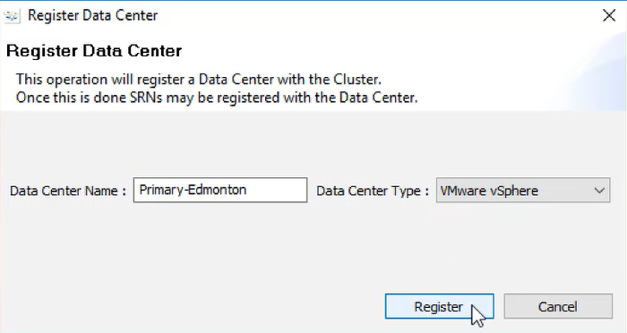

Now click on the Data Center you registered and under the **Properties** Panel click on **Register**.

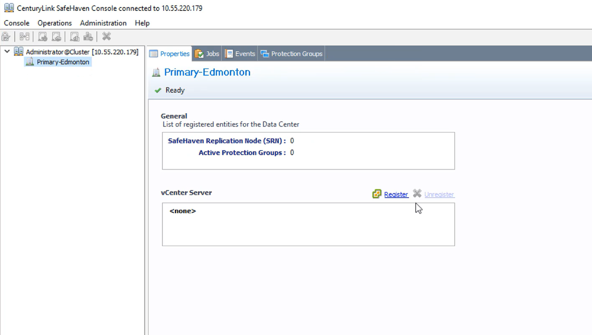

Enter the **vCenter Identifier** (it can be any name), vCenter **IP Address/Host Name**, **UserName** and **Password** the VMware Data Center administration and Click **Next**.

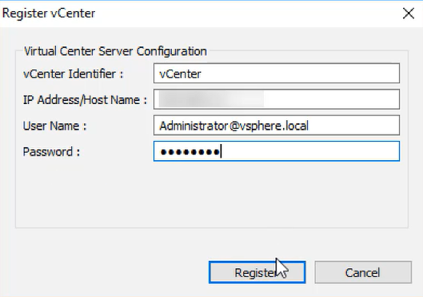

**Properties Panel** shows the vCenter Server information.

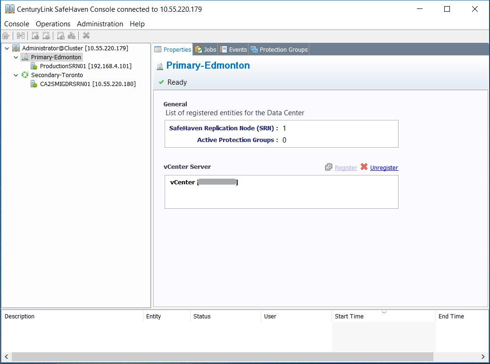

#### Lumen Cloud Data Center

Within the SafeHaven Console, right-click on the **Administrator@Cluster** in the Navigation Tree on the left and select **Register Data Center** from the drop-down menu.

Enter **Data Center Name** and select **Lumen Cloud** as the **Data Center Type**. Click **Register**.

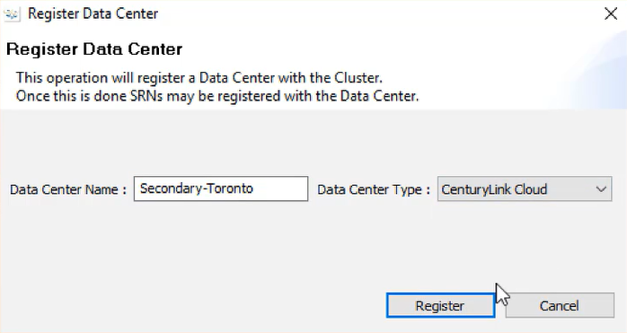

Now click on the Data Center you registered and under the **Properties** Panel click on **Change Credentials**.

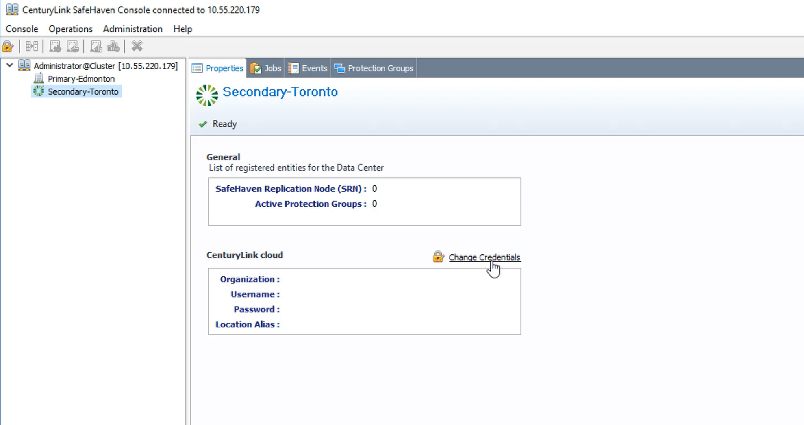

Enter your **Lumen Portal Username** and **Password** for Lumen Cloud administration. Click **Next**.

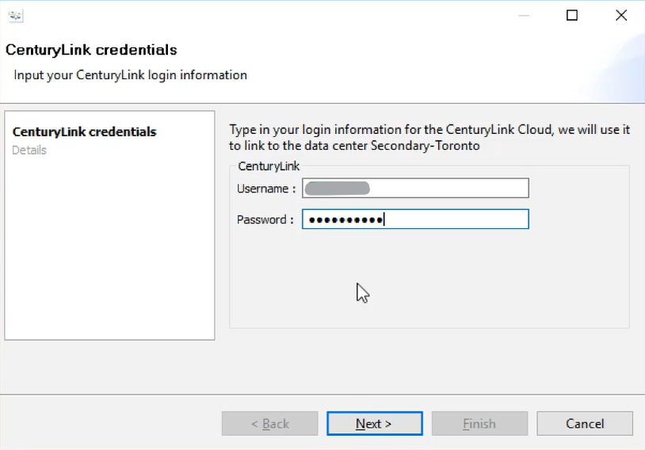

Select your **parent account** or **sub-account** as well as the Lumen Data Center **Location** select **Finish**.

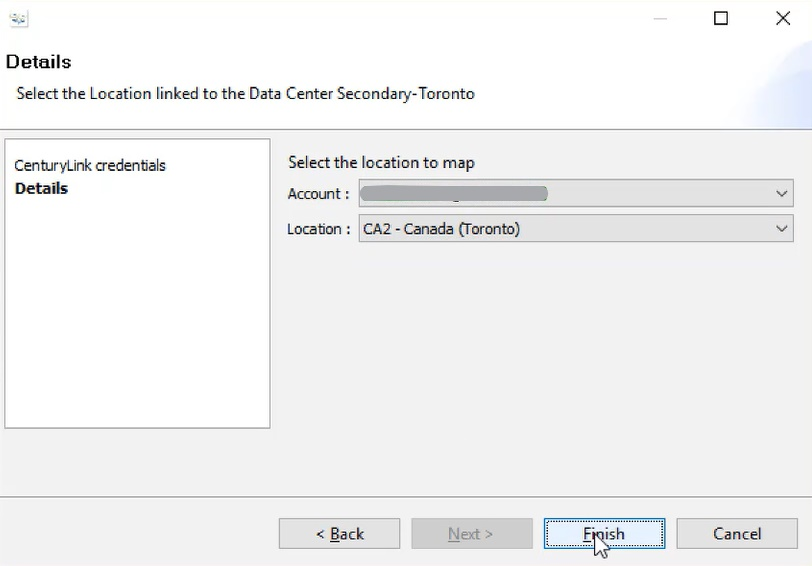

**Properties Panel** shows the Lumen Cloud information.

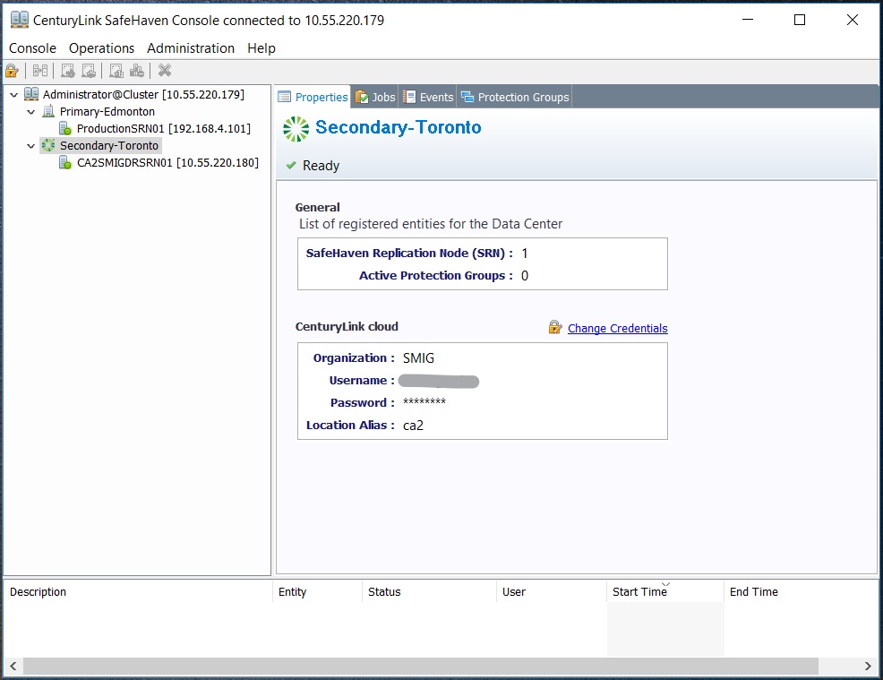

#### Manual Data Center

For Standalone ESXi Hosts or DCC Site type: Within the SafeHaven Console, right-click on the **Administrator@Cluster** in the Navigation Tree on the left and select **Register Data Center** from the drop-down menu.

Enter **Data Center Name** and select **Manual** as the **Data Center Type**. Click **Register**. No credentials required for a Manual site.

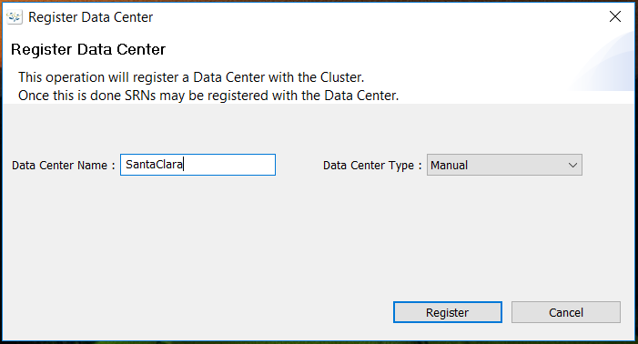

**NOTE**: No credentials required for a Manual site.

**Properties Panel** shows the Lumen Cloud information.

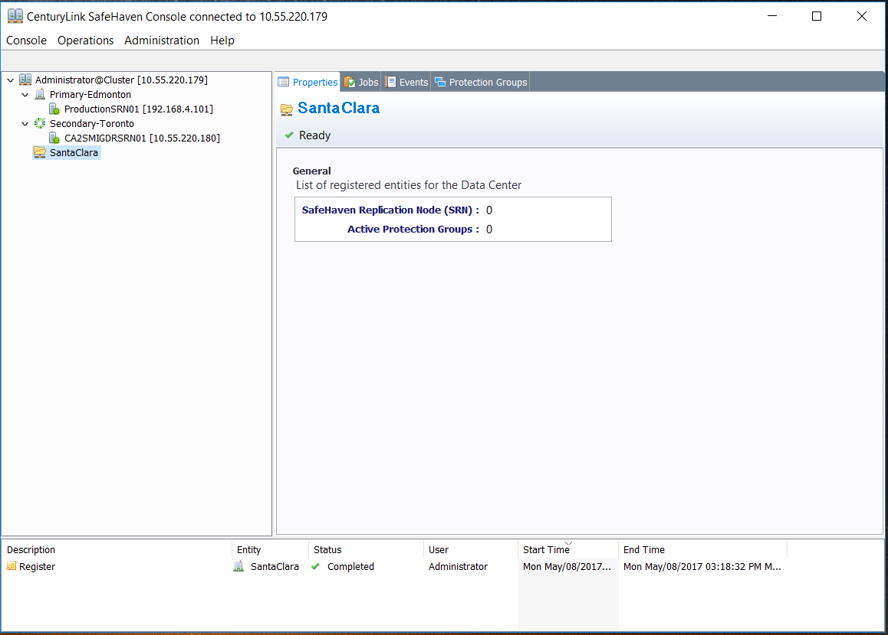

### Register SRN

**Right-click** on the any registered **Data Center** within the Navigation Tree and select **Register SRN** from the drop-down menu.

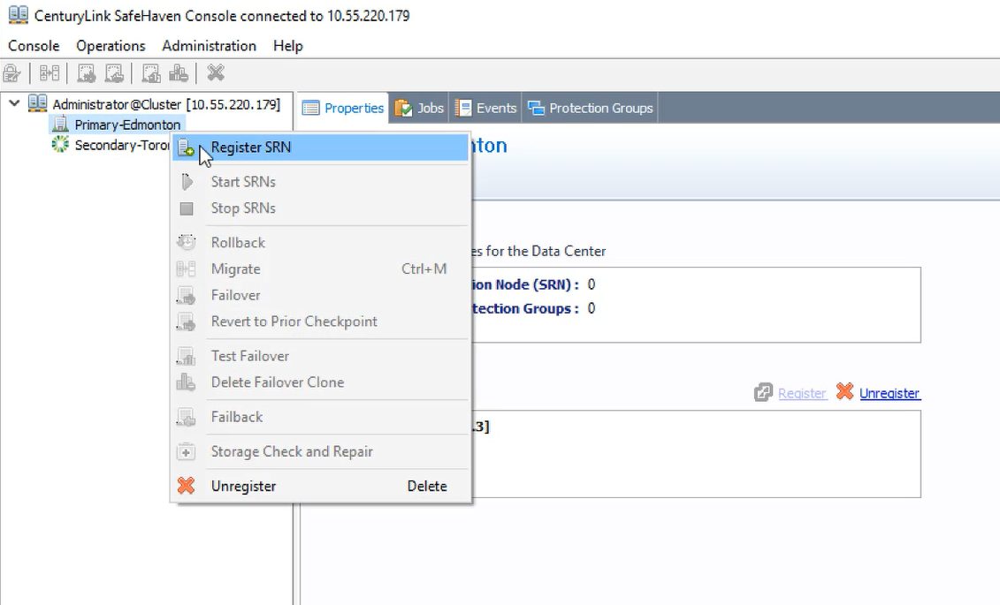

Fill in the following fields:
1. SRN hostname as the **Node Name**
2. SRN **Root Password** (set at the time of SRN deployment)
3. **Service IP**: SRN IP used to communicate with other SafeHaven Nodes (SRN and CMS). Typically set as the Private IP of the SRN.
4. **WAN Replication IP**: SRN IP used to communicate with the peer SRN for WAN replication. Typically set as the Private IP of the SRN.
5. **Local iSCSI IP**: SRN IP used to communicate with the production/recovery servers in that particular Data Center. Typically set as the Private IP of the SRN.
6. Do not modify the Service Port (TCP) and Heartbeat Port (UDP)

**NOTE**: Incase SRN has multiple NIC's, Service IP and WAN Replication IP will be the Primary IP of the SRN which has proper network connectivity to other SRN's and CMS. Local iSCSI IP will be set to 0.0.0.0

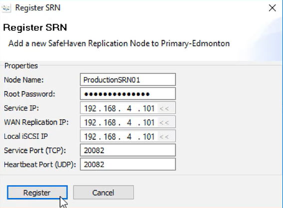

**NOTE**: Follow the same procedure to register the all the SRN's within the SafeHaven Console.

### Add SRN Peer

Once all the production and recovery SRN's have been registered, then we must establish peering relationships between SRNs (ssh key exchange) in the production and recovery data centers. Select an SRN in the production Data Center, navigate to the **Peers** tab and click on **Add Peer**.

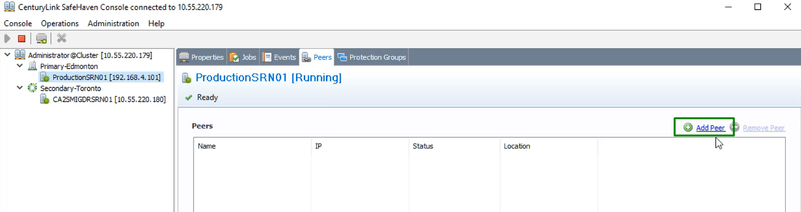

Select the **SRN2** (sister SRN for SRN1) and provide the **Root Password** for both the SRN's. Click **Register**.

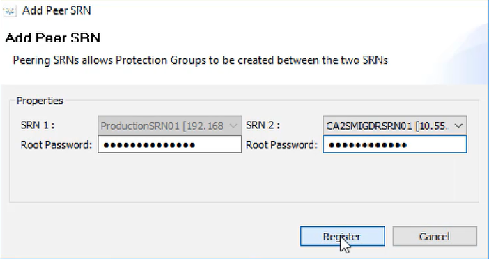

**NOTE**: A single production SRN can be paired with multiple recovery SRN's and vice-versa(Any:Any mapping is allowed and not limited to 1:1 mapping).
