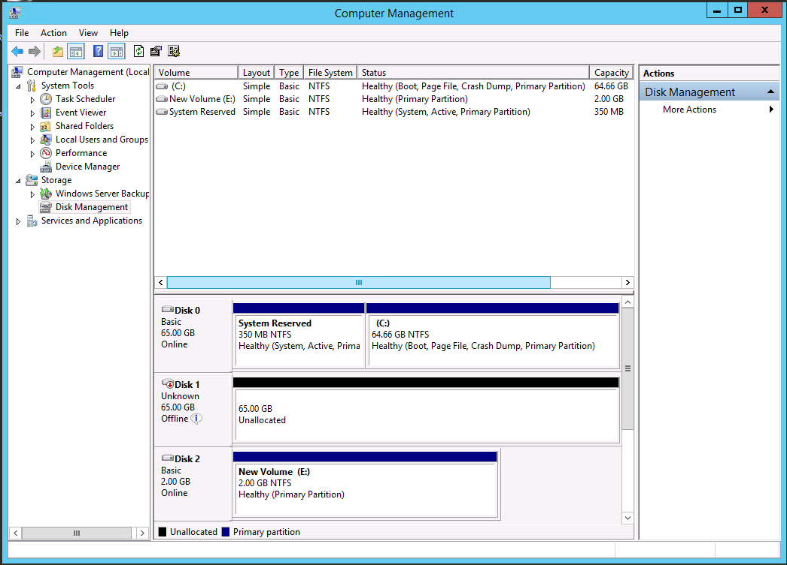

{{{
  "title": "SafeHaven 4.0: Adding, Removing, and Expanding: Disks and VMs",
  "date": "02-13-2017",
  "author": "Aaron Young",
  "attachments": [],
  "contentIsHTML": false
}}}

### Article Overview
This article walks through the process of adding, removing, and expanding disks or VMs within your SafeHaven protection groups. Steps are provided for both the protected guest and the SafeHaven console.

### Contents

**Windows**
* Adding a new disk to a protected VM
* Expanding a protected disk
* Removing a disk from a protected VM
* Adding a new VM to your protection group
* Removing a VM from your protection group

**Linux LVM**
* Adding/Expanding a disk for a protected VM
* Adding a new VM to your protection group
* Removing a VM from your protection group

### Windows
----
**Requirements**

1. SafeHaven Console
2. Administrator access to protected guest

### Adding a new disk to a protected VM

**1. Safehaven Console**

Adding a new disk to a protection group requires available space inside the protection group.  The space required is the total sum storage capacity of all disks to be protected. For example, if a protection group is 60GB in size, and the currently protected disks only use 40GB, then 20GB of space remains for additional protection. If your protection group does not have enough free space, you will be unable to add the disk until you expand it. See the [Protection Group Expansion KB](SafeHaven-4-Expand Protection Group Size.md) for more information. 

You can view your protected disks in the "Virtual Servers" tab of your protection group, as well as the available space.


Once your protection group has enough space, you can open the "Virtual Servers" tab and select the VM you would like to add a disk for, and then select "Create Disk for replication target" to open the wizard. Specify the properties of the disk and click "Finish".

**2. Protected Guest**

Login to the production server and go to Disk Management. You should see a new source disk (ISCSI) show up. You may need to rescan/refresh for the changes to be updated.  



Open the "SafeHaven 4.0 DRaaS Windows Replication Agent/tools" folder with an admin command line shell and run "DgSyncEx.exe list". Note that new disks show up. You may need to run "DgSyncEx.exe rescan" if the disks have not yet refreshed.


Enter the following commands in image 3 to manually start replication from the unprotected disk to the new ISCSI disk.


### Expanding a protected disk

**1. SafeHaven Console**

Expanding a disk in a protection group requires available space inside the protection group.  The space required is the total sum storage capacity of all disks to be protected. For example, if a protection group is 60GB in size, and the currently protected disks only use 40GB, then 20GB of space remains for additional expansion. If your protection group does not have enough free space, you will be unable to expand the disk until you expand the protection group. See the [Protection Group Expansion KB](SafeHaven-4-Expand Protection Group Size.md) for more information. 

Once your protection group has enough space, you can open the "Virtual Servers" tab and select the VM you would like to expand a disk for, and then select "Expand Disk" to open the wizard. Specify the properties of the disk and click "Finish".

**2. Protected Guest**

Login to the production server and go to Disk Management. You should see the disk has a new size. You may need to rescan/refresh for the changes to be updated.  


Open the "SafeHaven 4.0 DRaaS Windows Replication Agent/tools" folder with an admin command line shell and run "DgSyncEx.exe list". Note that new sizes show up. If you have already resized your source disk, the prompt may warn you that the size has changed. You may need to run "DgSyncEx.exe rescan" if the disks have not yet refreshed.


Once the sizes between the two disks match, replication should automatically resume. You can see the progress reset below 100% if there is remaining data to be synced.

### Removing a disk from a protected VM

**1. SafeHaven Console**

Open the "Virtual Servers" tab for your protection group. Select the VM and the disk that you wish to remove and click "Delete".

At this time it is not possible to reduce the size of a protection group.

**2. Protected Guest**

Open the "SafeHaven 4.0 DRaaS Windows Replication Agent/tools" folder with an admin command line shell and run "DgSyncEx.exe list". The prompt may warn you that a disk is missing. You may need to run "DgSyncEx.exe rescan" if the disks have not yet refreshed.

To remove a disk from replication, first run "DgSyncEx.exe select disk *num*" where *num* is the disk you wish to remove from replication.  Then run "DgSyncEx.exe unmap".  You can run "DgSyncEx.exe list" to see your changes.

### Adding a new protected VM to a Protection Group

**1. SafeHaven Console**

Adding a new VM is much like provisioning a new Protection Group. Select the protection group you'd like to add a VM to and click the "Virtual Servers" tab. Then select "Add VMs" and a familiar provisioning wizard will allow you to add a new VM like you did during onboarding. If protection group expansion is required, you will be able to provision more storage at this time. 

If you'd like to automatically install the Local Replication Agent to the VM, the wizard has the option available. Alternatively, you can install it manually. See the Local Replication Agent section in the Recovery Operations Guide for more information.

### Removing a protected VM from a Protection Group

**1. SafeHaven Console**

Removing a VM is much like removing a disk. Select the protection group and then the "Virtual Servers" tab. You can select the VM you wish to unprotect and click "Remove VM from PG" to delete it. **Note:** Your production VM will not be modified.

At this time it is not possible to reduce the size of a protection group.

**2. Protected Guest**

Log into the protected guest and uninstall the SafeHaven Local Replication Agent via the "Uninstall" program in the SafeHaven folder. This will uninstall the agent, remove all replication, as well as remove the folder, restoring your VM to an unprotected state.

### Linux LVM
___

Linux has a wide variety of configurations. The principles applied in this LVM partition guide can be used for any configuration. *The end goal is that the source filesystem has a mapped iscsi filesystem.*

### Adding/Expanding a disk for a protected VM

Run "lsblk" to see your disk layout.

```
[root@localhost ~]# lsblk
NAME                  MAJ:MIN RM  SIZE RO TYPE MOUNTPOINT
fd0                     2:0    1    4K  0 disk 
sda                     8:0    0    2G  0 disk 
├─sda1                  8:1    0  500M  0 part /boot
└─sda2                  8:2    0  1.5G  0 part 
  ├─rhel-root         253:0    0  2.3G  0 lvm  /
  └─rhel-swap         253:1    0  204M  0 lvm  [SWAP]
sdb                     8:16   0    2G  0 disk 
├─sdb1                  8:17   0  500M  0 part 
└─sdb2                  8:18   0  1.5G  0 part 
  ├─vg_iscsi7-swap_lv 253:2    0  204M  0 lvm  
  └─vg_iscsi7-root_lv 253:3    0  2.3G  0 lvm  
sr0                    11:0    1 1024M  0 rom  
```

In this instance, "sdb" is our ISCSI disk provided by SafeHaven. You can see that at the moment the sizes match. After we add a disk to our guest eg. "sdc" and add it to the root logical volume, it might look something like this. If you're not familiar with doing this, the steps are detailed in the next section.

```
[root@localhost ~]# lsblk
NAME                  MAJ:MIN RM  SIZE RO TYPE MOUNTPOINT
fd0                     2:0    1    4K  0 disk 
sda                     8:0    0    2G  0 disk 
├─sda1                  8:1    0  500M  0 part /boot
└─sda2                  8:2    0  1.5G  0 part 
  ├─rhel-root         253:0    0  3.3G  0 lvm  /
  └─rhel-swap         253:1    0  204M  0 lvm  [SWAP]
sdb                     8:16   0    2G  0 disk 
├─sdb1                  8:17   0  500M  0 part 
└─sdb2                  8:18   0  1.5G  0 part 
  ├─vg_iscsi7-swap_lv 253:2    0  204M  0 lvm  
  └─vg_iscsi7-root_lv 253:3    0  2.3G  0 lvm  
sdc                     8:32   0    1G  0 disk 
└─rhel-root           253:0    0  3.3G  0 lvm  /
sr0                    11:0    1 1024M  0 rom  
```

We should now add a corresponding disk for SafeHaven through the "Virtual Servers" tab of the Safehaven Console. As with the previous example, it may be necessary to rescan the scsi bus and add the new disk to the logical volume using the standard commands. e.g.:

```
echo 1 > /sys/class/scsi_device/3\:0\:0\:0/device/rescan
pvcreate /dev/sdd
vgextend vg_iscsi7 /dev/sdd
lvextend /dev/vg_iscsi7/root_lv /dev/sdd
```

Afterwards the layout should look like this:

```
[root@localhost ~]# lsblk
NAME                  MAJ:MIN RM  SIZE RO TYPE MOUNTPOINT
fd0                     2:0    1    4K  0 disk 
sda                     8:0    0    2G  0 disk 
├─sda1                  8:1    0  500M  0 part /boot
└─sda2                  8:2    0  1.5G  0 part 
  ├─rhel-root         253:0    0  3.3G  0 lvm  /
  └─rhel-swap         253:1    0  204M  0 lvm  [SWAP]
sdb                     8:16   0    2G  0 disk 
├─sdb1                  8:17   0  500M  0 part 
└─sdb2                  8:18   0  1.5G  0 part 
  ├─vg_iscsi7-swap_lv 253:2    0  204M  0 lvm  
  └─vg_iscsi7-root_lv 253:3    0  3.3G  0 lvm  
sdc                     8:32   0    1G  0 disk 
└─rhel-root           253:0    0  3.3G  0 lvm  /
sdd                     8:48   0    1G  0 lvm
└─vg_iscsi7_root_lv   253:3    0  3.3G  0 lvm
sr0                    11:0    1 1024M  0 rom  

```
 
We've resized the logical volumes at this point, but we haven't yet extended the filesystems. 

```
mount /dev/mapper/vg_iscsi7-root_lv /mnt/vgiscsi
xfs_growfs /mnt/vgiscsi
umount /mnt/
```

You may also wish to run rsync again. You can find the schedule using "crontab -l" or run it yourself.
  
```
 /opt/datagardens/bin/repeatedRsync
 ```
  
### Adding a new VM to your protection group

**1. SafeHaven Console**

Adding a new VM is much like provisioning a new Protection Group. Select the protection group you'd like to add a VM to and click the "Virtual Servers" tab. Then select "Add VMs" and a familiar provisioning wizard will allow you to add a new VM like you did during onboarding.  If protection group expansion is required, you will be able to provision more storage at this time. 

**2. Protected Guest**

Log into the protected guest and simply run:

```
cd safehaven_linux_onboarding_scripts
./rsync2iscsi.sh
```

### Removing a VM from your protection group

**1. SafeHaven Console**

Removing a VM is much like removing a disk. Select the protection group and then the "Virtual Servers" tab. You can select the VM you wish to unprotect and click "Remove VM from PG" to delete it. **Note:** Your production VM will not be modified.

At this time it is not possible to reduce the size of a protection group.

**2. Protected Guest**

Log into the protected guest and simply run:

```
cd safehaven_linux_onboarding_scripts
./wipe_existing_protection.sh
```
