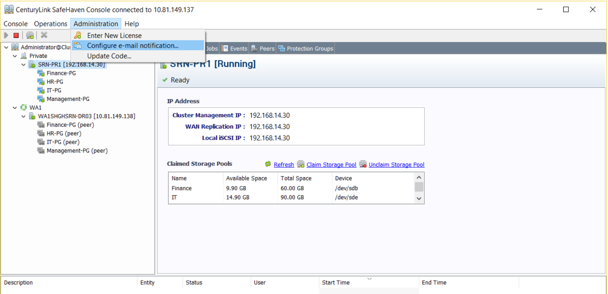
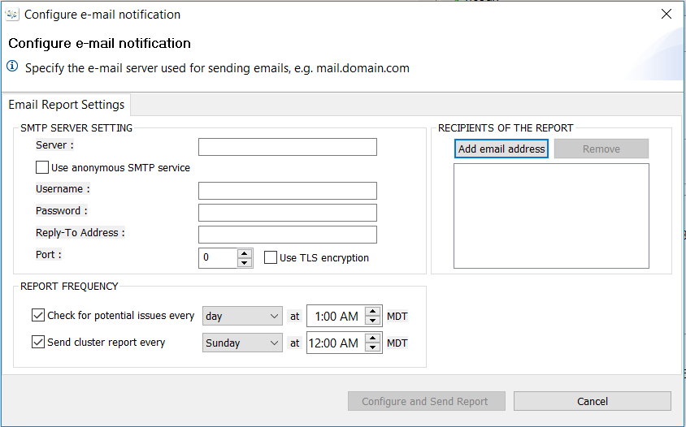

{{{
  "title": "SafeHaven-4-Configure Email Notification",
  "date": "1-11-2017",
  "author": "Anshul Arora",
  "attachments": [],
  "contentIsHTML": false
}}}
### Article Overview
This article explains how to configure email notifications using SafeHaven-4 console

### Configuring Email Notifications
* In SafeHaven Console, click on Administration tab and select "Configure email Notification" from the drop down menu.  
  

* Under SMTP Server Setting, enter Server, username, password, reply-to address, and port number. Check "Use TLS encryption" checkbox if the server uses TLS encryption. Then add the recipient's email address by clicking on "Add email address" under "Recipients of the Report".  
  

* Under Report Frequency, check both the checkboxes and enter the time when the cluster report should be sent. Once all the necessary information has been filled, click on "Configure and Send Report" and a test email will be sent to the recipient's email address right away. 

