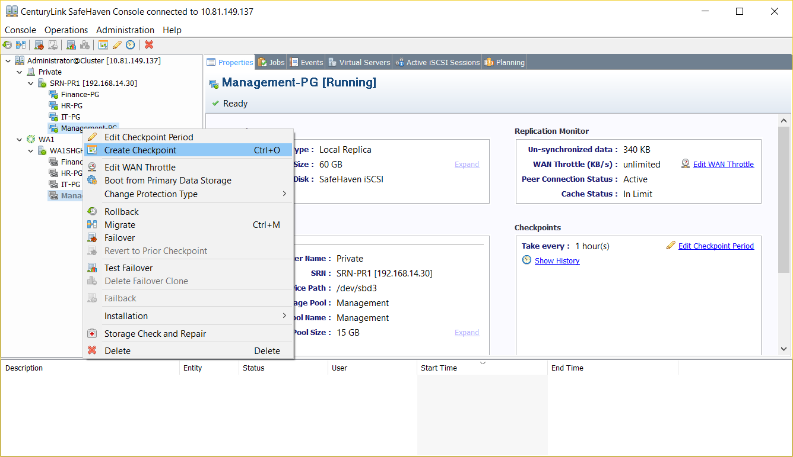

{{{
  "title": "SafeHaven-4-Create Checkpoint",
  "date": "11-29-2016",
  "author": "Anshul Arora",
  "attachments": [],
  "contentIsHTML": false
}}}
## Article Overview
This article explains how to create a checkpoint using SafeHaven Console..

### Create Checkpoint

Right click on the Protection Group and then click on "Create Checkpoint" from the drop-down menu.

Once the checkpoint has been created, it can be viewed by clicking on "show history" under checkpoints window.
