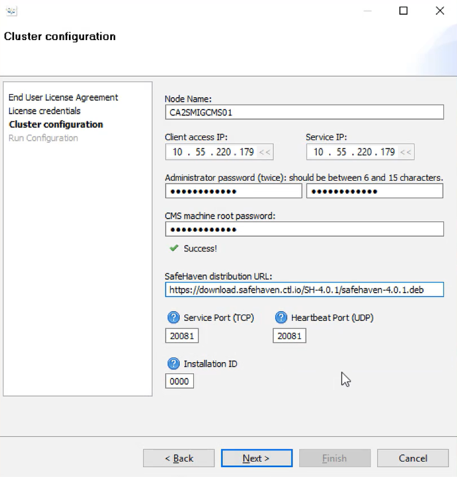
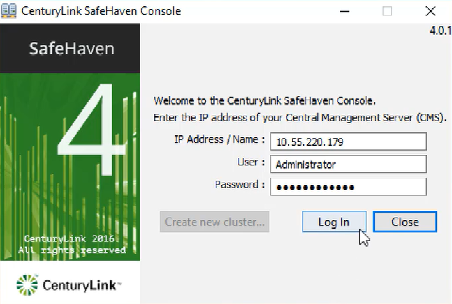

{{{
  "title": "SafeHaven-4-Create a SafeHaven Cluster",
  "date": "05-01-2016",
  "author": "Sharon Wang",
  "attachments": [],
  "contentIsHTML": false
}}}
## Article Overview
This article explains how to create a SafeHaven Cluster.

### Requirements
1) Pre-deployed CMS server in CenturyLink Cloud.
2) Network access to the CMS.

### Assumption
This article assumes that the user has already deployed the CMS server in CenturyLink Cloud.

To create the CMS please refer to [SafeHaven-4-Deploy CMS and SRN in CenturyLink Cloud](SafeHaven-4-Deploy%20CMS%20and%20SRN%20in%20CenturyLink%20Cloud.md)

### SafeHaven Cluster Installation

Begin by downloading the latest SafeHaven Console (GUI) from the **GUI Package** download link (https://download.safehaven.ctl.io/SH-4.0.1/SafeHavenConsole-4.0.1.zip) under the **Download Links** section of the [SafeHaven 4.0.1 Release Notes](safehaven-4.0.1-release.md).

Launch the Console by clicking on its icon. Select **Create New Cluster**.

Accept the **End User License Agreement** and click **Next**.

Enter the **Customer Name** and the **License key** provided to you by your CenturyLink Onboarding Engineer.

Enter the following fields:
1) CMS hostname in the **Node Name**
2) **Client Access IP** (CMS IP that used to connect to the SafeHaven Console GUI) and **Service Access IP** (CMS IP that is used for communication between CMS and SRN). Typically CMS Private IP address is entered in these fields. You can get this information from the CenturyLink Control Portal.
3) Set the **Administrator Password** (Password required to login to the SafeHaven Console GUI to manange the SafeHaven)
4) Enter the **CMS root password**. You can get this information from the CenturyLink Control Portal.
5) Click on **Test Login** to confirm connectivity to the CMS.
5) Copy the **Debian Package for CMS/SRN** link from the **Download Links** section of the [SafeHaven 4.0.1 Release Notes](safehaven-4.0.1-release.md) and enter it in the **SafeHaven 4.0.1 distribution URL** section. Please contact your CenturyLink Onboarding Engineer if you have any questions regarding the latest version of **Debian Package for CMS/SRN**.
6) Do not modify the Service Port (TCP) , Heartbeat Port (UDP) , Installation ID.

Click **Next**

Wait for the SafeHaven software to complete the configuration of the CMS server. When this process is complete, a pop-up window appears to let you know that the installation is successful. Select **OK** and then **Finish**. 
Note that the CMS will reboot as part of the installation procedure.

### Login to the SafeHaven Console

Login to the **SafeHaven Console** by using the **Client Access IP address** for the CMS (typically the private IP of CMS). Enter **Administrator** in the **User** field and enter the Administrator **Password** you had set during the cluster installation procedure stated above. Click **Log In**.

**Install** the SSL Certificate (This will require Administrator rights).

The **SafeHaven Cluster** will appear. The SafeHaven Cluster has now been created and you can start configuring it now.

### Next Step:

 [SafeHaven-4-Register Sites and SRN within a SafeHaven Cluster](SafeHaven-4-Register%20Sites%20and%20SRN%20within%20a%20SafeHaven%20Cluster.md).

test

