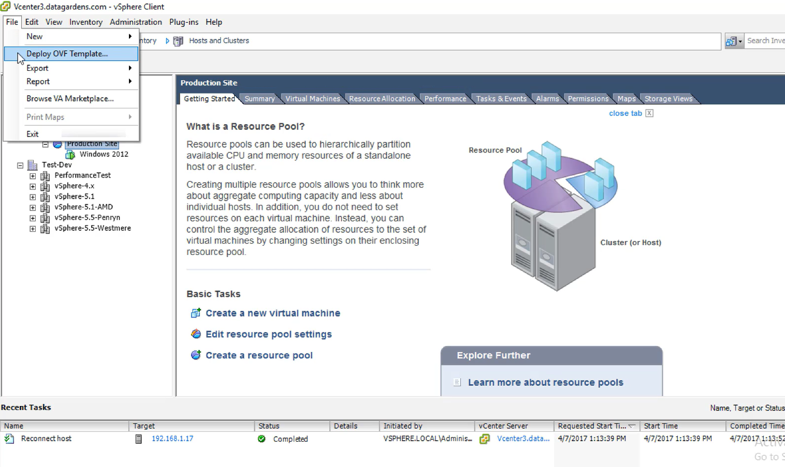
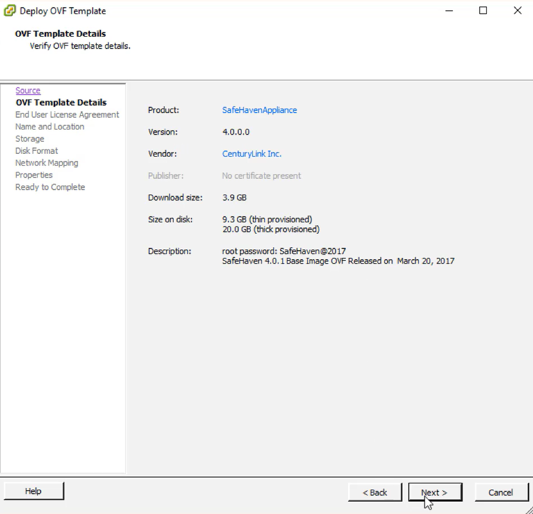
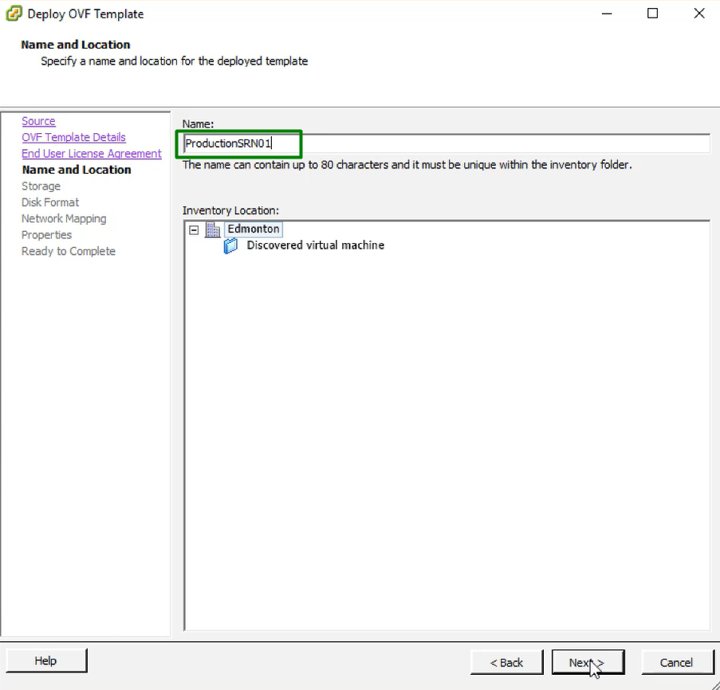
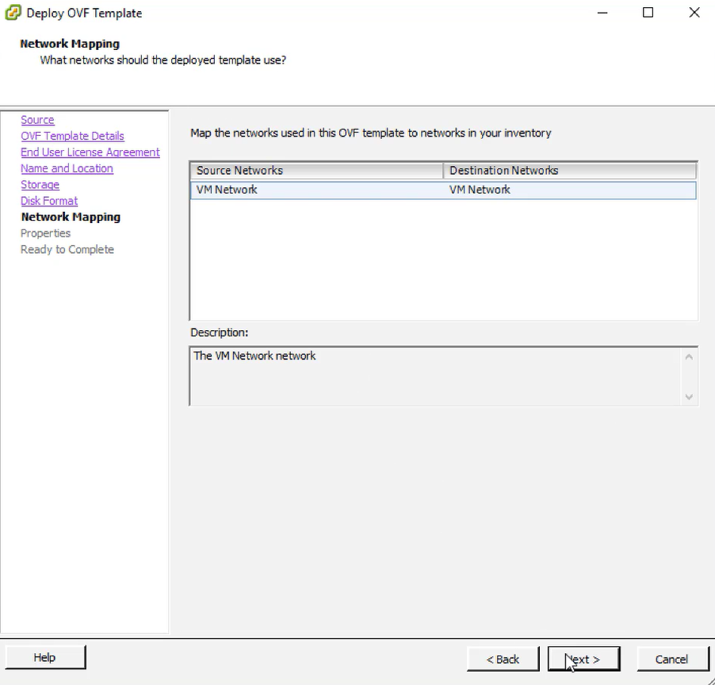

{{{
  "title": "SafeHaven-4-Deploy SRN in VMware (Private or On-premise DataCenter)",
  "date": "05-01-2016",
  "author": "Sharon Wang",
  "attachments": [],
  "contentIsHTML": false
}}}

## Article Overview
This article explains how to deploy the SafeHaven Replication Node(SRN) in VMware (Private or On-premise DataCenter).

### Requirements

Login access to the production vCenter envirionment 

### Assumptions

This article assumes that the user has login access to the CenturyLink Cloud Portal. Begin by logging into the Control Portal at https://control.ctl.io 

### Deploy the SafeHaven Repliation Node(SRN) in VMwera

Login to the **VMware Data Center** with your credentials and select the appropriate **Host** and the appropriate **Resource Pool** to deploy the SRN. Click on **File**, choose **Deploy OVF Template...** from the drop-down menu.

Put https://download.safehaven.ctl.io/SH-4.0.1/SHBase-4.0.1-Mar-20-2017.ova in **Deploy from a URL** blank and click on **next**.

Also you can find this URL in **Download Links** section in the [SafeHaven 4.0.1 Release Notes](safehaven-4.0.1-release.md).

Confirm the information of the OVF Template and click on **Next**

Accept the End user license aggreement and click on **Next**

 Provide a **Name** and **Inventory Location** for the SRN. Click on **Next**

Choose a storage device for SRN deployment, click on **Next**

Leave the default Disk Format and click on **Next**

Confirm the Networking Mapping and click on **Next**

Provide a **Networking Properties** for the SRN. Click on **Next**

Confirm the Deployment settings and click on **Finish** to start the deployment.

