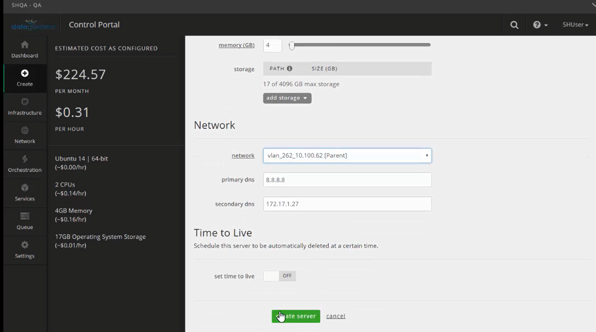

{{{
  "title": "SafeHaven-4-Deploy SafeHaven Nodes - CMS and SRN in CenturyLink Cloud",
  "date": "05-01-2016",
  "author": "Sharon Wang",
  "attachments": [],
  "contentIsHTML": false
}}}

## Article Overview
This article explains how to deploy the Central Management Server(CMS) and SafeHaven Replication Node(SRN) in CenturyLink Cloud.

A single CMS server is required for a single SafeHaven Cluster. Typically CMS resides in the DR datacenter so that users can access it and manage their SafeHaven environment, even if the production datacenter is unavailable. In this scenario our DR site is CA2-Canada(Toronto) in CenturyLink Cloud.

SRN resides in both production and DR datacenters. A single SafeHaven cluster can have upto 64 SRN's registered. Total number of SRN's depend on 

### Assumption
This article assumes that you already have an account in CenturyLink Cloud. Begin by logging into the Control Portal at https://control.ctl.io 

### Deploy the Central Management Server (CMS)

We now will deploy the server that will become the Central Management Server (CMS) for the SafeHaven Cluster. CMS acts as a master server for the SafeHaven Cluster and commands from the SafeHaven Console (GUI) are parsed by the CMS and then sent for execution to the appropriate SRNs in the appropriate data centers.

Select **Servers** under the **Infrastructure** tab.

Select the **Recovery DataCenter** (in this case its CA2-Canada (Toronto)) and the appropriate **Server Group** to deploy the CMS.

Select the **Server Group** and click on **Create Server** from the drop-down menu.

Under the **Create Server** section, select the **Standard** server type.

Select **Ubuntu 14 | 64 bit** as the **Operating System** type. Provide a **Name** and **Description** for the CMS. Provide a strong **root password** and confirm it.

Configure the CMS server with 2 virtual CPU and 4 GB of memory.

Under the Network section, select a VLAN that will have connectivity to the SRNs and select the appropriate production and recovery DNS servers. Select create server.

### Deploy server for SRN in the recovery data center  

In the CenturyLink Control Portal select the SafeHaven Nodes group, then select create, and server from the drop-down menu.

Select the Standard server type and the Ubuntu 14 | 64 bit operating system. Provide a name and description for the SRN along with a root password.

Under the Resources section, configure the server with 2 CPU and 4 GB of memory.

Under the Network section select the appropriate VLAN (i.e., which provides connectivity to the proxy recovery servers and the CMS). Also, select the primary and secondary DNS servers. Then select create server.

### Deploy server for SRN in the production data center  

Select Servers under the Infrastructure tab, then select the server group for the SafeHaven nodes in the production data center. Select create and then server from the drop-down menu.

As with the previous SafeHaven nodes, select Ubuntu 14 | 64 bit as the operating system. Provide a name and description for the SRN along with a root password. 

As before, configure 2 CPU and 4 GB memory for the SRN. In the Network section, select the correct VLAN in the production data center along with the primary and secondary DNS server. Select create server.

### Add storage to each SRN  

Select Servers under the Infrastructure tab. In the Navigation Tree, select the SRN in the recovery data center, then scroll down on the main data panel and select edit storage.

Select add storage and then in the drop-down menu select raw disk.

Add enough storage for the aggregate capacity of all VMs to be protected by the SRN, plus 25 to 30% for the checkpoint pool and an additional 5 GB for each VM to be used as temporary storage for Test Failover operations. Select apply.

Similarly, add storage to the SRN in the production data center. For Windows Protection Groups, with Local Cache protection type, you should add about 10% of the aggregate capacity of the protected VMs to be used as a disk cache. For Windows and Linux Protection Groups of the Local Replica protection type, you should add enough storage for the aggregate storage capacity of the protected VMs, plus 25 to 30% for the checkpoint pool and an extra 5 GB for each VMs as temporary storage for failback operations. Select apply.
You have now deployed the servers that will become the SRNs and the CMS and have attached the prerequisite storage to the SRNs.

