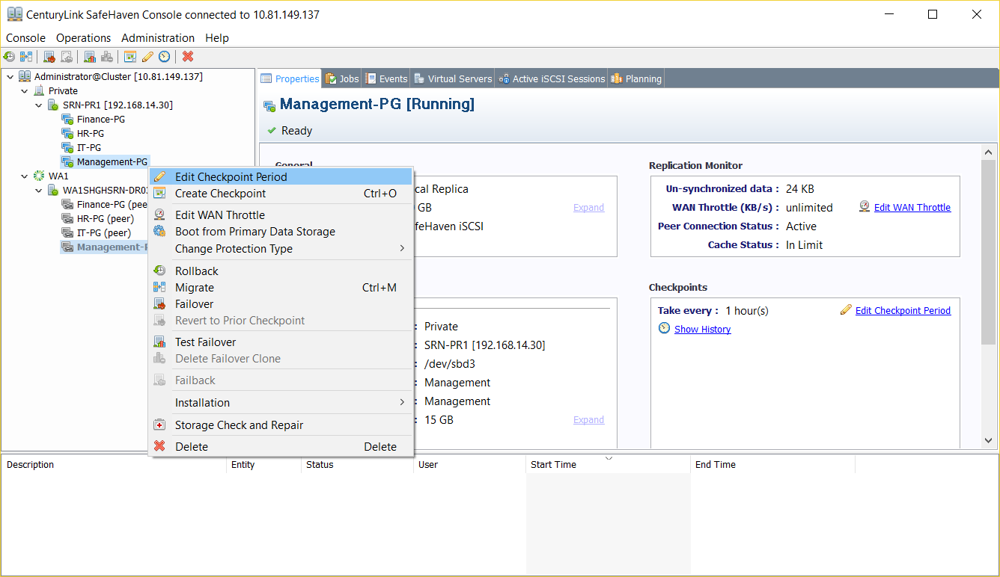
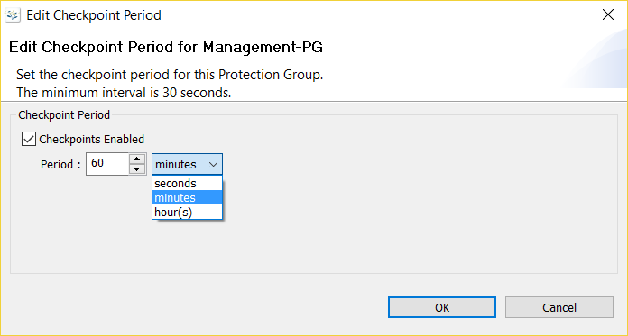

{{{
  "title": "SafeHaven-4-Edit Checkpoint Period",
  "date": "11-29-2016",
  "author": "Anshul Arora",
  "attachments": [],
  "contentIsHTML": false
}}}

### Steps to enable periodic checkpoints

* Right click on the Protection Group and then click “Edit Checkpoint Period” from the drop-down menu.

    

*  Enable Periodic Checkpoints by checking “Checkpoints enabled” option.  

*  Enter a value, which can be as low as 30 seconds, for the checkpoint period and then click on "OK".

  
