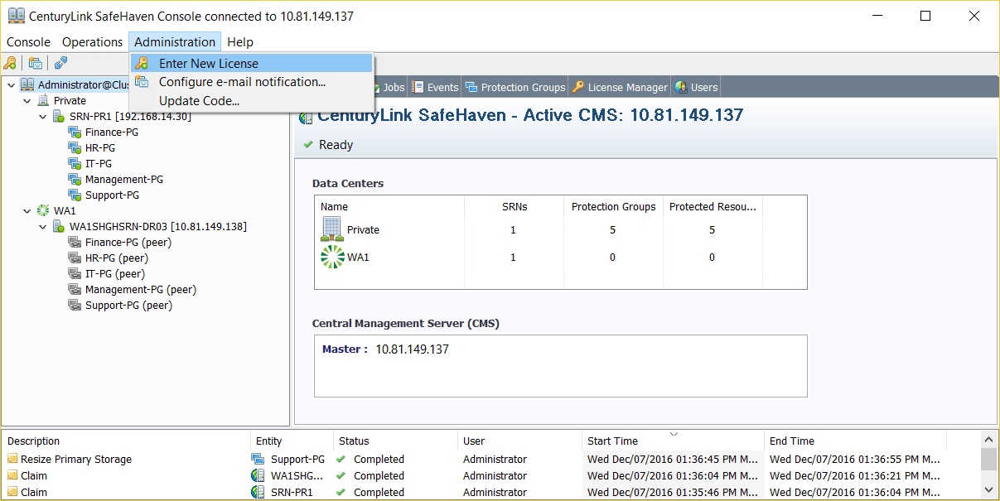
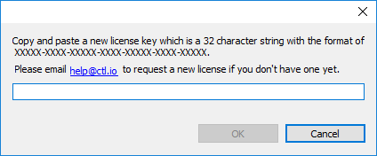
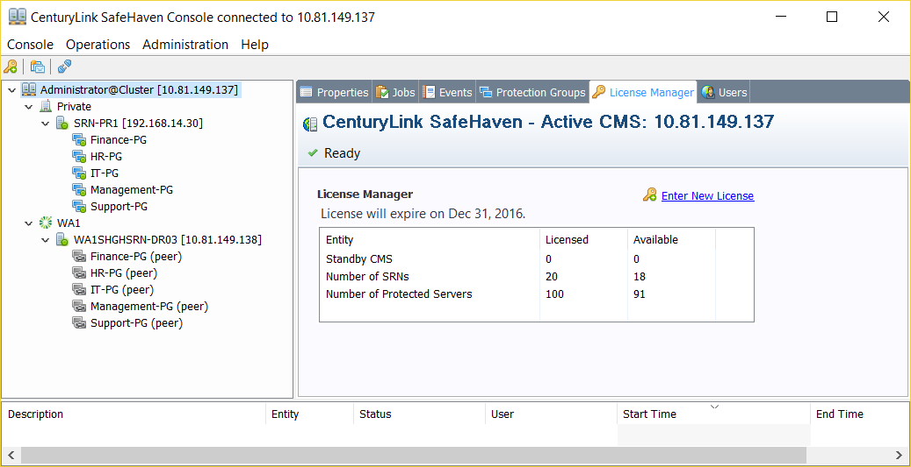

{{{
  "title": "SafeHaven-4-Enter New License Key",
  "date": "12-07-2016",
  "author": "Sharon Wang",
  "attachments": [],
  "contentIsHTML": false
}}}

### Article Overview
This article explains how to change SafeHaven license key from the SafeHaven Console.

### Entering New License Key

Click on Administration Tab and then click on “Enter New License”.  

  

Enter the License key and then click on "OK"   

  

In order to confirm the new license key, click on “Administrator@cluster” and then go to the “License Manager” tab. Information related to the license key such as expiry date, number of protected servers, and number of SRNs can be found here.  

