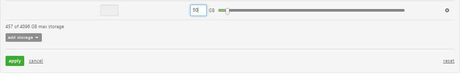
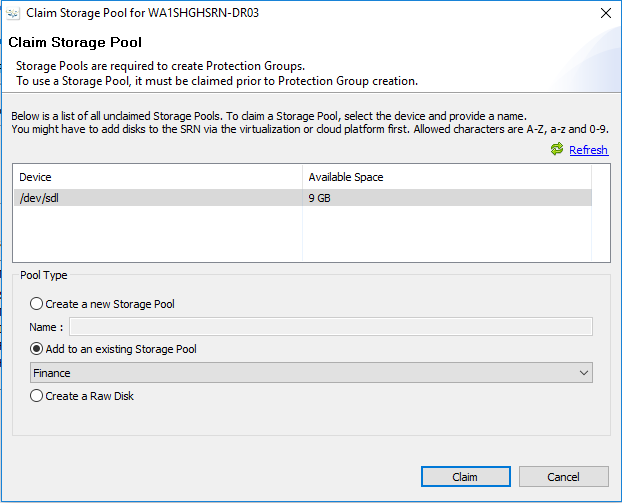

{{{
  "title": "SafeHaven-4-Expand Protection Group Size",
  "date": "1-11-2017",
  "author": "Anshul Arora",
  "attachments": [],
  "contentIsHTML": false
}}}
### Article Overview
This article explains how to expand the size of a Protection Group. This can be useful when a user wants to expand disk size or add a new disk to an already protected VM, or add a new VM to an existing Protection Group. In either case, the first step is to expand the size of the Protection Group.

### Add storage to the Production and Recovery SRN  

### Edit Storage
Go to the Lumen Portal, select the Production SRN and click on "Edit Storage"   

 

### Add Raw Disk
* On Production SRN  
Add 10% of the additional disk for local Cache and 100% for local Replica. 

* On Recovery SRN  
Add 100% of the additional disk.

Click on Add storage and select Raw Disk from the drop down menu. DO NOT expand existing storage or add a partition.    

 

Enter a value for the new raw disk and click on apply. This has to be repeated for the Recovery SRN. Once the approprite amount of storage has been added to both the production and the recovery SRNs, it needs to be claimed in the storage pool associated with the Protection Group.   

   

### Claim Storage Pool
Next step is to claim the newly added storage to the storage pool associated with the Protection group. In order to find out the storage pool associated with the protection group, click on the protection group and see "Data Volume Storage Pool" under "Data Center" for both active(Production) and Peer(recovery) datacenters.   

   

To claim the storage to storage pool, select the appropriate SRN and then click on "Claim Storage Pool".  

   

Select the Newly Added storage and add it to an existining storage pool. Select the right storage pool from the drop down menu and click on Claim.  
Note: This has to be done for both Production and Recovery SRN.  

   

### Expand Protection Group   
Once the storage has been claimed on both the Production and Recovery SRN, next step is to expand the Protection Group. In order to do so, click on the appropriate Protection Group and then click on "Expand".  

   

Enter the new value for the size of the Protection Group and then click on Ok.  

  

Once the Resize job finishes, the Protection Group Size can be verified by clicking on the Protection Group and checking the protection group size.

 

