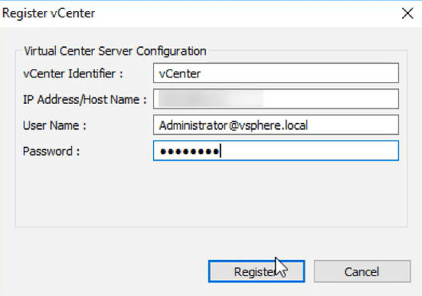
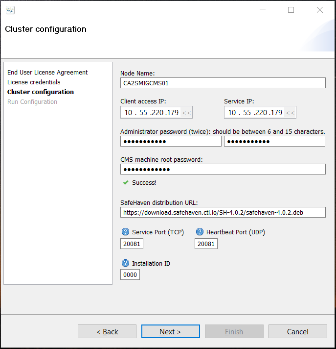

{{{
  "title": "SafeHaven-4-Register Data Center and SRN within a SafeHaven Cluster",
  "date": "05-03-2016",
  "author": "Mahima Kumar",
  "attachments": [],
  "contentIsHTML": false
}}}

## Article Overview
This article focusses on how to: 
1) Register datacenters and SRN's within the SafeHaven Console for CenturyLink Cloud, VMware vSphere and Manual (Standalone VMware ESXi hosts and DCC) datacenter type
2) Pair the SRN's together to set up Protection Groups

A single SafeHaven Cluster can have upto 64 datacenters registered within itself and each production and recovery datacenter has to be registered within the SafeHaven Console before protecting/recovering any workload.
There are 4 **Data Center Type** types available: 
1) VMware vSphere
2) VMware vCloud Director
3) CenturyLink Cloud
4) Manual (Standalone VMware ESXi hosts and DCC)

NOTE: For CenturyLink Cloud, each sub-account has to be registered as a separate datacenter.

### Requirements
1) SafeHaven Cluster already installed
2) CMS and SRNs to have proper network connectivity as per [SAHA4.0 Networking](SAHA4.0%20Networking.md)

### Assumptions
SafeHaven Cluster already installed with proper network connectivity between CMS and SRN.

### Register Data Centers

#### VMware Data Center

Within the SafeHaven Console, right-click on the **Administrator@Cluster** in the Navigation Tree on the left and select **Register Data Center** from the drop-down menu.

Enter **Data Center Name** and select the **Data Center Type**. Click **Register**.

Now click on the Data Center you registered and under the **Properties** Panel click on **Register**.

Create a name as your **vCenter Identifier**, enter your credentials for you VMware Data Centernk Cloud administration. Click **Next**.

#### Centurylink Cloud Data Center

WWithin the SafeHaven Console, right-click on the **Administrator@Cluster** in the Navigation Tree on the left and select **Register Data Center** from the drop-down menu.

Enter **Data Center Name** and select **CenturyLink Cloud** as the **Data Center Type**. Click **Register**.

Now click on the Data Center you registered and under the **Properties** Panel click on **Change Credentials**.

Enter your **CenturyLink Username** and **Password** for CenturyLink Cloud administration. Click **Next**.

Enter your account alias, identify the data center with one of the CenturyLink data centers and select Finish.

Now perform the same tasks for the production data center. You have now registered the production and recovery data center with the SafeHaven Cluster.

### Register the SRNs

Right-click on the recovery data center within the Navigation Tree and select Register SRN from the drop-down menu.

A pop-up panel appears. Provide a name for the SRN. You may want to match the name already provided for the SRN by the CenturyLink Cloud. Next provide the root password, the Service IP, WAN Replication IP, and local iSCSI IP along with the service ports for TCP and UDP (both have default values of 20082). Select Register.

If you need additional SRNs in the recovery data center, use a similar procedure to register them as well.

Using a similar procedure, register the SRNs in the production data center.

### Establish peering between SRNs and claim storage

Next we must establish peering relationships between SRNs in the production and recovery data centers. Select an SRN in the recovery data center. Select the Peers tab in the main data panel, then select Add peer.

A pop-up panel appears. Provide the root password for the recovery SRN. Next, identify the SRN in the production data center which needs to act as a peer. Provide its root password as well. Select Register.

Finally, you need to claim storage pools for each SRN. In the Navigation Tree, select an SRN in the recovery data center. In the main data panel under the Properties tab, select Claim Storage Pool.

A pop-up panel appears. Select the radio button to Claim a New Storage Pool. Provide the new pool a name. Select Claim.

Perform a similar task for all other SRNs in the recovery data center and also for the SRNs in the production data center. 

