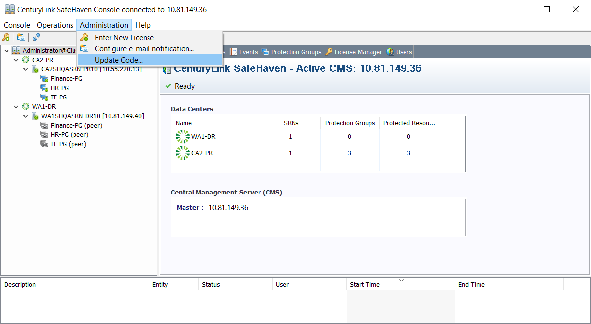
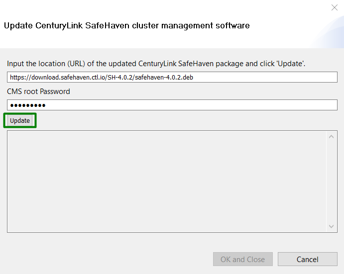
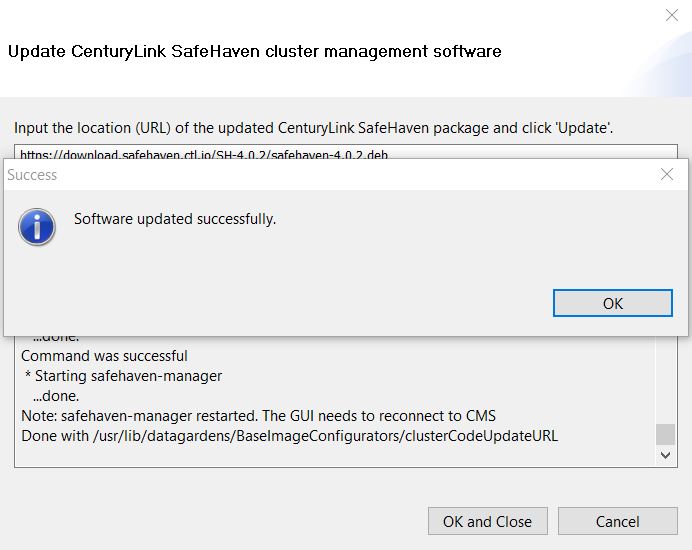

{{{
  "title": "SafeHaven-4-Upgrade Procedure for Minor Releases(Syntropy and GUI Console)",
  "date": "05-03-2016",
  "author": "Sharon Wang",
  "attachments": [],
  "contentIsHTML": false
}}}
## Article Overview
This article explains how to perform a minor upgrade for SafeHaven.

Minor Upgrade includes:
* **SafeHaven Syntropy Service**
* **SafeHaven GUI Console Upgrade**

### Assumption

This article assumes that the existing SafeHaven cluster is running on version 4.0.1

### Requirement

Confirm that there are no jobs running in the SafeHaven Console at the time of the upgrade.

### Update SafeHaven software (Syntropy)

Login to your existing SafeHaven Cluster version and validate both **Syntropy version** and **SafeHaven Console version** is 4.0.1 by clicking on **About CenturyLink SafeHaven Console** under the **Help** tab.

Click **Update Code...** under the **Administration** tab.

Input the URL of the update debian file, link (https://download.safehaven.ctl.io/SH-4.0.2/safehaven-4.0.2.deb) under the **Download Links** section of the [SafeHaven 4.0.2 release notes](safehaven-4.0.2-release.md)

Then input CMS root Password, click "Update" to start the update

**NOTE**: The latest official SafeHaven is 4.0.2 when this article is been written, if you are running on later version, please contact SafeHaven team for assistance 

After the update is finished, click on "OK" then "OK and Close" to leave the wizard.

### Download the new SafeHaven Console 

Download the latest compatible SafeHaven Console (GUI) from the GUI Package download link (https://download.safehaven.ctl.io/SH-4.0.2/SafeHavenConsole-4.0.2.zip) under the Download Links section of the SafeHaven 4.0.2 release notes : https://www.ctl.io/knowledge-base/disaster-recovery/safehaven-4/safehaven-4.0.2-release/

Unzip the downloaded package and login to the cluster using the new console

Double check if the versions of SafeHaven Console and Syntropy are compatible.

