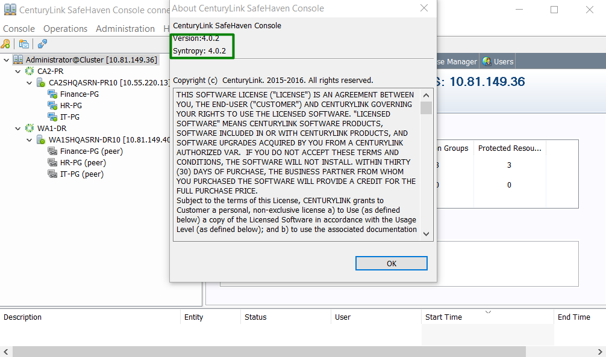

{{{
  "title": "Upgrade Procedure for Minor Releases(Syntropy and GUI Console)",
  "date": "05-03-2017",
  "author": "Sharon Wang",
  "attachments": [],
  "contentIsHTML": false
}}}

## Article Overview
This article explains how to perform a minor upgrade for SafeHaven.

Minor Upgrade includes:
* **SafeHaven Syntropy Service**
* **SafeHaven GUI Console**

### Assumption

This article assumes that the existing SafeHaven cluster is running on version 4.0.1

### Requirement

Confirm that there are no jobs running in the SafeHaven Console at the time of the upgrade.

### SafeHaven Syntropy Service

Login to your existing SafeHaven Cluster version and validate both **Syntropy version** and **SafeHaven Console version** are 4.0.1 by clicking on **About CenturyLink SafeHaven Console** under the **Help** tab.

Click **Update Code...** under the **Administration** tab.

Input the URL [Debian Package for CMS/SRN](https://download.safehaven.ctl.io/SH-4.0.2/safehaven-4.0.2.deb) which can be found under the **Download Links** section of the [SafeHaven 4.0.2 release notes](safehaven-4.0.2-release.md)

Then input **CMS root Password** and click **Update** to start the update

After the **Update** is finished, click **OK** and then **OK and Close**

Close the SafeHaven Console.

### SafeHaven GUI Console 

Download the latest compatible SafeHaven Console (GUI) [GUI Package](https://download.safehaven.ctl.io/SH-4.0.2/SafeHavenConsole-4.0.2.zip) which can be found under the **Download Links** section of the [SafeHaven 4.0.2 release notes](safehaven-4.0.2-release.md)

Unzip the downloaded package and launch the **safehaven-console.exe**. Enter the credentials and **Login** to the SafeHaven Console.

Confirm that the upgrade has been completed successfully by validating both **Syntropy version** and **SafeHaven Console version** are 4.0.2

Upgrade is now complete.
