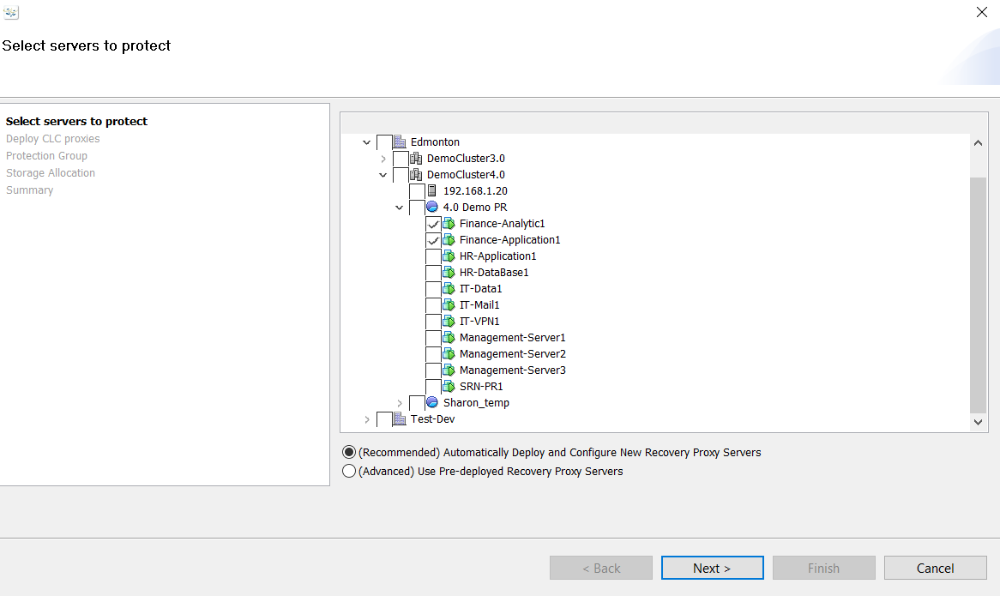
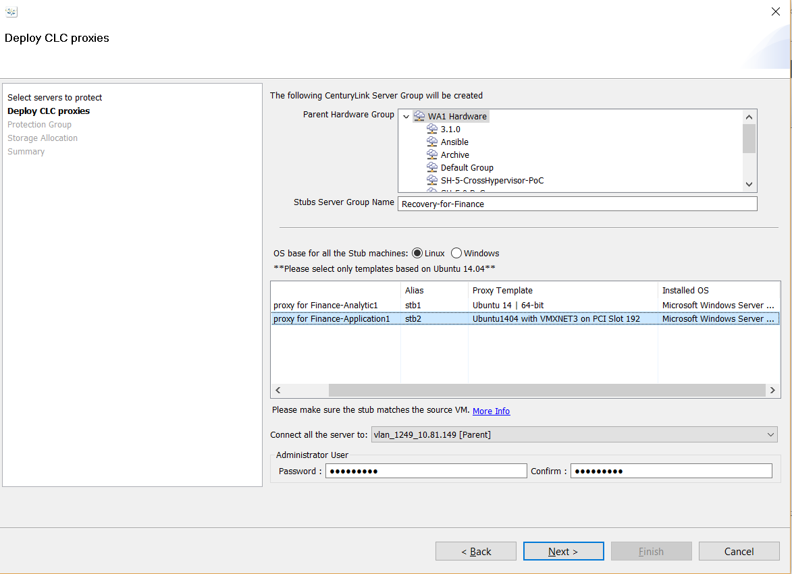
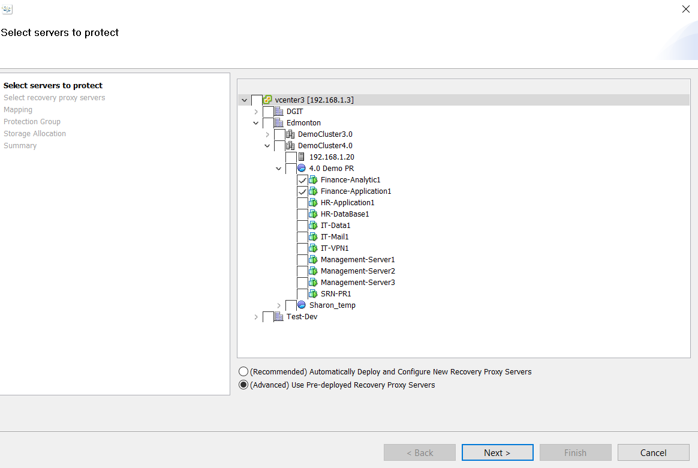
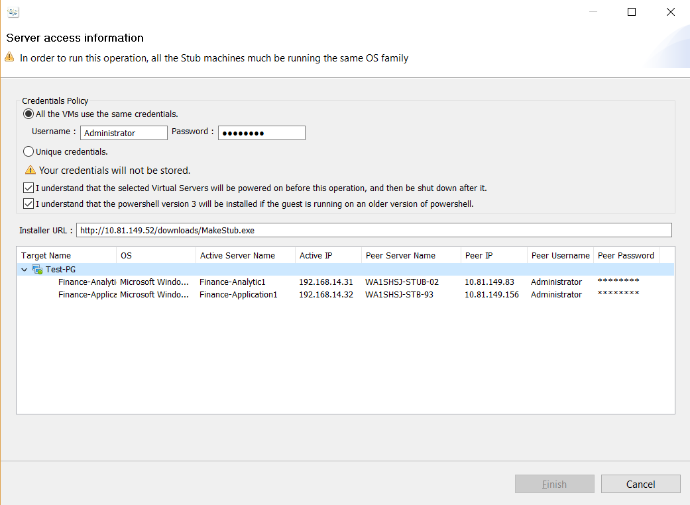

{{{
  "title": "SafeHaven 4: Use Linux as Recovery Proxy for Windows",
  "date": "10-24-2016",
  "author": "Shi Jin",
  "attachments": [],
  "contentIsHTML": false
}}}

### Why do we need this?
Before SafeHaven-4.0.1, the customer is required to deploy a Windows VM as a recovery proxy (aka stub) for any SafeHaven protection group (PG) that is protecting Windows servers. While this method works perfectly in the technical sense, the Windows stub incurs unnecessary Windows OS license cost, even while the stub VM is powered off in Lumen CLoud (CLC) for most of the time. In addition, in the ocassional event when a test failover or real failover is perfomred and the stub VMs are powered on, the Windows OS provided by CLC and paid for by the customers are not used since the stub boots into a customer disk image that is replicated by SafeHaven and Microsoft does have provisions in its licensing agreement to allow its customers to temporarily use its production Windows OS license during the short test/real failover scenarios.

An alternative method has been developed to use the open source Ubuntu-14 template which does not have any OS licensing cost in CLC. This should allow the customers to reduce cost for their SafeHaven disaster recovery solution in a significant way. This documents outlines the manual procedure that is necessary as of the SafeHaven-4.0.1 release which hopefully will soon be automated in future releases.


### 1. Information Gathering before Onboarding

We should gather information about servers to protect, for each Windows VM, we need to know its NIC model and PCI slot.
A table like this needs to be filled:

|VM Name|NIC Model|NIC PCI Slot|
|---|---|---|
|VM-1|VMXNET3|192|
|VM-2|VMXNET3|192|
|VM-3|VMXNET3|224|
|VM-4|VMXNET3|192|
...

Notes
* The method described in this document only works for the VMXNET3 NIC type. If the production VM runs E1000 or E1000E NIC type, it is highly recommended to replace them with a VMXNET3 NIC.
* If there are multiple NICs, any one of the NICs can be chosen as the match in the discovery recovery site and it does not have to be the one on production site connecting to the iSCSI target.
* SafeHavne-4 does not support recovery VMs with multiple NICs.

### 2. Create CLC Templates before Onboarding

* Get a list of unique VMXNET3 PCI Slot numbers for the production VM. For example, the above table has two unique numbers: 192 and 224.
* For each of the unique PCI Slot number that is not 160 (which is the standard CLC Ubunyu-14 template configuration)
  * Deploy a Ubuntu-14 in recovery CLC site
  * Send a ticket to help@ctl.io to change its PCI slot number from 160 to this new number that exists in production
  * Once the change is confirmed with the ```lspci -v``` conmmand, convert this VM to a template with names such as ```MakeStub Template: Ubuntu-14 on PCI Slot 192```.

### 3. Create Protection Groups during Onboarding

#### 3.1 (Available starting from  SafeHaven-4.0.1) Automatically Deploy/Configure the Recovery Proxy
This is a feature that is not yet available in SafeHaven-4.0.0.

Note that there are two ways to create a protection group and they have different methods to deploy/configure the recovery servers to boot from the proper iSCSI target.

##### 3.1.1 (Recommended) Automatically Deploy and Configure the Recovery Proxy during PG Creation





When deploying a recovery proxy server in CLC in the SafeHaven GUI protection group provision wizard, we need to make sure the template created in step 2 with matching **PCI Slot** number is chosen.

Notes
* If the production VM is running on VMXNET3 NIC on PCI Slot 160, the default CLC template of ```Ubuntu 14|64bit``` should be used.
* **It is the user's responsibility to choose the proper templates**. For example, the Linux has been selected as the OS of the stub machines, the user needs to choose templates that would deploy Ubuntu-14 on proper PCI Slot.
  *  If Windows templates are chosen, the PG creation process would fail.
  *  If the OS is correct but NIC PCI slot does not match the production VM, PG creation would work but the test-failove/failover operation would fail to properly boot into the recovery server.


##### 3.1.2 (Advanced) Automatically Run Makestub for PG Created by Choosing Existing Recovery Servers

On the next page, please make sure only Ubuntu-14 Linux VMs deployed from the proper templates that matches the corresponding production VM NIC model and PCI slot are chosen as recovery proxies.

Once the PG is created, the user launch the Makestbu wizard by right clicking on the PG and choose "installation->Install SafeHaven MakeStub".

Notes

* If all the recovery VMs are Windows, then this wizard will allow the user to configure them automatically using the Windows method.
* If all the recovery VMs are Linux, then this wizard will allow the user to configure them automatically using the Linux method.
* If the recovery VMs in the PG are of different OS (Windows and LINUX), the wizard would refuse to proceed and the user has no option but to manually configure them to boot from iSCSI target running the proper binary in each guest. Please refer to section 3.2 of this document.


#### 3.2 Manually Deploy from Template and Choose exsting VM as Recovery Proxy
This is the only method to be used in SafeHaven-4.0.0 if a Linux OS is to be used as the stub to protect a Windows VM.

When deploying a recovery proxy server manually in CLC, we need to make sure the template created in step 2 with matching **PCI Slot** number is chosen. Note that if the production VM is running on VMXNET3 NIC on PCI Slot 160, the default CLC template of ```Ubuntu 14|64bit``` should be used.

Once the stub VM is deployed from the chosen template, obtain the ```makestub_for_windows.sh``` by running the following commands as root:
```
wget https://www.dropbox.com/s/r8emtxq2rt8edls/makestub_for_windows.sh
chmod +x makestub_for_windows.sh
```

##### 3.2.1 Interactively during a Test Failover: Auto iSCSI Discovery
If the iSCSI target is present (for example during the test failover), one can simply run the ```makestub_for_windows.sh``` command. An interactive interface will guide the user to 
* install necessary packages
* enter the SRN IP address
* choose the proper iSCSI target IQN found by auto discovery

An example:
```
root@CA2SHSJSTW08-01:~# ./makestub_for_windows.sh 
Script started, file is running_makestub_for_windows.sh.log
Linux Makestub for Windows on Ubuntu-14
Need to install the following (required) packages: open-iscsi lsscsi
Install now or exit [y/n]: y
Reading package lists... Done
Building dependency tree       
Reading state information... Done
The following NEW packages will be installed:
  lsscsi open-iscsi
0 upgraded, 2 newly installed, 0 to remove and 0 not upgraded.
Need to get 303 kB of archives.
After this operation, 2,327 kB of additional disk space will be used.
Get:1 http://us.archive.ubuntu.com/ubuntu/ trusty/main lsscsi amd64 0.27-2 [35.6 kB]
Get:2 http://us.archive.ubuntu.com/ubuntu/ trusty/main open-iscsi amd64 2.0.873-3ubuntu9 [268 kB]
Fetched 303 kB in 0s (1,381 kB/s)
Selecting previously unselected package lsscsi.
(Reading database ... 85825 files and directories currently installed.)
Preparing to unpack .../lsscsi_0.27-2_amd64.deb ...
Unpacking lsscsi (0.27-2) ...
Selecting previously unselected package open-iscsi.
Preparing to unpack .../open-iscsi_2.0.873-3ubuntu9_amd64.deb ...
Unpacking open-iscsi (2.0.873-3ubuntu9) ...
Processing triggers for man-db (2.6.7.1-1ubuntu1) ...
Processing triggers for ureadahead (0.100.0-16) ...
ureadahead will be reprofiled on next reboot
Setting up lsscsi (0.27-2) ...
Setting up open-iscsi (2.0.873-3ubuntu9) ...
Processing triggers for ureadahead (0.100.0-16) ...
Restarting iSCSI service.
Please enter the iSCSI Target Server IP address (your SRN Private IP) at this site: 10.55.220.184
Discovering iSCSI targets on 10.55.220.184 ...
Select the target IQN of your Protection Group:
1)  iqn.2016-09.io.ctl:Windows-PG-Win12R2-external
2)  iqn.2016-09.io.ctl:Windows-PG-Win08R2-external
#?2
Created /opt/datagardens/dg.conf
Checking networking configuration ...
Determining boot interface configuration
Boot Device Configuration:
NIC Device:   eth0
IP            10.55.220.24
Gateway:      10.55.220.1
PCI Slot:     192
Does PCI Slot Number 192 agree with the NIC of your original VM [y/n]: y
SRN 10.55.220.184 is on a different subnet than stub - gateway 10.55.220.1 will be cleared on boot
Created /boot/iscsi.ipxe
Created /etc/grub.d/42_datagardens_custom_entry (mode 755)
Adding 'iSCSI boot of iqn.2016-09.io.ctl:Windows-PG-Win08R2-external via 10.55.220.184' boot entry to local grub configuration
Generating grub configuration file ...
Found linux image: /boot/vmlinuz-3.13.0-83-generic
Found initrd image: /boot/initrd.img-3.13.0-83-generic
Found linux image: /boot/vmlinuz-3.13.0-32-generic
Found initrd image: /boot/initrd.img-3.13.0-32-generic
done
Script done, file is running_makestub_for_windows.sh.log
```


##### 3.2.2 (Recommended) Silently: Without Test Failover

It is recommended to perform the MakeStub procedure while the production VMs are in the onboarding process. For this reason, a test failover is not possible. The IQN can be copied from the SafeHaven Console's Targets tab.

```
root@CA2SHSJSTW12-01:~# ./makestub_for_windows.sh  -d -s 10.55.220.184 -i iqn.2016-09.io.ctl:Windows-PG-Win12R2-external
Script started, file is running_makestub_for_windows.sh.log
Linux Makestub for Windows on Ubuntu-14
Created /opt/datagardens/dg.conf
Checking networking configuration ...
Determining boot interface configuration
Boot Device Configuration:
NIC Device:   eth0
IP            10.55.220.54
Gateway:      10.55.220.1
PCI Slot:     192
Does PCI Slot Number 192 agree with the NIC of your original VM [y/n]: y
SRN 10.55.220.184 is on a different subnet than stub - gateway 10.55.220.1 will be cleared on boot
Created /boot/iscsi.ipxe
Created /etc/grub.d/42_datagardens_custom_entry (mode 755)
Adding 'iSCSI boot of iqn.2016-09.io.ctl:Windows-PG-Win12R2-external via 10.55.220.184' boot entry to local grub configuration
Generating grub configuration file ...
Found linux image: /boot/vmlinuz-3.13.0-83-generic
Found initrd image: /boot/initrd.img-3.13.0-83-generic
Found linux image: /boot/vmlinuz-3.13.0-32-generic
Found initrd image: /boot/initrd.img-3.13.0-32-generic
done
Script done, file is running_makestub_for_windows.sh.log

```

As a reference, the options to this command is as following:
```
root@CA2SHSJSTW12-01:~# ./makestub_for_windows.sh  -h
usage: makestub_for_windows.sh [options]
      -h,         --help          display this help screen
      -d,         --defaults      use the default values wherever suggested
      -s <SRN-IP> --srn <SRN-IP>  (private) IP address of SRN serving the iSCSI target
      -i <IQN>    --iqn <IQN>     IQN of the Windows iSCSI target to connect to
```


