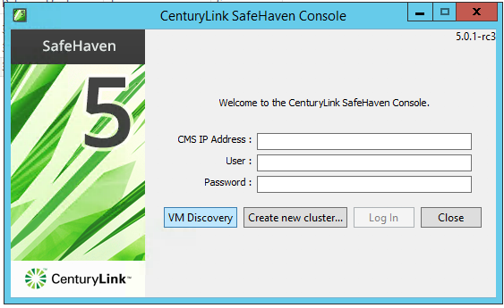
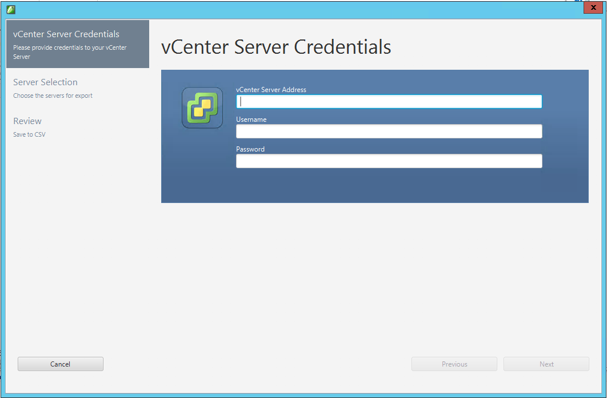
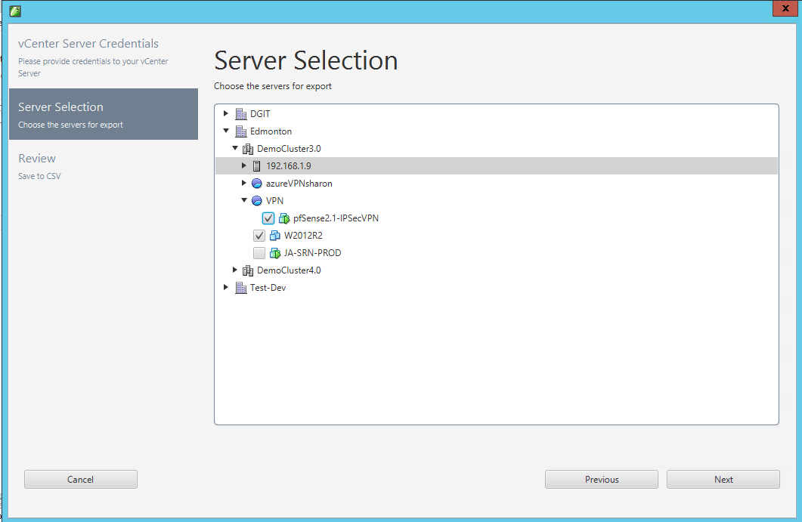
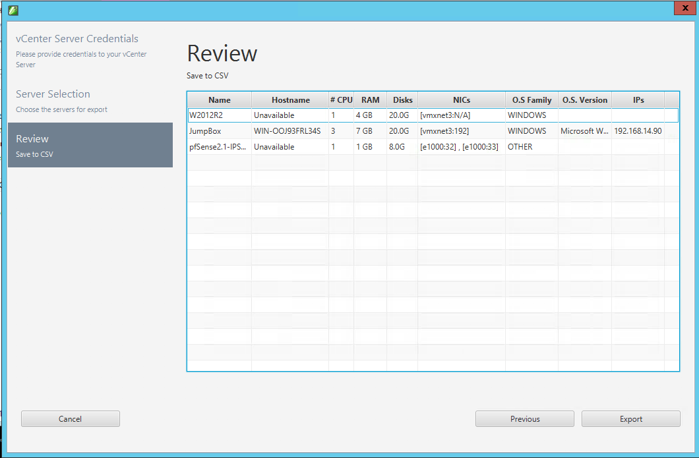

{{{
  "title": "Gather Production Server Information",
  "date": "12-27-2017",
  "author": "Mahima Kumar",
  "attachments": [],
  "contentIsHTML": false
}}}

### Article Overview
This article covers the information a user needs to gather before protecting a Production Server using SafeHaven.
This article does not cover any other aspect of the DR setup.

### Production Server Information
Production Servers can either be Windows or Linux. Please refer to [SafeHaven 5.0 Use Case and Support Matrix](../SafeHaven 5 General/SafeHaven-5.0-Use-Case-and-Support-Matrix.md) for more information.

Gather the following information for the servers you want to protect:

1. Server Name
2. O.S. Type
3. Number of vCPU
4. RAM
5. Production Server Size (Storage) that has to be protected  
    a. Provisioned Storage for Windows  
    b. Used Storage for Linux
6. Network/VLAN Information/I.P. Address
7. Server dependencies(grouping servers together)

Apart from this other information regarding Domain Controllers, DNS Servers, transaction rate of SQL Servers, etc. have to be gathered as it impacts the overall disaster recovery setup. CenturyLink's resource will provide guidance on this.

### VM Discovery for VMware on prem site using SafeHaven console

**Note** use the VM Dicovery tool enbeeded in the SafeHaven console to get the required information when the customer environment is VMware.

1. Launch the SafeHaven console.
2. Click on the VM Discovery button.

3. Provide the vCenter Server address or name and the credentials to access it. Then click on Next.

4. Select all the VMs in the inventory tree that you wish to protect with SafeHaven then click Next.

5. Review the information before you export it. Data like hostname and IP from the VMs is only available if VMware tools have been installed on the server.

6. Click on Export, then select the location for the .xls file.

### Documentations

[SafeHaven Inventory Sheet](https://download.safehaven.ctl.io/SH-5-Docs/SafeHaven-Inventory-Sheet-1.xlsm)
