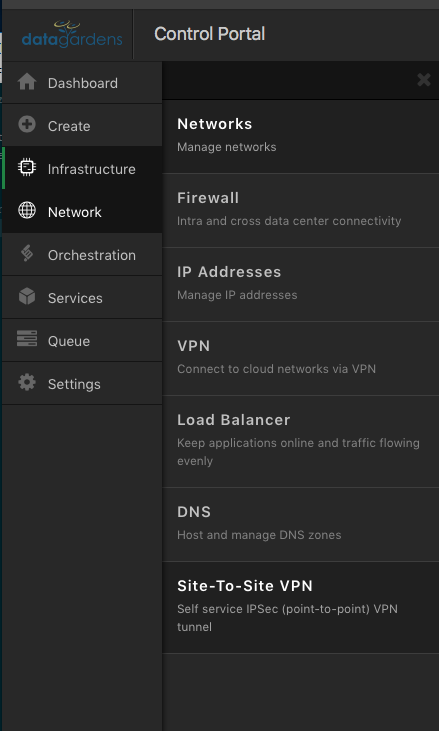
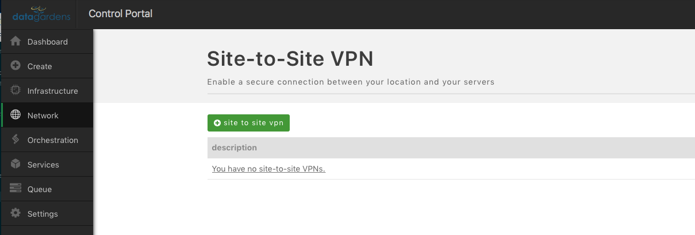
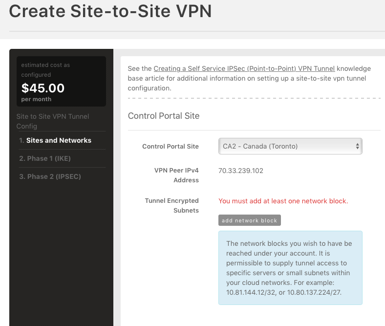
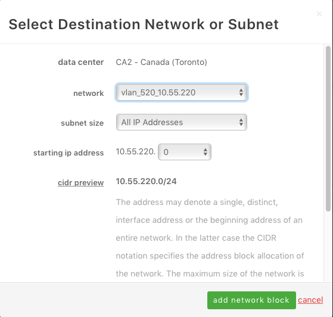
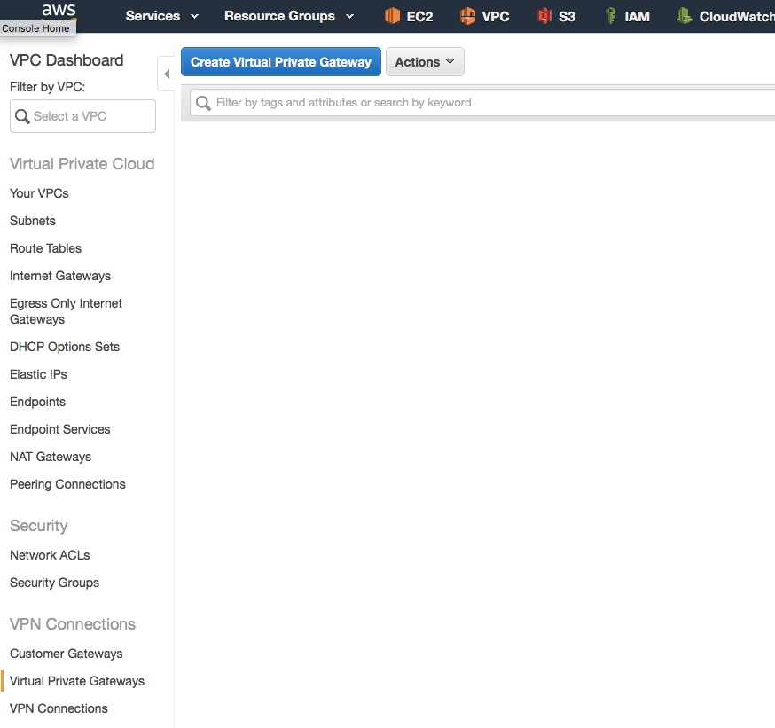
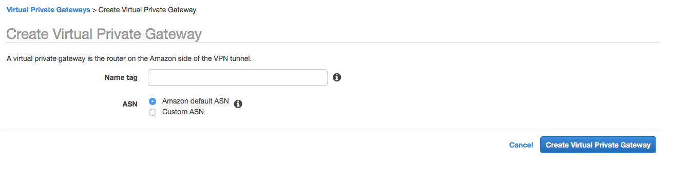
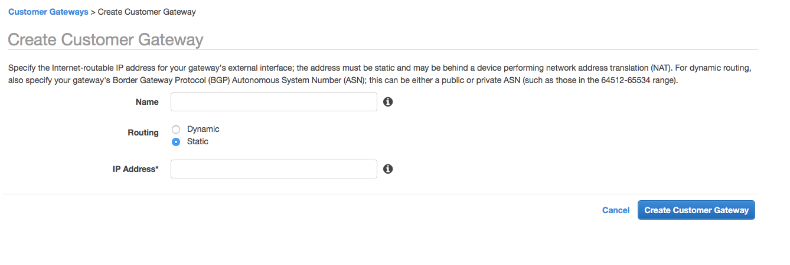

{{{
  "title": "Site to Site VPN between Lumen Cloud and AWS",
  "date": "1-9-2018",
  "author": "Juan Aristizabal",
  "attachments": [],
  "contentIsHTML": false
}}}

### Article Overview
This article covers the steps to create Site-to-Site VPN between Lumen Cloud and AWS.

### Lumen Cloud Configuration Part 1
Go to the CLC portal at https://control.ctl.io and select **Site-to-Site VPN** under the **Network** tab in the left navigation panel.

**NOTE:** You must select the parent account in order create a site to site VPN.

Click on the **+ site to site vpn** button.

Select the appropriate Lumen Cloud datacenter as the **Control Portal Site**.

Click on **add network block** under the Tunnel Encrypted Subnets

Select the IP range you want to route over the VPN from one of the existing networks on your CLC datacenter.

Click on **add network block**.

### AWS Configuration Part 1:
Sign in to the AWS console and go to the **VPC** service.

#### Create a Virtual Private Gateway
Click on **Virtual Private Gateways** on the left and then click on the **Create Virtual Private Gateway**. Give it a name in **Name tag** and select **Amazon default ASN**. Associate the gateway to the VPC that contains the subnet you want to route through the VPN.

### Create a Customer Gateway:
Click on **Customer Gateway** on the left and then click on **Create Customer Gateway**.
Give it a **Name** that describes what connection it is creating, example: CLC CA2. Select Routing as **Static** and enter the **IP Address** obtained from the Lumen Cloud Configuration Part 1 above.

### Create a VPN Connection:
Click on **VPN Connections** and then click on **Create VPN Connection**.

Privide a **Name Tag** for the VPN connection, click on **Virtual Private Gateway** and select the **Virtual Private Gateway** that was created. Leave the **Customer Gateway** option to **Existing**, and enter the **Customer Gateway ID** that was created.

For **Routing Options** select **Static**. Enter the **IP Prefixes** of the Lumen Cloud Network you want to connect to AWS. Leave the Tunnel options empy and click on **Create VPN Connection**

Wait until the VPN is created and its state is available.

