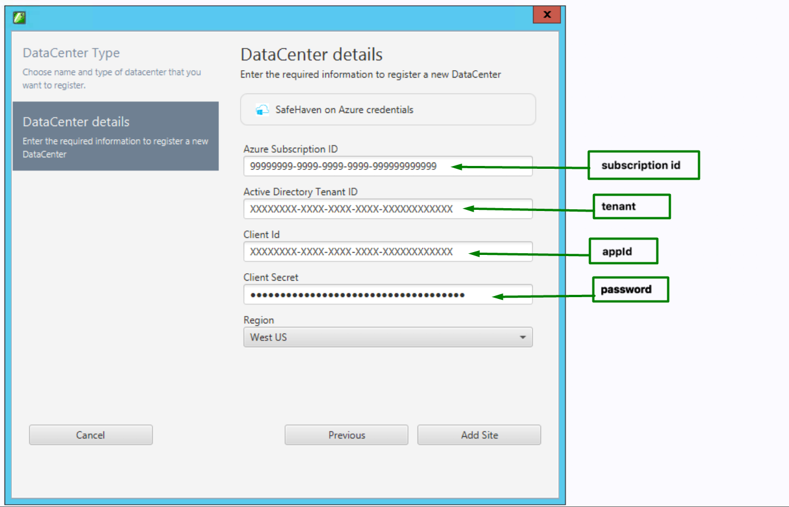

{{{
  "title": "Register Azure Datacenters within a SafeHaven Console",
  "date": "06-14-2018",
  "author": "Juan Aristizabal",
  "attachments": [],
  "contentIsHTML": false
}}}

### Article Overview
Register Datacenters within the SafeHaven Console for Azure Cloud.

### Requirements
SafeHaven Cluster already installed and user has access to it.

### Assumptions
1. CMS Virtual Machine has been deployed in Azure and SafeHaven Cluster has already been created.
2. A Service Principal on Azure for programatic access has been created as per [CreateServicePrincipalAzure](CreateServicePrincipalAzure.md).

### Register Azure Region
Each Azure Region is treated as a separate Datacenter within a SafeHaven Cluster.

1. Within the **SafeHaven Console**, right-click on the **Administrator@Cluster** in the Navigation Tree on the left and select **Register Data Center** from the drop-down menu.
2. Enter **Data Center Name** and select **Microsoft Azure** as the **Data Center Type**. Click **Next**.
3. Enter your **Azure Subscription ID**,  **Active Directory Tenant ID**, **Client Id** and **Client Secret** with the values obtained as per [CreateServicePrincipalAzure](CreateServicePrincipalAzure.md) using **subscription id**, **tenant**, **appId** and **password** respectively. 

4. Then, select your Recovery **Region**.
5. Click **Add Site**.
6. The credentials will be validated by the SafeHaven console before declaring the operation successful.
