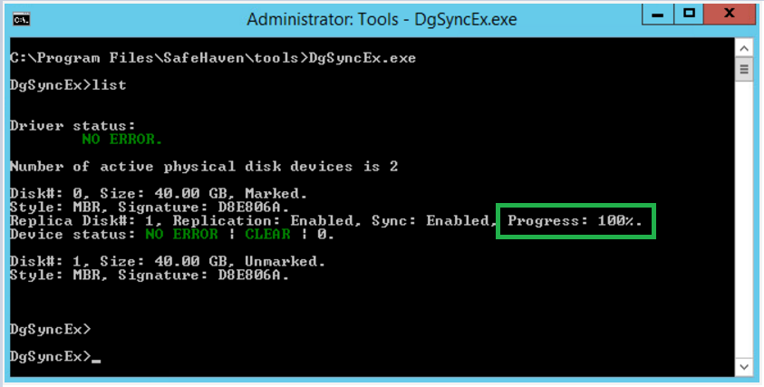
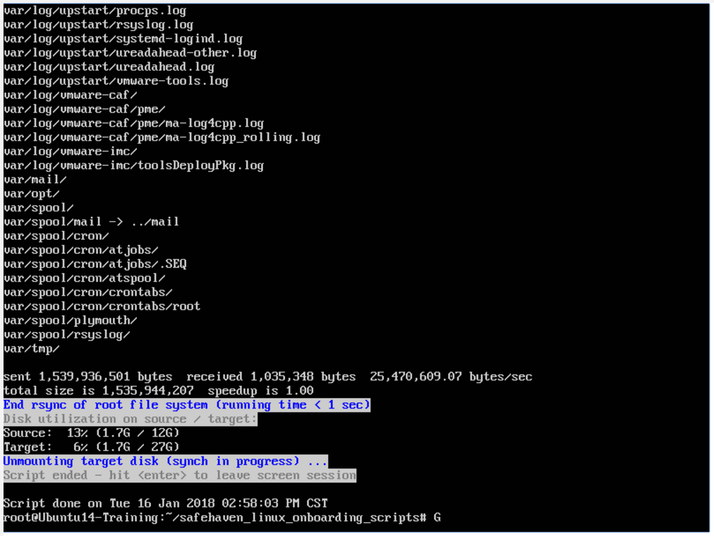
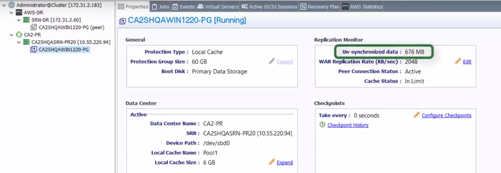

{{{
  "title": "Check Replication Status",
  "date": "01-17-2017",
  "author": "Anshul Arora",
  "attachments": [],
  "contentIsHTML": false
}}}

### Article Overview
This article explains how to check replication status for protection groups from the SafeHaven console and production server.

### Assumptions
This article assumes that a SafeHaven cluster has already been created successfully. Both production and recovery SRNs are registered and peered with storage pools claimed correctly. Initial replication has been started on the Windows Production Servers.

### Check Replication Status for a Windows Server
1. RDP to the Production Windows server you are protecting. Open a command prompt with admin privileges, and change the directory to C:\Program Files\SafeHaven\tools
```
cd C:\Program Files\SafeHaven\tools
```
2. Execute the following command:
```
C:\Program Files\SafeHaven\tools>DgSyncEx.exe
```
3. Check the status of the synchronization by running the list command
```
DgSyncEx>list
```
4. Monitor the local replication by looking at the Progress% for each source disk. We require each disk to have progress % of 100 before configuring checkpoints.



### Check Replication Status for a Linux Server
1. SSH to the Production Linux Server you are protecting. Run these commands:
```
cd safehaven_linux_onboarding_scripts/
ls
cat running_rsync2iscsi.sh.log
```
2. This will show you the replication status and that the rsync job completed and the Script has ended.



### Monitor the Unsynchronized Data for Protection Groups
Monitor the WAN replication by logging into the SafeHaven console, click on the Protection Group and monitor the **Unsynchronized Data** count in the **Properties** panel.



Once the WAN replication completes and the Unsynchronized data count is close to 0 bytes, **next step** is to [Configure Checkpoints](Configure Checkpoints.md)
