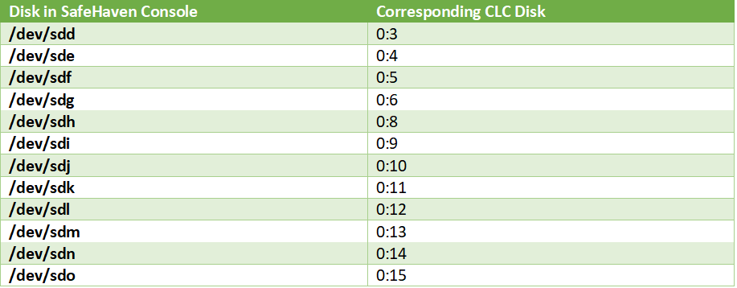

{{{
  "title": "Expand Disk under a Protection Group",
  "date": "08-22-2018",
  "author": "Anshul Arora",
  "attachments": [],
  "contentIsHTML": false
}}}

### Article Overview
This article explains how to expand the disks under a VM in a protection group is a source VMs disk has been expanded

### Requirements
1. Access to the SafeHaven console (GUI).
2. Access to Centurylink portal
3. SafeHaven version 4.0.2 or above are required

### Expand disk on the DR SRN
This step explains how to expand disk on the DR SRN to accomodate the expanded storage on source VM
1. Login to SafeHaven console.
2. Click on the Protection group where the source VMs disk has been resized.
3. Under the properties panel, note down the **Data volume Storage Pool** under **Peer** side.
4. Click on the SRN where the PG resides under DR datacenter.
5. In properties panel, note down the disks corresponding to the Claimed Storage Pool for the resized source VM. This will appear like /dev/sdd, or /dev/sde,etc
6. Login to Centurylink Cloud Portal : https://control.ctl.io/
7. Under infrastructure, go to the DR SRN for the resized source VM under the DR Datacenter.
8. On the right hand side, click on edit storage. Expand the disk in CLC from step 5 according to the image below
   
9. Click **Apply**, and wait for the disk resize job to finish.

### Expand Protection group.
1. Go to SafeHaven console and click on the DR SRN.
The claimed storage pool should now be increased. If it is still showing old value, click on rescan to update it.
2. Click on the Protection group with the resized source VM.
3. Under **General** panel, click on **Expand** in front of **Protection Group Size**.
4. Enter the new size. If the original size was 100GB and you added 10 GB more, then write 110GB here. Click **ok**.
5. Wait for the PG resize hob to finish.

### Expand VM disk from SafeHaven console.
1. Once the PG resize job is finished, click on **Virtual Servers** tab within the same PG.
2. Click on the VM that needs to be resized.
3. Selec the disk that needs to be resized.
4. Scroll to the right, and click on **expand**
5. Enter the new size of the disk, and click **Finish**.

### Check the replication on source VM
1. Login to the Source VM.
2. run SafeHaven **tools** commandline as **administrator**. You can find it by searching "tools" from windows start menu.
3. Type **DgSyncEx.exe**, and press enter.
4. Type, **rescan**, and press enter to update the disk size in source VM.
5. Type **list**, and press enter.
6. Make sure the resized source disk has the same sized replica disk.  

This finishes the resize process. You will see clean checkpoints once the additional disk is replicated.  
**Note**: If you run into any issues while following this KB article, then please send an email to help@ctl.io for support.

