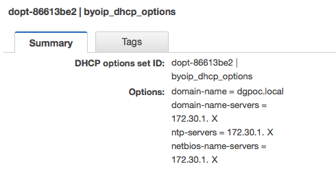

{{{
  "title": "Bring Your Own IP upon Failover in AWS(BYOIP)",
  "date": "12-27-2017",
  "author": "Juan Aristizabal",
  "attachments": [],
  "contentIsHTML": false
}}}

### Article Overview
This article explains how to configure AWS networking in order to be able to failover servers from Lumen Cloud to the same IP space in AWS.

### Requirements
1. Having a VPN between AWS and CLC is not required for SaveHaven to work but it is in order to have AD replication working properly; domain controllers behind NAT is not a Microsoft best practice, for more information please see: https://support.microsoft.com/en-us/help/978772/description-of-support-boundaries-for-active-directory-over-nat
2. Dependencies between the application components should be configured with names, hardcoded IPs can potentially affect a successful failover. 

### Assumptions
This article assumes that the user has already a working SafeHaven and there are SRN/CMS nodes deployed at CLC and AWS. This article doesn’t cover the creation of the multi-tier application, make sure it is functional before attempting a failover.  Also, it is assumed that the application is already protected by SafeHaven on a single protection group.

### Network configuration
The following diagram illustrates the high-level network configuration of this setup:

### Site-to-site VPN
On Lumen cloud there is only one subnet that contains the multi-tier application as well as the SafeHaven SRN. There is a VPN between subnet 10.55.220.0/24 and subnet 172.30.1.0/24 on AWS.

On AWS the VPN is associated with the VPC which CIDR contains 172.30.1.0/24m and it must contain a route to the subnet on CLC.
### VPC Peering

Given that it is required to have the bring your own IP range on CLC and AWS, a separate VPC is created on AWS to host the failover instances.  VPC peering allows us to route traffic between different CIDR blocks on AWS and isolate the traffic for failed over instances.

### Routing tables
By manipulating the routing tables of the subnets on AWS we can failover/test failover instances without impacting the production environment and keeping the multi-tier application isolated. For CLC there is no setup required other than the VPN configuration.

For AWS:
vgw-xxxxxx    	VPN between CLC and AWS
pcx-yyyyyy	VPC Peering between Main and BYOIP VPCs
igw-zzzzzz	Internet Gateway

**NOTE** that for the main VPC all traffic to 10.55.220.X is sent to the BYOIP VPC, excluding the Domain controller and the SRN, this enables the communication from the domain replica to any failed over instances, even if those change their IP. Remember that more specific routes take precedence over others, regardless if they are local, VPC peered or over VPN.

The route on BYOIP VPC to 172.30.1.0/24 over the VPC peering guarantees that the failed over instances can talk to the replica domain controller.

### DHCP options
In addition to the routing tables we need to configure the DHCP options set on the BYOIP VPC so any instances there will have the domain replica as the primary DNS server.

