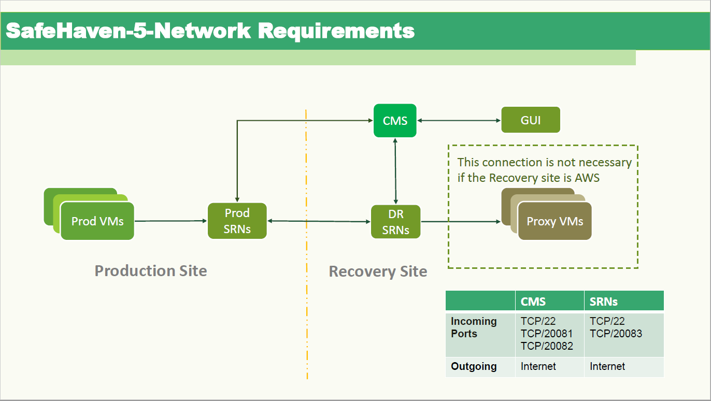

{{{
  "title": "SafeHaven-5-Network and Port Requirements",
  "date": "03-22-2018",
  "author": "Shi Jin",
  "attachments": [],
  "contentIsHTML": false
}}}

### Article Overview
This article covers different TCP and UDP ports required to be opened on CMS, SRN, and local guest for SafeHaven 5.0.

### CMS
* TCP/22: ssh (remote management)
* TCP/20081: SafeHaven  communication with GUI, **SSL encrypted**
* TCP/20082: SafeHaven cluster communications with SRNs
* Internet access (see the last section for details)

### SRN
There are 3 logically separated networks which can be arbitrarily combined into actual NIC interface in real implementations.
* SafeHaven cluster service network
* SafeHaven data replication network
* Local network

**1. On SafeHaven Cluster Service Network**
* TCP/22: ssh (remote management and start/stop safehaven-service via CMS)
* TCP/20083: SafeHaven cluster communication with peer SRNs and CMS, **SSL encrypted**
* Internet access (see the last section for details)

**2. On SafeHaven Data Replication Network**

* TCP/22: ssh (remote SRN establishes a SSH tunnel to master SRN for actual data replication)

**3. On Local Network**

* TCP/80: http (web server to provide binaries downloads and certificates for protected servers)
* TCP/3260: iSCSI (iSCSI targets to be connected by protected servers for local replication)
* TCP/5671: RabbitMQ (local communication between SRN and protected servers), **SSL encrypted**

#### Networking Requirement to Make API Calls

* For VMware site, the SRN within it needs to have a network connectivity to the vCenter server to make vSphere API calls
* For CLC site, the SRN within it needs to have access to https://api.ctl.io/
* For AWS site, the SRN within it and the GUI needs to have access to AWS API end points

### Windows Machine Running the GUI

* It needs to have network connectivity to the CMS, ie, access TCP port 20081 of the CMS.
* If there is a VMware site, this client machine also needs network connectivity to the vCenter server, ie, it should be able to run VMware vSphere client and connect to the vCenter server.

### About Internet Access

Once installed, the SafeHaven cluster does not need Internet to operate if there is a way for the customer to use the GUI to login to CMS and the API calls  from SRNs can reach the service it needs to contact. But as a general rule, it is a lot easier to assume all nodes have access to Internet as ongoing clients and this normally does not impose any significant security risk since there is no service provided to the Internet.

#### The SafeHaven Cluster Installation Phase

In order to finish the installation of the SafeHaven-5 cluster, the CMS/SRN nodes need to
* download the debian package specified by the user via the GUI cluster installation wizard
* install necessary dependency packages from
  * standard Ubuntu release repositories for standard Ubuntu packages. A typical URL is http://us.archive.ubuntu.com/ubuntu/. However, the actual URL used might be a selected mirror that has better connectivity.
  * or the specific release URLs for those packages not shipped as part of the standard Ubuntu distribution. For example, the Ansible winrm package is downloaded from https://github.com/diyan/pywinrm directly.

In summary, it is difficult to come up with a comprehensive list of URLs that needs to be white listed in the firewall rules to allow access. It is recommended to temporarily allow outgoing Internet connections during the installation phase, at least temporarily.

#### Normal Operation Phase

During normal operations, there is only one possible outgoing Internet access which is made by the CLC SRN (if any) to make CLC API calls and it is made to the https://api.ctl.io/ URL.

#### Summary and Recommendation to Firewall Internet Access White Listing

* Temporarily allow all Internet access (http and https) during cluster installation phase.
* White list https://*.ctl.io/ which could cover anything provided by CenturyLink Cloud.
* White list https://*.amazonaws.com/ which could ocver anything provided by Amazon Web Services
