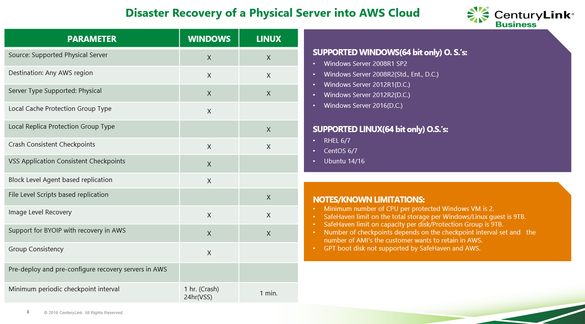

{{{
  "title": "SafeHaven 5.1 Use Cases and Support Matrix",
  "date": "06-19-2018",
  "author": "Anshul Arora",
  "attachments": [],
  "contentIsHTML": false,
  "sticky": true
}}}

### Article Overview
This article covers all the supported use cases and support matrix for SafeHaven 5.0.

### SafeHaven 5.1 Use Cases and Support Matrix
Below is a list of all the supported use cases along with the support matrix.

### CLC as DR Site

### Disaster Recovery of a CLC Datacenter into another CLC Datacenter

### Disaster Recovery of an On-Prem VMware/DCC-Core site into a CLC Datacenter

### AWS Cloud as DR Site

### Disaster Recovery of a CLC Datacenter/VMware/CenturyLink Private Cloud on VMware Cloud Foundation site into AWS Cloud

### Disaster Recovery of a Hyper-V Gen1 server into AWS Cloud

### Disaster Recovery of a CLC Bare Metal server into AWS Cloud

### Disaster Recovery of an AWS Region into another AWS Region

### Disaster Recovery of a Physical Server into AWS Cloud

### Azure Cloud as DR Site

### Disaster Recovery of a CLC Datacenter/VMware/DCC-F site into Azure

### Disaster Recovery of a Hyper-V Gen1 Server into Azure

### Disaster Recovery of a CLC Bare Metal Server into Azure

### Disaster Recovery of an AWS server into Azure

### Disaster Recovery of a Physical Server into Azure

