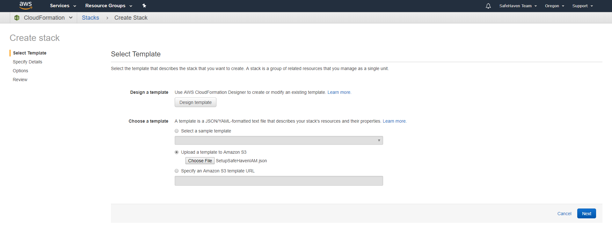
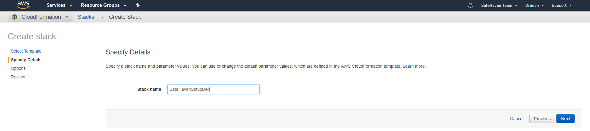
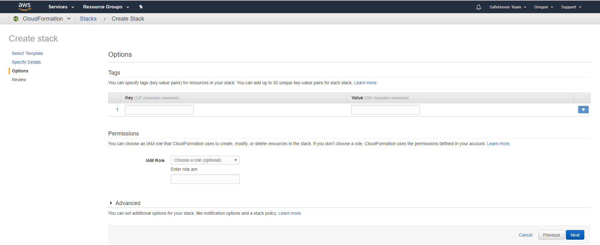
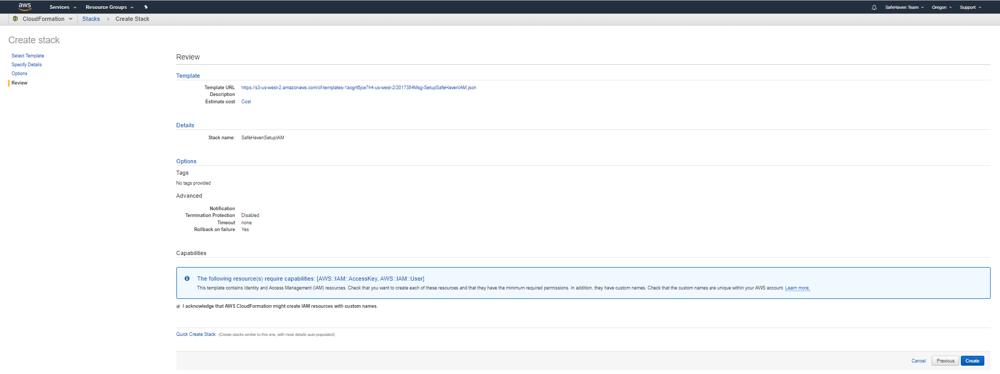
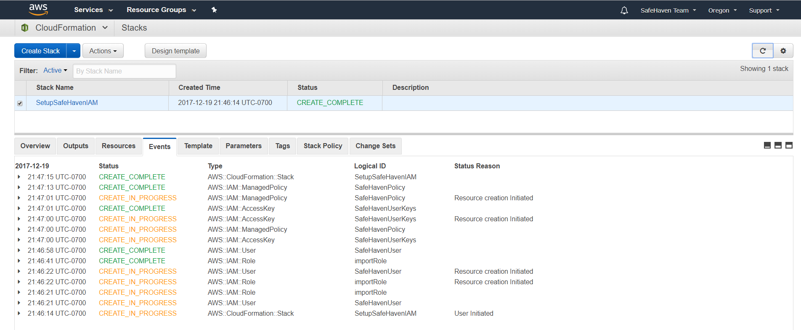
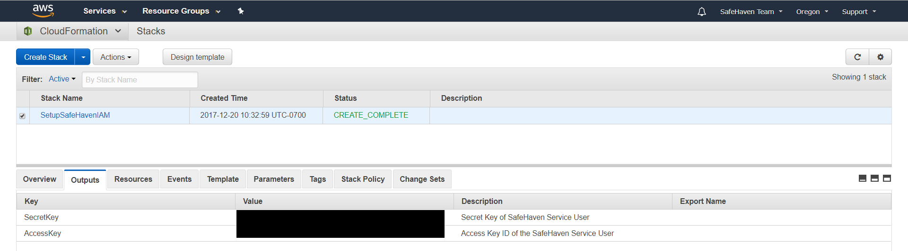
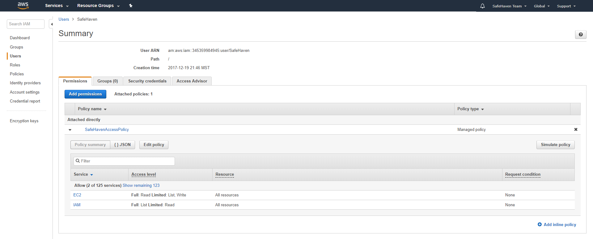
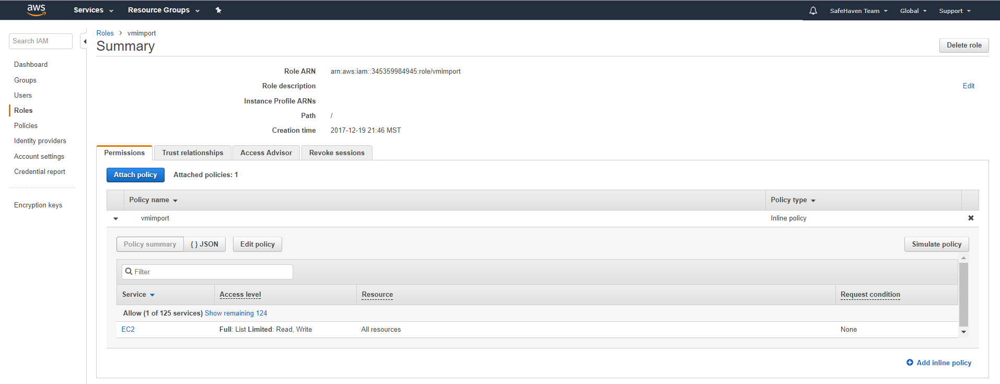
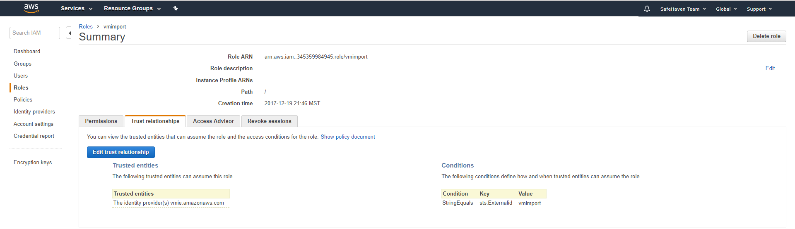

{{{
  "title": "Setup AWS for SafeHaven-5 Using CloudFormation",
  "date": "12-27-2017",
  "author": "Shi Jin",
  "attachments": [],
  "contentIsHTML": false
}}}

### Requirements
Access to an AWS account.

### How to Use SetupSafeHavenIAM.json to Setup AWS IAM
1. Download [SetupSafeHavenIAM.json](https://download.safehaven.ctl.io/SH-5.0.0/SetupSafeHavenIAM.json) to be used later. Feel free to open this file with a text editor to review its content.
2. Login to AWS Console with a user with permission to change IAM (such as the root account user or Administrator)
3. Go to the CloudFormation service
4. Create a new Stack by  uploading this SetupSafeHavenIAM.json file

* Provide a Stack name such as `SetupSafeHavenIAM`

* Do nothing on the Options page

* Check the acknowledgement checkbox and click on **Create**

* When the CloudFormation script finish running, we should see the **CREATE_COMPLETE** status

* Click on the Outputs tab to see the API key pair

**Please note that once this key pair is securely stored locally, one can delete the CloudFormation stack and the resources created by this stack will be kept**

### Confirmation
We can confirm the results by going to the IAM service of the AWS Console.

#### Confirm User
We should find a `SafeHaven` user created with the following permissions:

We can see that this user has
* full read access to both EC2 and IAM
* only limited write access to EC2 (just enough for SafeHaven to work)

The API key pair of this `SafeHaven` user can be found in the **Outputs** section of the CloudFormation stack we just created.

#### Confirm Role
We should also find a `vmimport` role created with an inline policy that allows for limited access to EC2:

By clicking on the **Trust relationships** tab of this role, we show trust to the VM Import/Export service (vmie.amazonaws.com)

**Next Step** is to [Create Production SRN in Lumen Cloud](../SafeHaven 5 CLC to AWS/Create Production SRN in Lumen Cloud.md)
