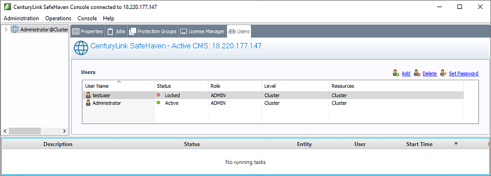

{{{
  "title": "SafeHaven 5: Account Operations",
  "date": "03-13-2019",
  "author": "Christian Hunt",
  "attachments": [],
  "contentIsHTML": false
}}}

### Account Operations

* Accounts can be created and deleted using SafeHaven
* A user account password can be reset using SafeHaven




##### Password Recovery
* If an incorrect password is used on an account ten or more times sequentially the account will be locked.
* Once an account has been locked it must undergo a password change to unlock the account.
* An account can be identified as locked in SafeHaven, under the users tab, the status will read `Locked`.
* Using SafeHaven the user password can be reset by the Administrator account.
* Administrator password recovery requires access to the CMS via SSH.

##### Password Reset Steps
* With Administrator account credentials:
    * Using SafeHaven, login using the Administrator credentials.
    * Access the Users tab and select the user that requires a password reset.
    * Press `Set Password` on the right side of sceen near the top in the group of user controls.
    
    * Enter the new password into each of the provided fields.
    * Once the job is complete, the account is ready to be used with the new password.

* Unlocking Administrator Account:
    * SSH access to the CMS machine using root credentials is required.
    * Once logged in via SSH the appropriate command can be entered:
        ```
        gosh user-set-password Administrator <NEW PASSWORD>
        ```
    * Once this action is performed and the job is completed, the new password can be used to login the Administrator.
        * It is recommended to use a temporary password when using the command as it will be plain text.
        * Change the password once again using the SafeHaven software to maintain a secure password.
        * When changing the Administrator password using SafeHaven the current password is required.
        
