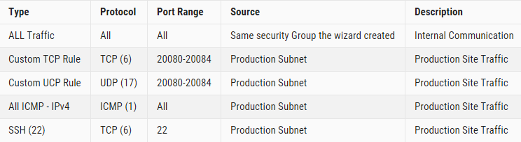

{{{
  "title": "Setup Security Group in AWS for SafeHaven5",
  "date": "02-05-2018",
  "author": "Weiran Wang",
  "attachments": [],
  "contentIsHTML": false
}}}

### Article Overview
This article explains how create Security Group for SRN and CMS instances in AWS.
### Requirements
1. Access to AWS account.
2. VPN Connection between CLC Data Center and AWS VPC.

#### Configuration Steps
1.	Open the Amazon VPC console at https://console.aws.amazon.com/vpc/.
2.  Choose **Security Groups** in the navigation pane. 
3.  Select **Create Security Group**
4.  Specify your Security **Name tag**/**Group name** and fill the **Description** to help you identify the Security Group later.  
6.  Select the VPC that we created with the connection to production data center.
7.  Click **Yes, Create**
8.  When the wizard is done. Select the Security Group that the wizard created.
9.  Select **Inbound Rules**, click **Edit** and add the following rules and save:  

### Video Tutorial
<iframe width="560" height="315" src="https://www.youtube.com/embed/Hjl4n3dr5sA" frameborder="0" allow="autoplay; encrypted-media" allowfullscreen></iframe>
