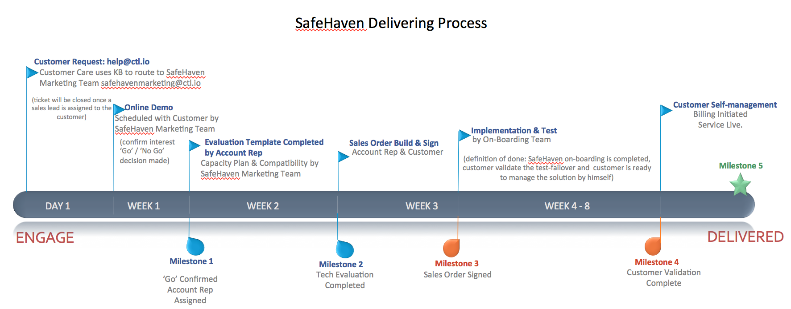

{{{
  "title": "Process of Delivering SafeHaven As a Disaster Recovery Service",
  "date": "1-06-2016",
  "author": "Shasha Zhu",
  "attachments": [],
  "related-products" : [],
  "contentIsHTML": false,
  "sticky": true
}}}

### Overview
This article covers major steps to use SafeHaven as a disaster recovery
service.

### Get an Order From Marketing Team
To start the process, contact the SafeHaven team,
safehavenmarketing@ctl.io, requesting a free trial or direct order. A SafeHaven
sales lead will deliver a demo and work to create a capacity plan and
compatibility validation. You will then be transferred to SafeHaven on-boarding team
when the PoC or direct order is approved.

### Start Working With On-Boarding Team
The SafeHaven on-boarding team provides customized designs based on your specific
requirements. An experienced on-boarding engineer will be assigned to provide professional guidance on how to setup your SafeHaven environment and manage the DR solution. The on-boarding project normally takes 30 to 45 days to complete, depending on your specific requirements and the number of servers to protect.

### Get Help From Customer Care Team
If you need assistance after your on-boarding is complete, contact our Customer Care team. This
[Knowledge Base](../../Support/how-do-i-report-a-support-issue.md) article explains how to open a ticket requesting support. 
