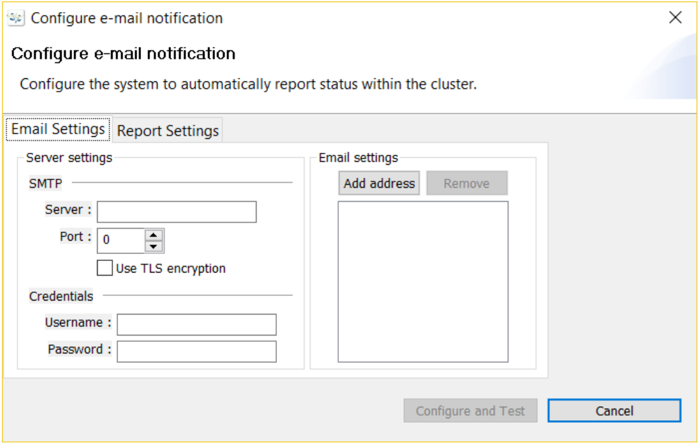

{{{
  "title": "SafeHaven-4-Configure Email Notification",
  "date": "1-11-2017",
  "author": "Anshul Arora",
  "attachments": [],
  "contentIsHTML": false
}}}
### Article Overview
This article explains how to configure email notifications using SafeHaven-4 console

### Configuring Email Notifications
* In SafeHaven Console, click on Administration tab and select "Configure email Notification" from the drop down menu.  
  

* Under Email Settings tab, fill up the SMTP information(Server and Port) and Credentials (Username and Password). Then add the email address which is going to recieve the email notifications by clicking on "Add Address" under Email Settings.  
  

* Under Report Settings tab, enter the time of the day when the cluster report should be sent. Once all the necessary information has been filled, click on "Configure and Test" and a test email will be sent to the entered email address right away. 
  
