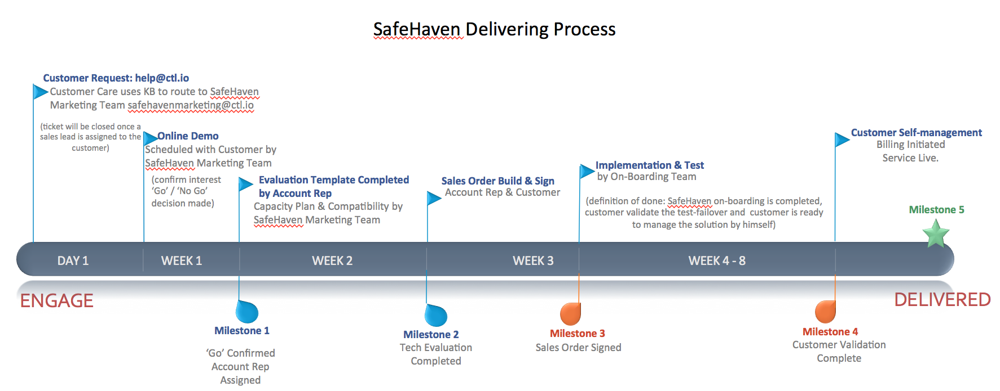

{{{
  "title": "Process of Delivering SafeHaven As a Disaster Recovery Service",
  "date": "1-06-2016",
  "author": "Shasha Zhu",
  "attachments": [],
  "related-products" : [],
  "contentIsHTML": false,
  "sticky": true
}}}

### Overview
This article covers major steps to use SafeHaven as a disaster recovery
service.

### Get an Order From Marketing Team
To start the process, you simply contact the SafeHaven team,
safehavenmarketing@ctl.io, requesting a free trial or direct order. A SafeHaven
sales lead will deliver a demo and work with you to do the capacity plan and
compatibility validation. You will be transferred to SafeHaven on-boarding team
when the PoC or direct order is approved.

### Start Working With On-Boarding Team
SafeHaven on-boarding team provides customized design based on your specific
requirements. An experienced on-boarding engineer will be assigned to pair with you to provide professional guidance on how to setup SafeHaven environment and manage the DR solution. The on-boarding project normally takes 30 to 45 days to complete. Depending on your specific requirements and the number of servers to protect, the on-boarding time varies.

### Get Help From Customer Care Team
After on-boarding SafeHaven, you should be able to manage the solution by
yourself. If you need help, contact our Customer Care team. This
[Knowledge Base](https://www.ctl.io/knowledge-base/support/how-do-i-report-a-support-issue/) article explains how to open a ticket requesting support. 
