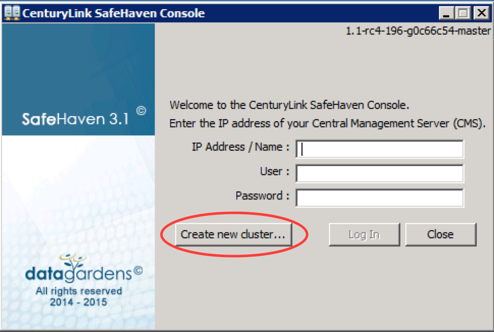
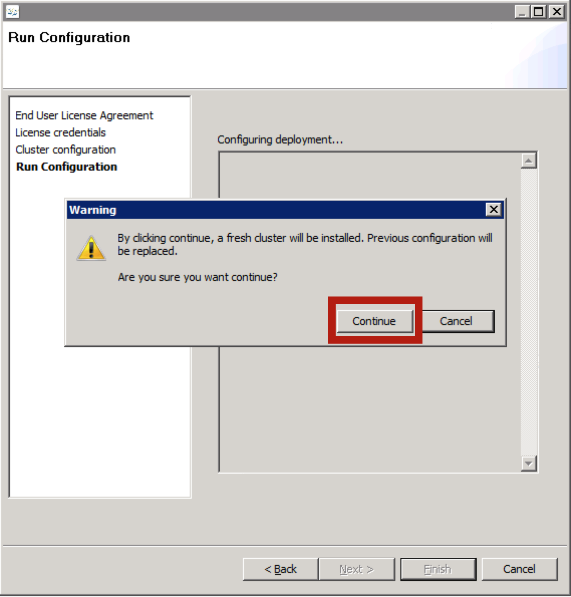
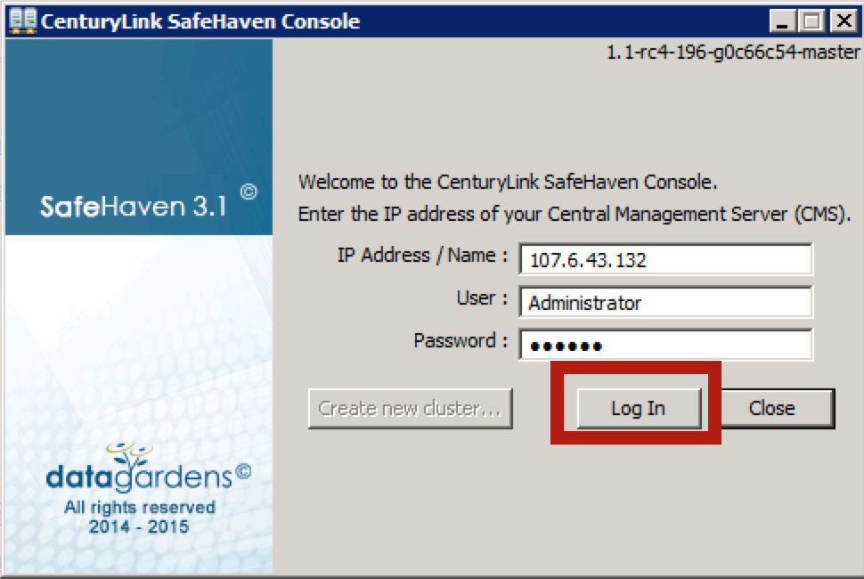
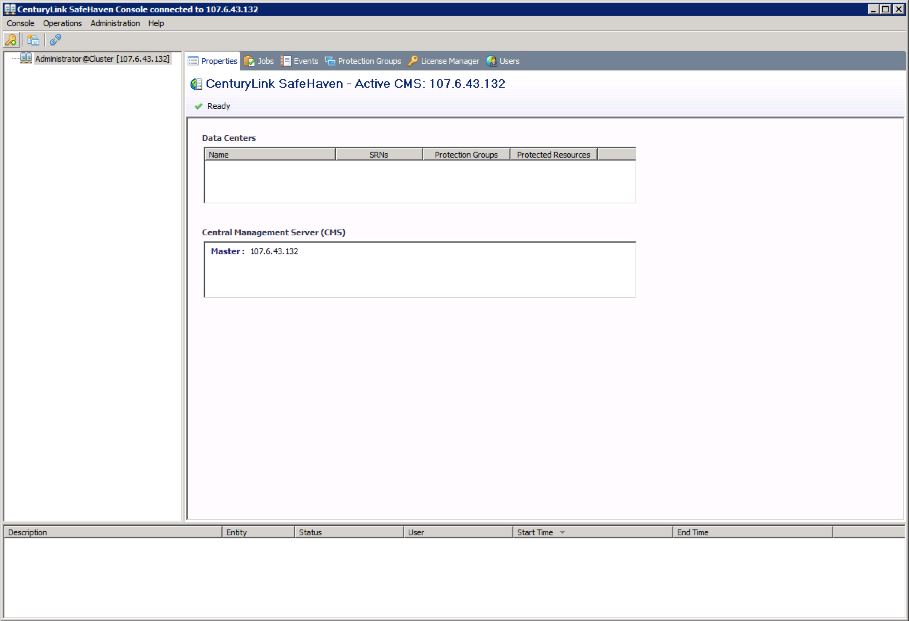
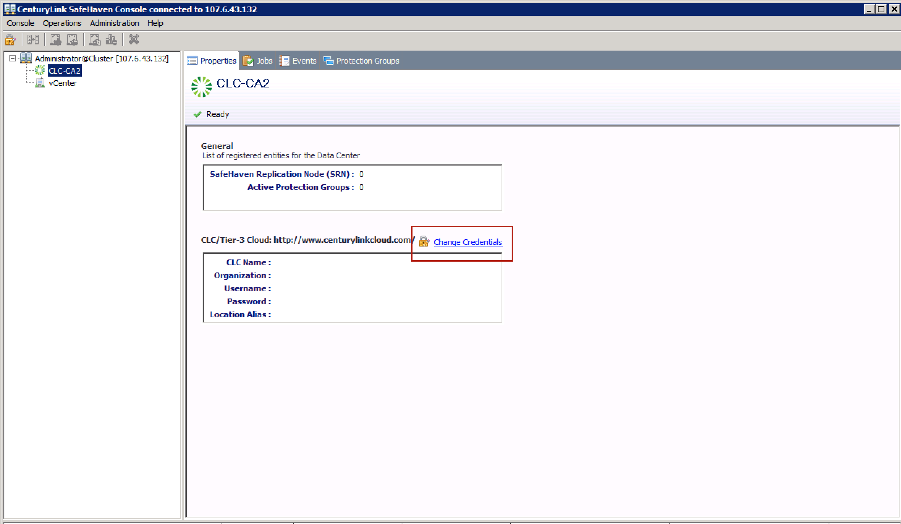
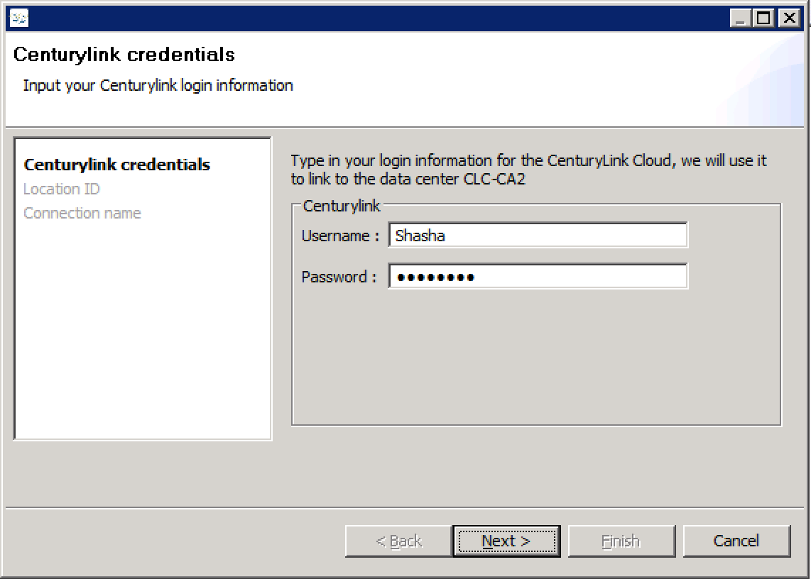
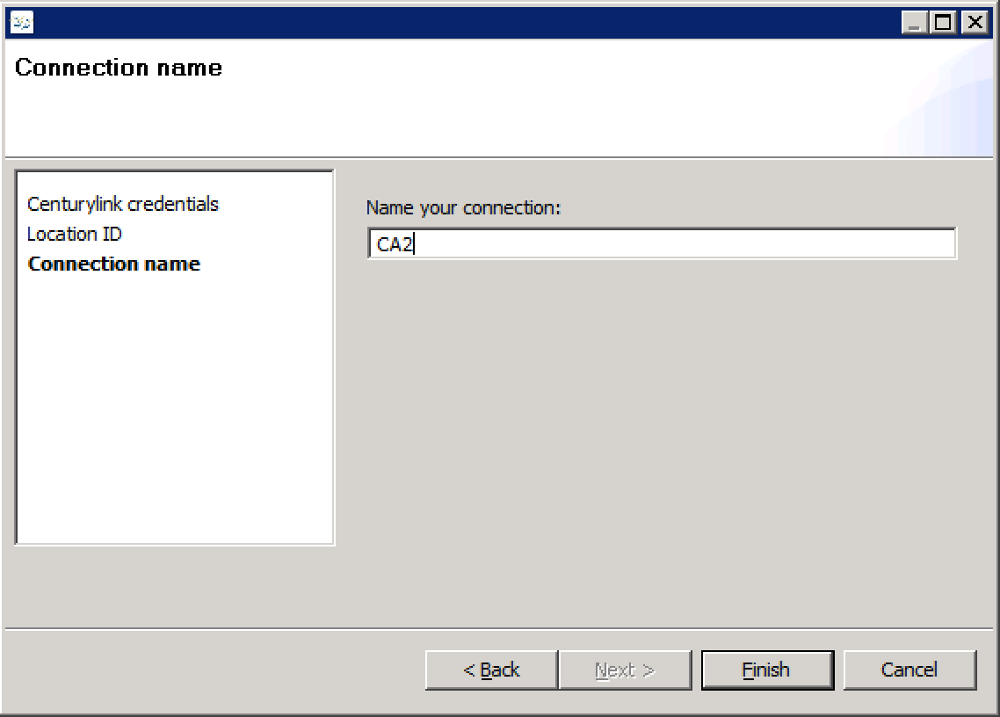
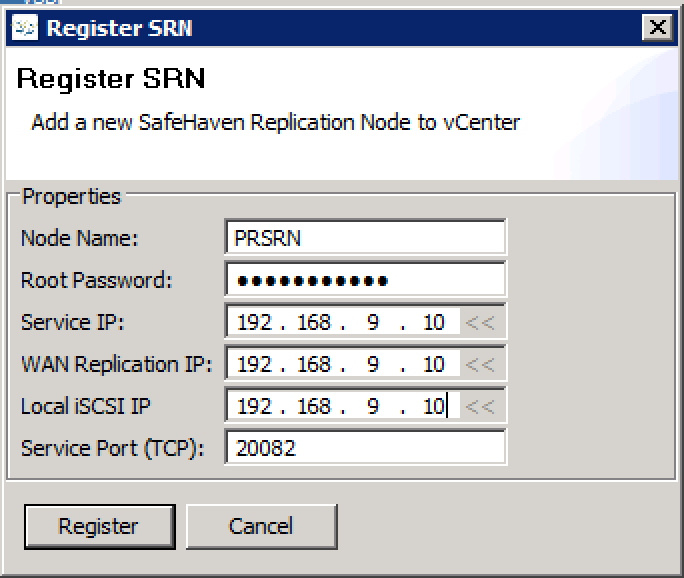

{{{
  "title": "Create A SafeHaven 3.1.1 Cluster",
  "date": "12-01-2015",
  "author": "Shasha Zhu",
  "attachments": [],
  "related-products" : [],
  "contentIsHTML": false,
  "sticky": true
}}}

### Article Overview 
This article focuses on how to create a SafeHaven 3.1.1 cluster. In the article,
the primary site is VMware and remote site is Centurylink Cloud. Other type of
clusters such as CLC to CLC can be set up in a similar way. This article assumes
that the CMS node and SRN nodes are already created based SafeHaven base image.

### Create Cluster
SafeHaven 3.1.1 integrates the cluster installer with the login console. You
setup the CMS first and then login into it via SafeHaven console and then sites
and SRNs. In this example, we only show adding a VMware site as production site
and adding Centurylink Cloud as disaster recovery site.
#### Set up the CMS

- Double click on the SafeHaven3.1.1-Client.jar and click "Create new Cluster"

    
- Accept the End User License Agreement

    
- Enter user name and license key
    
    
- Enter CMS information. **Client Access IP** is the ip used to log into the
  SafeHaven console and **Service IP** is the ip used to communicate with SRNs.
  So please make sure you enter the correct ip. **SafeHaven Distribution URL**
  is the url contains the SafeHaven code, currently we use
  https://www.dropbox.com/s/bz75nmcccemseo0/SafeHaven3.1.1-GA_nosbd_12-16-2015_bin.tar.gz?dl=0
  Please make sure the **Service Port** and **Heartbeat Port** are opened on
  both public ip and private ip.

    
- Click **Continue** to configure the CMS. 
   
    
- Wait for the CMS is configured and rebooted, log into it via SafeHaven console
    
    
- Here is a screenshot of successfully logged in
    
    

#### Add sites and SRNs to the cluster
In this section, we add sites and SRNs to the cluster. 

- Right click on the CMS node and select **Register Data Center**.
   
    
- Enter the **Data Center Name** and select the **Data Center Type**. The
  following screenshot shows adding a vCenter data center.

    
- In a same way, you can add a CLC site 

- Register the **CLC-CA2** site.

    - Click **Change Credentials**.
    
    
    - Enter the CLC control portal username and password.
    
    
    - Choose the Location ID.
    
   
    - Enter the connection name which has to be unique and click Finish button.
    
   
- Register the VMware site. Enter the vCenter identifier, IP address of the
  vCenter, User Name and Passwrod. 
 
    
- Register SRN. The following screenshots shows how to register a VMware SRN.
  You can register a CLC SRN in the same way.

    
    
- After we register a CLC SRN
    
    
