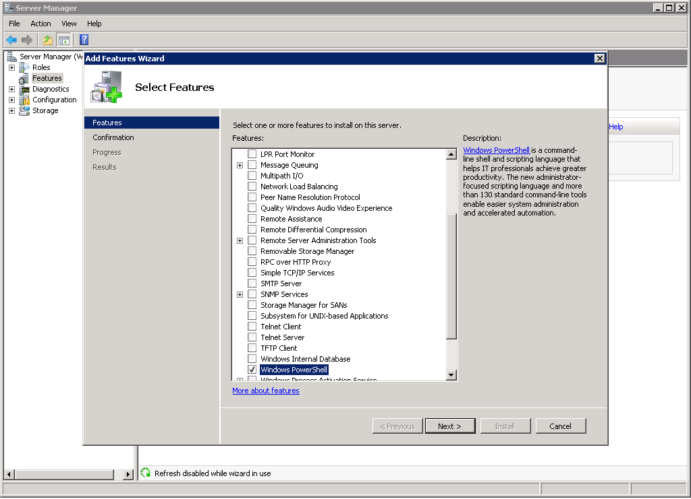

{{{
  "title": "SafeHaven 4: Protect Windows Server 2008R1",
  "date": "2-11-2016",
  "author": "Shi Jin",
  "attachments": [],
  "contentIsHTML": false
}}}

### Important Notes

The official support of Windows Server 2008R1 was discontinued since the release of SafeHaven-3.1.1 in December, 2015. This document provides a good-will method for customers to get SafeHaven Disaster Recovery as a Servce(DRaaS) protection on their legacy servers still running Windows Server 2008R1. Customers are strongly advised to upgrade to a newer server OS instead of keep running this legacy Windows server 2008R1 OS. Use this document only if there is absolutely no other options.


### What's the Same as for Supported OS

* Creating a protection group using SafeHaven-4 just the same way for any supported Windows OS
* The DR operations such as failover/test-failover/failback are exactly the same

### What's Different from the Supported OS?

#### Special Windows Local Replication Agent Binary

The Windows Local Replication Agent (LRA) for Windows server 2008R1 needs some special treatment from Windows server 2008R2 or later OSes because there are certain Windows APIs not available.

The URL to download this special build is: https://d17b4h8tf54deh.cloudfront.net/SH-4.0.0/safehaven_windows_driver_win2008r1.exe


Also please note that this method does not support automated LRA installation. Only manual instllation is supported for Windows 2008R1

#### LRA Installation

##### Install Prerequisite: PowerShell v2

Before installing LRA, we have to get powershell v2 installed.

Note that this procedure is only tested on Windows 2008R1 Service Pack 2. If you are on a different service pack level, the procedure might be different. For example, you might have to install certain powershell related Windows updates before you can  enable this feature.

* Open Server Manager and natigate to Features->Add Features
* Choose "Windows PowerShell" as a new feature to be added

* Follow the wizard and it would install powershell 1.0

```
Windows PowerShell
Copyright (C) 2006 Microsoft Corporation. All rights reserved.

PS C:\Users\Administrator> get-host


Name             : ConsoleHost
Version          : 1.0.0.0
InstanceId       : 7c1d4f66-3613-411e-8e93-e620ba1ca406
UI               : System.Management.Automation.Internal.Host.InternalHostUserInterface
CurrentCulture   : en-US
CurrentUICulture : en-US
PrivateData      : Microsoft.PowerShell.ConsoleHost+ConsoleColorProxy
```
* Powershell version 1 is not enough for our purpose. We need to upgrade to version 2.


##### Driver Installation

* Once the LRA installation exe is downloaded, launch it from a cmd.exe (for a unknown reason, double clicking the EXE does not work during our tests)
* The rest of installatino is similar to supported OSes. In the end, a reboot is required.

##### Start Replication with Manager.exe

Lanuch Manager.exe the same way as for supported OSes

