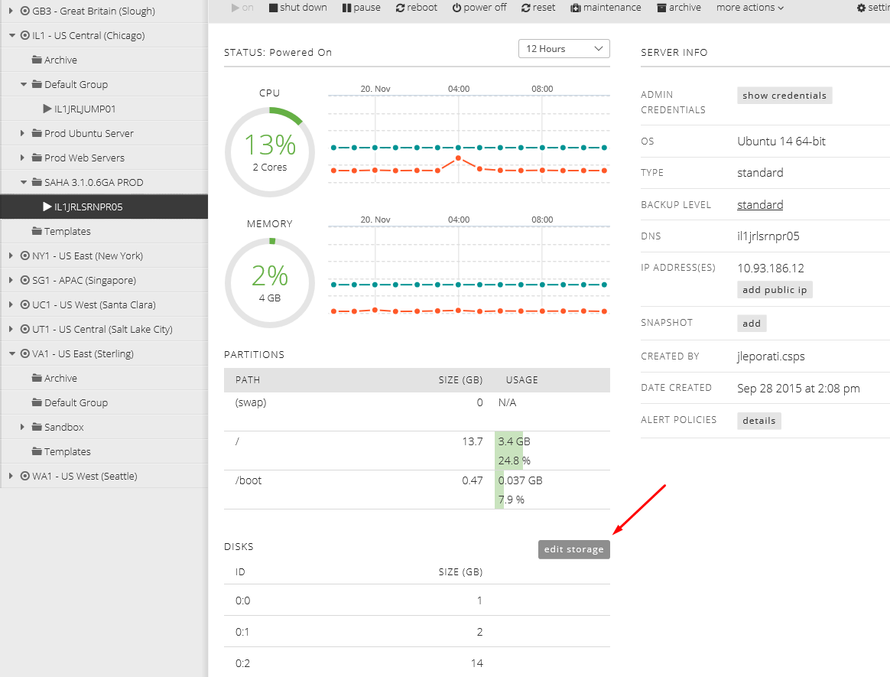
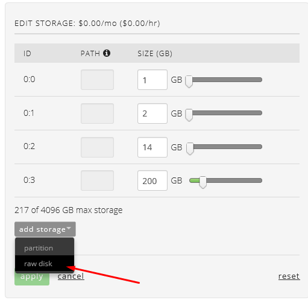
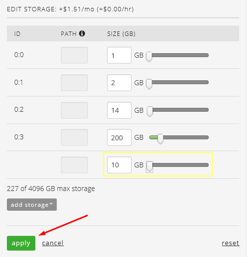
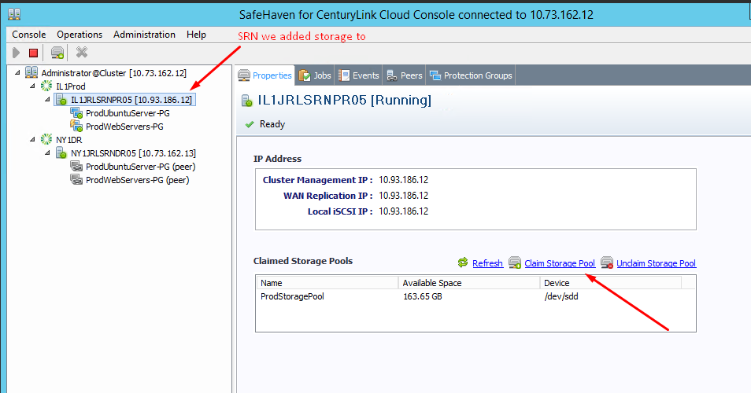
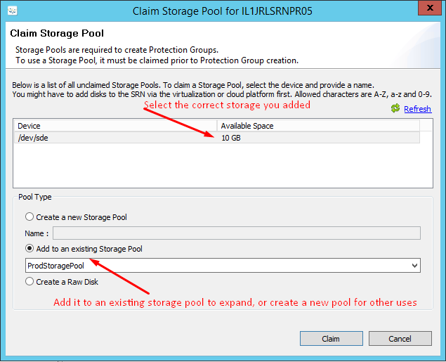
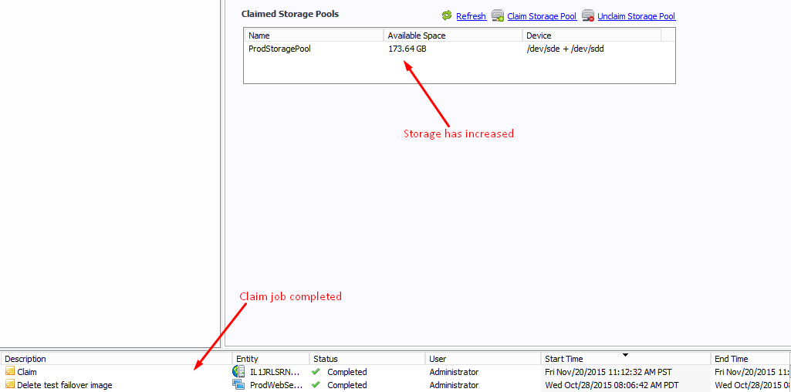

{{{
  "title": "SafeHaven 3.1: Expanding SRN Storage",
  "date": "11-20-2015",
  "author": "Josh Leporati",
  "attachments": [],
  "contentIsHTML": false
}}}

### Article Overview
This article will walk you through expanding the storage assigned to your SRN.  You can assign new storage to current storage pools, or create a new pool on the SRN to assign the storage to.  Storage from the SRN is used for all aspects of the SafeHaven protection, from the Local Replica / Local Cache, to Checkpoints, as well as temporary write space during test failover and failover scenarios.

### Expanding SRN Storage

1. Assuming that our SRN is contained within the CenturyLink Cloud we need to first go and add a new raw disk with the appropriate amount of disk space to our SRN.  If your SRN is on-prem, proceed to add raw storage via the correct method pertanant to your environment

  - Browse to the SRN within the portal and select **edit storage**

    

  - Select add **storage**, then **raw disk**

    

  - Enter the correct disk size, and then select **apply**.  The job will go out to the queue to be completed.

    

2. After the storage has been added, open up the SafeHaven Console and connect to your cluster.  From here, we'll add the new storage to our SRN.

  - Select the SRN you added the new storage/disk to and then select **Claim Storage Pool**

    

  - Select the correct new disk and choose to either create a new storage pool, or select **Add to an existing Storage Pool** to expand your current pool size and select **Claim**

    

  - Once claimed you should see your total available space increase for the storage pool you either created or assigned to, as well as the claim job completed

    

### Other Notes

Apply caution when working with your SRN Storage Pools.  These pools are used to maintain the SafeHaven replication data between your Production and DR side systems.  Typically you will want to increase 1 for 1, your Production SRN with you DR SRN when modifying space allocations - especially when in a local replica mode.  Local cache mode does not require a 1 for 1 mirror.  You should always understand your environment sizing requirements prior to adjusting SRN storage.

**Some typical reasons to expand SRN storage would be:**

  - Introduction of new servers or increased storage requirements on current servers - forcing you to exceed current SRN disk allocations
  - Increasing cache space to compensate for synchronized data issues
  - Addition of storage for Production SRN when initiating a failback from the DR environment to Prod ***AND*** when having used Local Cache mode in Production SRN
  - Increase of temporary white space used by SafeHaven when conducting failovers and failbacks
