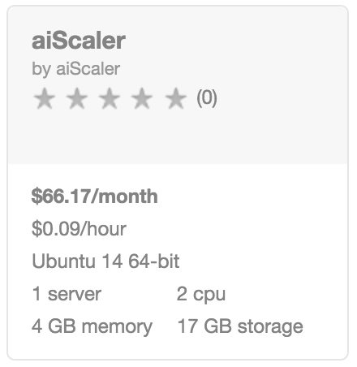
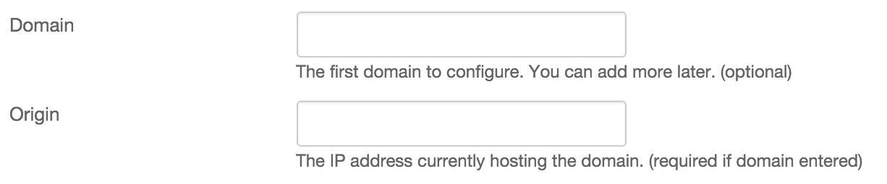
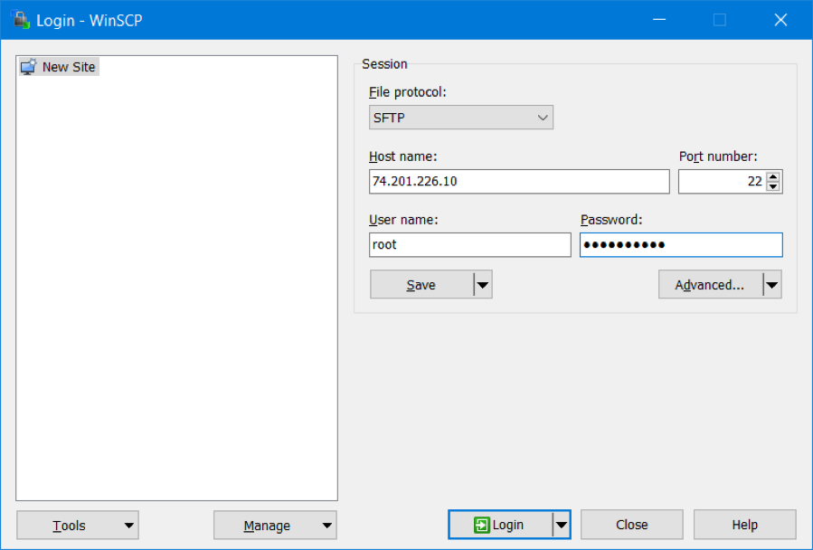
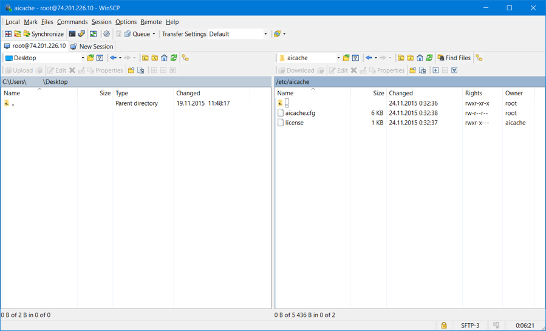
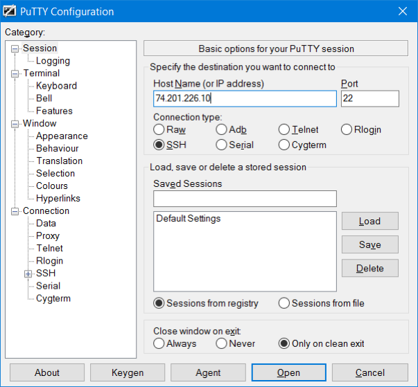
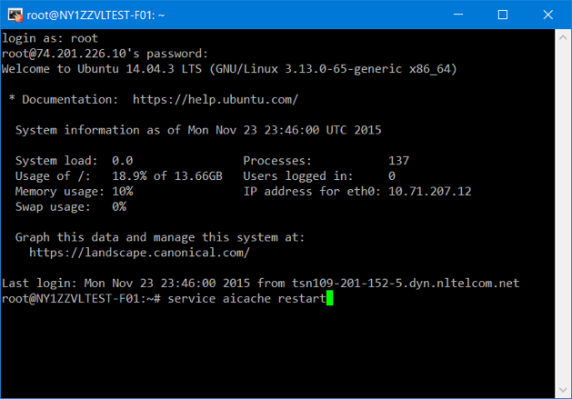

{{{
  "title": "Getting Started with aiScaler - Blueprint",
  "date": "12-29-2015",
  "author": "<a href='https://twitter.com/KeithResar'>@KeithResar</a>",
  "attachments": [],
  "contentIsHTML": false
}}}

### Technology Profile

aiScaler helps Lumen Cloud customers address the business challenge of website scalability, stability and security - now available as part of the Lumen Cloud Blueprint Engine.

##### Customer Support
|Sales Contact| |
|:-	| |
|support@aiscaler.com +1-408-744-6078 +44 20 7993 4587 Skype: ai.scaler | 2 Free hours of installation support Professional services available. Email, skype and phone available M-F Business hours EST.|

### Description
aiScaler has integrated their technology with the Lumen Cloud platform.  The purpose of this KB article is to help the reader take advantage of this integration to achieve rapid time-to-value for this application delivery controller solution.

#### aiScaler
**aiScaler** Provides Traffic Management, Dynamic Site Acceleration, and DDoS protection in a single easily configured virtual appliance. We provide free installation support and ongoing access to engineers with Lumen expertise to help you optimize your site.

Alexa top 1000 sites, use aiScaler to scale and stabilize their environments.

Our reporting tools provide over 200 real-time metrics so you know what is happening with your application, allowing you to alert on and solve issues before they affect your users. We support mobile redirection and re-writing, HTTPS offload, while managing your users session layer, to free up origin resources.

**aiScaler** can reduce your Origin load by over **80%**, simplifying your implementation and saving money on your deployment. Our dynamic site caching increases the speed from click to content. Deploying aiScaler as multiple endpoints on different Lumen Cloud geographic networks removes network latency.

We support Highly Available deployment and can help you configure your Lumen systems to guarantee uptime. In addition we provide 2 hours of free deployment support. Please contact us for a free technical consult.

### Audience
Lumen Cloud Users

### Impact
After reading this article, the you should feel comfortable getting started using the aiScaler technology on Lumen Cloud.

After executing the steps in this Getting Started document, you will have a functioning virtual application delivery controller, upon which you can deploy web applications that are fast, able to handle massive traffic and secured from DDoS and other online attacks.

### Prerequisites
Prior to deploying this Blueprint please create a new server matching the below specifications:
* Server running Ubuntu 14.04, Debian 7, RHEL 7 or CentOS 7. 4CPU/8GB RAM is a good starting point
* Assigned public IP with the following open ports: `22`, `80`, `443`.

### Deploying aiScaler
You can achieve a single-button deployment of a new aiScaler instance using Lumen Cloud Blueprints. Follow these step by step instructions to deploy aiScaler. For more details please reference
https://aiscaler.com/wiki/getting-started-centurylink.

1. Locate the Blueprint in the Blueprint Library.
   * Login to the Control Portal. From the Nav Menu on the left, click **Orchestration > Blueprints Library**.
   * Search for "aiScaler" in the keyword search on the right side of the page.

  

2. Click the Deploy Blueprint button.

3. Set Required parameters.
   

   * **Domain** - optionally specific the first domain
   * **Origin** - optionally specific the content origin

4. Set Optional Parameters.
   * Password/Confirm Password (This is the root password for the server. Keep this in a secure place).
   * Set DNS to “Manually Specify” and use “8.8.8.8” (or any other public DNS server of your choice).
   * Optionally set the server name prefix.
   * The default values are fine for every other option.

5. Review and Confirm the Blueprint.

6. Deploy the Blueprint.
   * Once verified, click the `deploy blueprint` button.
   * You will see the deployment details stating the Blueprint is queued for execution.

7. Deployment Complete.
   * Once the Blueprint has deployed you will receive an email confirming the newly deployed assets within a few minutes.
   * If you do not receive an email you may have had a deployment error - check the *Blueprints Queue* or review the *Blueprint Build Log* to for error messages.

### Pricing
The costs listed above in the above steps are for the infrastructure only. After deploying this Blueprint, you may secure entitlements to the technology using the following steps:
* aiScaler offers 30 day free trial demo licenses.
* You can find all license plans available at https://aiscaler.com/pricing. For cloud usage we recommend 1GB/s bandwidth cap.
* In order to get you license please contact support@aiscaler.com.
* Once you obtained your license, connect over SFTP and upload the license to `/etc/aicache/license`.
  
  

* Either restart the server from dashboard or connect over SSH and run `service aicache restart`.
  
  

### Frequently Asked Questions

**Where do I obtain my license?**
* aiScaler offers 30 day free trial demo licenses.
* You can find all license plans available at https://aiscaler.com/pricing. For cloud usage we recommend 1GB/s bandwidth cap.
* In order to get you license please contact support@aiscaler.com.

**Who should I contact for support?**
* For issues related to deploying aiScaler, please contact support@aiscaler.com (Skype: ai.scaler).
* For issues related to cloud infrastructure, please open a ticket using the [Lumen Cloud Support Process](../../Support/how-do-i-report-a-support-issue.md).
